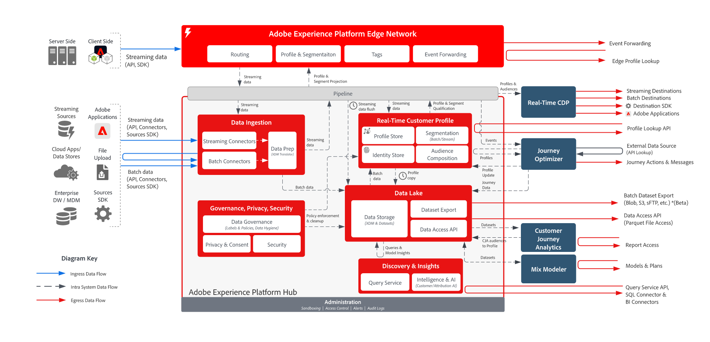

# Flusso di dati di Adobe Experience Platform

## Diagramma del flusso di dati

Questo diagramma illustra i vari percorsi per l’acquisizione e l’uscita dei dati da Adobe Experience Platform.

{width="1000" zoomable="yes"}

## Flussi di ingresso e uscita dei dati

Per un elenco dettagliato di tutti i pattern di acquisizione, raccolta, ingresso e uscita dei dati, consulta la [documentazione sull&#39;acquisizione dei dati](https://experienceleague.adobe.com/en/docs/experience-platform/collection/home).