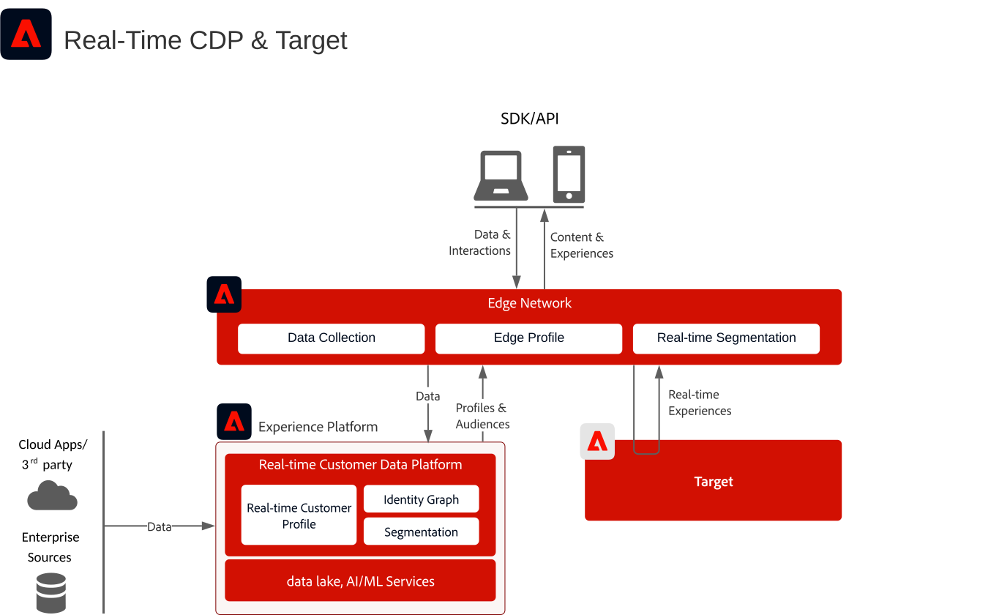
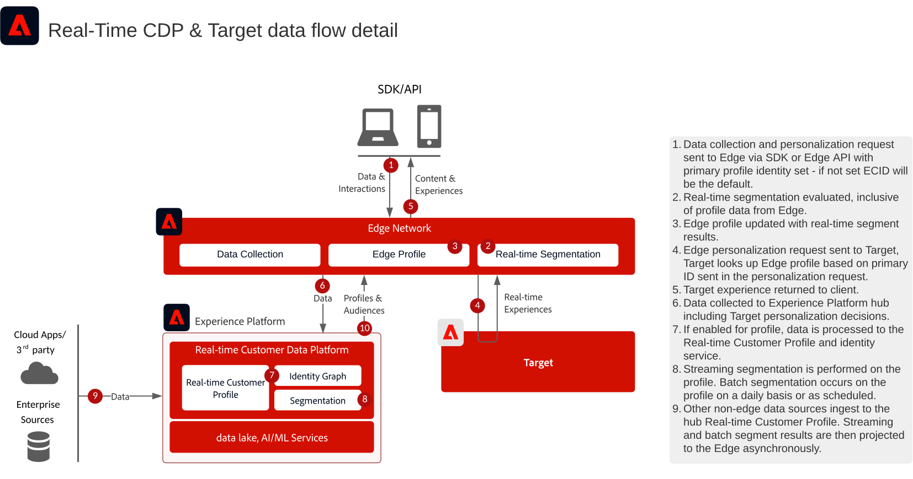

# Integrazione di Adobe Real-Time CDP e Adobe Target

Questa architettura mostra come [!DNL Real-Time Customer Data Platform] e [!DNL Adobe Target] si integrano tramite Edge Network. Consente di scegliere tra la valutazione del pubblico in tempo reale ai margini e la condivisione di tipi di pubblico in streaming o in batch con Target.

## Applicazioni

* [!DNL Real-Time Customer Data Platform]
* [!DNL Adobe Target]
* Edge Network [!DNL Experience Platform]
* Experience Platform Web SDK o Edge Network Server API

## Scegli un approccio di integrazione

### Valutazione del pubblico in tempo reale ai margini

Utilizza questo approccio quando [!DNL Adobe Target] ha bisogno di tipi di pubblico e attributi di profilo valutati edge per la personalizzazione della stessa pagina o della pagina successiva. Implementare l&#39;API Web SDK o Edge Network Server e configurare uno stream di dati con i servizi [!DNL Adobe Target] e [!DNL Experience Platform] abilitati.

### Condivisione in streaming e in batch del pubblico su Target

Utilizzare questo approccio quando i tipi di pubblico valutati in [!DNL Real-Time Customer Data Platform] devono essere disponibili in [!DNL Adobe Target] senza valutazione Edge in tempo reale. Configurare la destinazione [!DNL Adobe Target] nella sandbox di produzione predefinita. L’implementazione dell’API Web SDK o Edge Network Server è necessaria solo per la valutazione Edge in tempo reale o per le ricerche personalizzate dello spazio dei nomi delle identità.

## Diagramma dell’architettura

Questo diagramma mostra i punti di integrazione principali tra la raccolta dati, Edge Network, [!DNL Real-Time Customer Data Platform] e [!DNL Adobe Target].

## Diagramma del flusso di dati

Questa sequenza mostra come una richiesta client raggiunge Edge Network, valuta i tipi di pubblico e il contesto del profilo, invia una richiesta di personalizzazione a [!DNL Adobe Target] e restituisce l&#39;esperienza risultante al client.

## Considerazioni sull’implementazione

* [!DNL Adobe Target] e [!DNL Real-Time Customer Data Platform] devono utilizzare la stessa organizzazione IMS.
* La destinazione [!DNL Adobe Target] supporta la sandbox di produzione predefinita in [!DNL Real-Time Customer Data Platform].
* Per le ricerche personalizzate dello spazio dei nomi delle identità nel server Edge di, utilizza Web SDK o Edge Network Server API e includi ogni identità nella mappa delle identità.
* Se utilizzi at.js, l’integrazione dei profili supporta solo lo spazio dei nomi delle identità ECID.

## Documentazione correlata

### Configurare l’integrazione

* [Connessione Adobe Target per Real-time Customer Data Platform](https://experienceleague.adobe.com/docs/experience-platform/destinations/catalog/personalization/adobe-target-connection.html?lang=it)
* [Configurazione dello stream di dati di Edge](https://experienceleague.adobe.com/docs/experience-platform/edge/fundamentals/datastreams.html?lang=it)

### Implementare al bordo

* [Documentazione di Experience Platform Web SDK](https://experienceleague.adobe.com/docs/experience-platform/edge/home.html?lang=it)
* [Documentazione sui tag di Experience Platform](https://experienceleague.adobe.com/docs/experience-platform/tags/home.html?lang=it)
* [Documentazione del servizio Experience Cloud ID](https://experienceleague.adobe.com/docs/id-service/using/home.html?lang=it)

### Valutare i tipi di pubblico

* [Panoramica sulla segmentazione di Experience Platform](https://experienceleague.adobe.com/docs/experience-platform/segmentation/home.html?lang=it)
* [Segmentazione in tempo reale](https://experienceleague.adobe.com/docs/experience-platform/segmentation/ui/edge-segmentation.html?lang=it)
* [Segmentazione in streaming](https://experienceleague.adobe.com/docs/experience-platform/segmentation/api/streaming-segmentation.html?lang=it)
* [Configurazione criterio di unione](https://experienceleague.adobe.com/docs/experience-platform/profile/merge-policies/ui-guide.html?lang=it#create-a-merge-policy)
