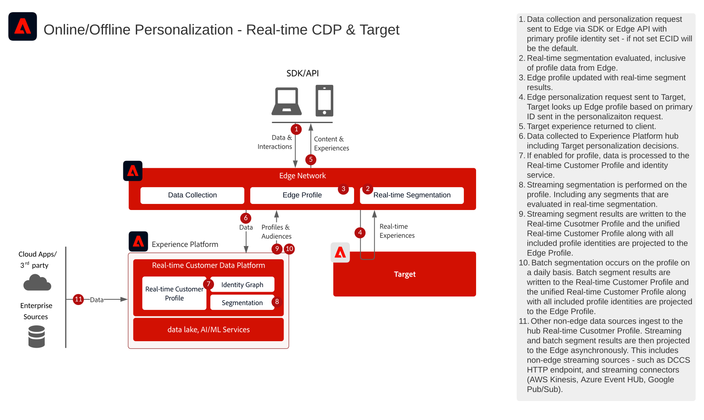

# Integrazione di Real-time Customer Data Platform con Adobe Target

## Casi di utilizzo

* Personalizzazione online con dati dei clienti noti
* Ottimizzazione della pagina di destinazione
* Personalizzazione basata su precedenti visualizzazioni di prodotti/contenuti, affinità di prodotti/contenuti, attributi ambientali e dati demografici, nonché dati offline quali dati da transazioni, dal programma fedeltà e dal sistema CRM, e dati modellati
* Condividere e indirizzare i tipi di pubblico definiti in Real-time Customer Data Platform su siti web e app mobili tramite Adobe Target

## Applicazioni

* [!UICONTROL Real-time Customer Data Platform]
* Adobe Target

### Documentazione di riferimento

* [Connessione Adobe Target per Real-time Customer Data Platform](https://experienceleague.adobe.com/docs/experience-platform/destinations/catalog/personalization/adobe-target-connection.html)
* [Configurazione dello stream di dati Edge](https://experienceleague.adobe.com/docs/experience-platform/edge/fundamentals/datastreams.html?lang=it)

## Modelli di integrazione

| Modello di integrazione | Funzionalità | Prerequisiti |
|--------------------|------------|---------------|
| **Valutazione dei segmenti in tempo reale su Edge condivisa da Real-time Customer Data Platform a Target** | : valuta i tipi di pubblico in tempo reale per la personalizzazione della stessa pagina o della pagina successiva in Edge.  - Anche tutti i segmenti valutati in streaming o in modalità batch verranno proiettati in Edge Network per essere inclusi nella valutazione e nella personalizzazione dei segmenti edge. | - È necessario implementare Web/Mobile SDK per l’API server di Edge Network.  - Lo stream di dati deve essere configurato in Experience Edge con l&#39;estensione Target e Experience Platform abilitata.  - La destinazione di destinazione deve essere configurata in Destinazioni Real-time Customer Data Platform.  - L’integrazione con Target richiede la stessa organizzazione IMS usata per l’istanza di Experience Platform. |
| **Condivisione in streaming e in batch del pubblico da Real-time Customer Data Platform a Target tramite l&#39;approccio Edge** | - I tipi di pubblico in streaming e in batch devono essere condivisi da Real-time Customer Data Platform a Target tramite la rete Edge.  - I tipi di pubblico valutati in tempo reale richiedono l&#39;implementazione di Web SDK e Edge Network. | - L’implementazione di SDK per web/mobile o API Edge di Target non è necessaria per la condivisione in Target di pubblici RTCDP in streaming e in batch, ma è necessaria per abilitare la valutazione Edge in tempo reale.  - Se si utilizza AT.js, è supportata solo l’integrazione dei profili rispetto allo spazio dei nomi dell’identità ECID.  - Per le ricerche personalizzate dello spazio dei nomi delle identità in Edge, è necessaria la distribuzione API Web SDK/Edge e ogni identità deve essere impostata come identità nella mappa delle identità.  - La destinazione di destinazione deve essere configurata in Destinazioni Real-time Customer Data Platform. È supportata solo la sandbox di produzione predefinita in RTCDP.  - L’integrazione con Target richiede la stessa organizzazione IMS usata per l’istanza di Experience Platform. |
| **Condivisione in streaming e in batch del pubblico da Real-time Customer Data Platform a Target e Audience Manager tramite l&#39;approccio del servizio di condivisione del pubblico** | : questo modello di integrazione può essere utilizzato quando desideri un ulteriore arricchimento dai dati e dai tipi di pubblico di terze parti in Audience Manager. | - Web/Mobile SDK non è richiesto per la condivisione di tipi di pubblico in streaming e in batch su Target, ma è necessario per abilitare la valutazione Edge in tempo reale.  - Se si utilizza AT.js, è supportata solo l’integrazione dei profili rispetto allo spazio dei nomi dell’identità ECID.  - Per le ricerche personalizzate dello spazio dei nomi delle identità in Edge, è necessaria la distribuzione API Web SDK/Edge e ogni identità deve essere impostata come identità nella mappa delle identità.  - È necessario eseguire il provisioning della proiezione del pubblico tramite il servizio di condivisione del pubblico.  - L&#39;integrazione con Target richiede la stessa organizzazione IMS dell&#39;istanza di Experience Platform.  - Solo i tipi di pubblico della sandbox di produzione predefinita supportano il servizio core di condivisione del pubblico. |

## Condivisione del pubblico in tempo reale, in streaming e in batch con Adobe Target

Architettura

Dettagli della sequenza

Architettura d’insieme

## Modelli di implementazione

La personalizzazione per clienti noti è supportata tramite diversi approcci di implementazione.

### Schema di implementazione 1 - [!DNL Edge Network] con Web/Mobile SDK o API [!DNL Edge Network] (approccio consigliato)

* Utilizzo di [!DNL Edge Network] con Web/Mobile SDK. La segmentazione Edge in tempo reale richiede l’implementazione di Web/Mobile SDK o dell’API Edge.
* [Consulta la blueprint per Experience Platform Web e Mobile SDK](../../experience-platform/deployment/websdk.md) per l&#39;implementazione basata su SDK.
* Per l&#39;utilizzo in Mobile SDK, è necessario installare l&#39;estensione [Adobe Journey Optimizer - Decisioning](https://developer.adobe.com/client-sdks/edge/adobe-journey-optimizer-decisioning/).
* [Consulta la [!DNL Edge Network] API server](https://experienceleague.adobe.com/docs/experience-platform/edge-network-server-api/overview.html?lang=it) per informazioni su un&#39;implementazione di Adobe Target basata su API con profilo Edge.

### Modello di implementazione 2 - SDK per specifiche applicazioni

Mediante SDK tradizionali per specifiche applicazioni (ad esempio, AT.js e AppMeasurement.js). La valutazione dei segmenti Edge in tempo reale non è supportata da questo approccio di implementazione. Tuttavia, questo approccio supporta la condivisione del pubblico in streaming e in batch dall’hub di Experience Platform.

[Consulta la documentazione del connettore Adobe Target](https://experienceleague.adobe.com/en/docs/experience-platform/destinations/catalog/personalization/adobe-target-connection)
[Consulta la blueprint di SDK specifica per l&#39;applicazione](../../experience-platform/deployment/appsdk.md)

## Considerazioni sull’implementazione

* Qualsiasi identità primaria può essere utilizzata quando si utilizza il modello di implementazione 1 descritto sopra con [!DNL Edge Network] e Web SDK.
* La prima personalizzazione di accesso con dati noti dei clienti precedentemente acquisiti in RTCDP richiede che la richiesta di personalizzazione abbia un’identità primaria che corrisponda al grafico dell’identità del cliente noto in Real-time Customer Data Platform. Se l’ID primario è impostato su ECID o su un’identità che non è ancora stata unita con il profilo cliente noto, occorreranno diversi minuti affinché l’unione di identità sia realizzata sul server Edge e la personalizzazione Edge includa i dati noti dei clienti acquisiti in precedenza.
* I profili Edge hanno attualmente un TTL di 14 giorni. Pertanto, se un utente non ha effettuato l’accesso o è stato attivo per 14 giorni sul server Edge di, il profilo sul server Edge di potrebbe essere scaduto e, pertanto, il server Edge di deve recuperare il profilo dall’hub per avere la visualizzazione del profilo storica di Power Personalization che include i segmenti e gli attributi del profilo acquisiti in precedenza, ciò comporterà una personalizzazione con la visualizzazione storica dei profili che si verifica nelle visualizzazioni di pagina successive rispetto al primo accesso.

## Documentazione correlata

### Documentazione di SDK

* [Documentazione di Experience Platform Web SDK](https://experienceleague.adobe.com/docs/experience-platform/edge/home.html?lang=it)
* [Documentazione sui tag di Experience Platform](https://experienceleague.adobe.com/docs/experience-platform/tags/home.html?lang=it)
* [Documentazione del servizio Experience Cloud ID](https://experienceleague.adobe.com/docs/id-service/using/home.html?lang=it)

### Documentazione sulla segmentazione

* [Panoramica sulla segmentazione in Experience Platform](https://experienceleague.adobe.com/docs/experience-platform/segmentation/home.html?lang=it)
* [Segmentazione in tempo reale](https://experienceleague.adobe.com/docs/experience-platform/segmentation/ui/edge-segmentation.html?lang=it)
* [Segmentazione in streaming](https://experienceleague.adobe.com/docs/experience-platform/segmentation/api/streaming-segmentation.html?lang=it)
* [Condivisione dei segmenti di Adobe Analytics tramite Adobe Audience Manager](https://experienceleague.adobe.com/docs/analytics/components/segmentation/segmentation-workflow/seg-publish.html?lang=it)
* [Configurazione dei criteri di unione](https://experienceleague.adobe.com/docs/experience-platform/profile/merge-policies/ui-guide.html?lang=it#create-a-merge-policy)

### Tutorial

* [Personalizzazione con hit successivo con Real-Time CDP e Adobe Target](https://experienceleague.adobe.com/docs/platform-learn/tutorials/experience-cloud/next-hit-personalization.html?lang=it)
