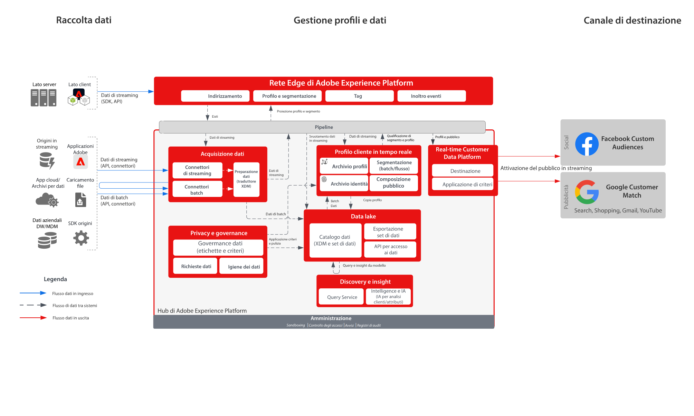

# Destinazioni da Audience Activation a social network e Advertising

>[!TIP]
>Questo blueprint è disponibile anche come [modello di casi d&#39;uso](/help/blueprints/use-case-patterns/audience-building-activation/audience-activation-to-destinations.md) in Creazione e attivazione pubblico.

Acquisisci i dati del cliente da più origini per creare una singola vista di profilo del cliente. Puoi segmentare questi profili in tipi di pubblico creati per il marketing e la personalizzazione, condividerli in reti di annunci come Facebook e Google per eseguire il targeting e personalizzare le campagne relative a tali tipi di pubblico.

## Casi di utilizzo

* Targeting per tipi di pubblico noti su destinazioni social e pubblicitarie.
* Personalizzazione online con attributi online e offline.

## Applicazioni

* Real-time Customer Data Platform

## Architettura

## Guardrail

[Guardrail di profilo e segmentazione](https://experienceleague.adobe.com/docs/experience-platform/profile/guardrails.html?lang=it)

## Documentazione correlata

Attivazione per Facebook Customer Audiences - [Configurazione della destinazione](https://experienceleague.adobe.com/docs/experience-platform/destinations/catalog/social/facebook.html?lang=it)

Attivazione per Google Customer Match - [Configurazione della destinazione](https://experienceleague.adobe.com/docs/experience-platform/destinations/catalog/advertising/google-customer-match.html?lang=it)