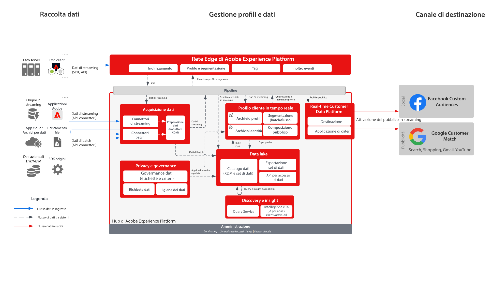

# Attivazione per destinazioni social e pubblicitarie da Real-time Customer Data Platform

Acquisisci i dati dei clienti da più origini per creare una singola vista del profilo del cliente; segmenta i profili per creare tipi di pubblico per le attività di marketing e personalizzazione; condividi questi tipi di pubblico in ad network come Facebook e Google per il targeting e la personalizzazione delle campagne.

## Casi di utilizzo

* Targeting per tipi di pubblico noti su destinazioni social e pubblicitarie.
* Personalizzazione online con attributi online e offline.

## Applicazioni

* Real-time Customer Data Platform

## Architettura

## Fasi di implementazione

1. Configurare gli spazi dei nomi di identità da utilizzare nelle origini dati per i profili.
   * Utilizzare gli spazi dei nomi predefiniti come e-mail, e-mail con hash SHA256, se disponibili.
   * Facebook dispone di un elenco di identità supportate. Per attivare i tipi di pubblico personalizzati di Facebook, una delle identità supportate deve essere presente nei profili da attivare.
   * Attualmente Facebook supporta le seguenti identità: GAID, IDFA, phone_sha256, email_lc_sha256, extern_id.
   * Per ulteriori dettagli consulta la [guida alla destinazione Facebook](https://experienceleague.adobe.com/docs/experience-platform/destinations/catalog/social/facebook.html?lang=it).
   * Google Customer Match ha un elenco di identità supportate. Per attivare Google Customer Match, una delle identità supportate deve essere presente nei profili da attivare.
   * Le seguenti identità sono attualmente supportate da Google Customer Match: GAID, IDFA, phone_sha256_e.164, email_lc_sha256, user_id.
   * Per ulteriori dettagli consulta la [Guida alla destinazione Google Customer Match](https://experienceleague.adobe.com/docs/experience-platform/destinations/catalog/advertising/google-customer-match.html?lang=it).
   * Crea spazi dei nomi personalizzati se non sono disponibili spazi dei nomi predefiniti per le identità applicabili.
1. Configurare gli schemi e i set di dati per l’origine dati del profilo.
   * Creare schemi Record profilo per tutti i dati di origine dei record di profilo.
      * Specificare le identità primaria e secondarie per ogni schema.
      * Abilitare lo schema per l’acquisizione del profilo.
   * Creare set di dati Record profilo per tutti i dati di origine dei record di profilo, assegnandovi il relativo schema.
      * Abilitare il set di dati per l’acquisizione del profilo.
   * Creare schemi per eventi di esperienza profilo per tutti i dati di origine del profilo basati su serie temporali.
      * Specificare le identità primaria e secondarie per lo schema.
   * Abilitare lo schema per l’acquisizione del profilo.
   * Creare set di dati per eventi di esperienza profilo per tutti i dati di origine degli eventi di esperienza profilo, assegnandovi il relativo schema.
      * Abilitare il set di dati per l’acquisizione del profilo.
1. Acquisire i dati di origine utilizzando un connettore di origine nel set di dati associato configurato in precedenza.
   * Configurare l’account del connettore di origine con le credenziali.
   * Configurare un flusso di dati per acquisire, nel set di dati specificato, i dati dalla posizione della cartella o file di origine, secondo una pianificazione specificata.
   * Mappare eventuali campi dai dati di origine allo schema di destinazione.
   * Trasformare eventuali i campi nel formato corretto per l’acquisizione in Experience Platform.
      * Trasformazioni delle date
      * Se appropriato, trasforma in minuscolo, ad esempio per gli indirizzi e-mail.
      * Trasformazioni dei pattern (ad esempio per i numeri di telefono)
      * Aggiungi ID di record univoci per i record degli eventi di esperienza, se non presenti nei dati di origine.
      * Trasforma gli array e i campi di tipi di mappa per la corretta mappatura e modellazione di array e mappe per la segmentazione in Experience Platform.
1. Configura il criterio di unione dei profili per la corretta configurazione del grafo delle identità e per definire i set di dati da includere nell’unione dei profili.
1. Dopo l’esecuzione dei flussi di dati, assicurati che l’inserimento dei dati profilo sia andato a buon fine, senza errori.
   * Esamina è il grafo delle identità di diversi profili per verificare che le relazioni delle identità siano state elaborate correttamente.
   * Esamina gli attributi e gli eventi di diversi profili per verificare che siano stati acquisiti correttamente nei profili.
1. Generare segmenti e quindi tipi di pubblico per i profili
   * Utilizza il generatore di segmenti con regole basate su attributi ed eventi per creare i relativi segmenti.
   * Salva i segmenti per la valutazione. I segmenti vengono valutati una volta al giorno, in base alla pianificazione specificata.
      * Se le regole dei segmenti sono idonee per la segmentazione in streaming, i segmenti verranno valutati man mano che vengono acquisiti nuovi dati in streaming per i profili. Anche i segmenti in streaming verranno valutati una volta al giorno durante la segmentazione batch pianificata.
1. Assicurati che i risultati dei segmenti siano come previsti.
   * Esamina il conteggio dei risultati dei segmenti specificati.
   * Esamina il profilo che deve essere incluso in un segmento per verificare che l’appartenenza al segmento sia effettivamente inclusa nella sezione appropriata del profilo.
1. Nella configurazione delle destinazioni, configura la distribuzione del pubblico alla destinazione.
   * Per informazioni sulla configurazione della destinazione Facebook, consulta la [guida alla destinazione Facebook](https://experienceleague.adobe.com/docs/experience-platform/destinations/catalog/social/facebook.html?lang=it).
   * Per informazioni sulla configurazione della destinazione Google, consulta la [guida alla destinazione Google Customer Match](https://experienceleague.adobe.com/docs/experience-platform/destinations/catalog/advertising/google-customer-match.html?lang=it).
   * Durante la configurazione di una destinazione, seleziona il pubblico da attivare in tale destinazione.
   * Determina la data di inizio pianificata, ossia quando il flusso di dati della destinazione dovrà iniziare a distribuire il pubblico alla destinazione.
   * Ogni destinazione prevede l’invio di specifici attributi obbligatori e facoltativi.
      * Per Facebook, è necessario includere una delle identità richieste che verrà utilizzata per associare i profili presenti nei tipi di pubblico in Experience Platform a un profilo utilizzabile come target da Facebook.
      * Per Google Customer Match, è necessario includere una delle identità richieste che verrà utilizzata per associare i profili presenti nei tipi di pubblico in Experience Platform a un profilo che possa essere utilizzato come obiettivo da Google Customer Match.
   * Inoltre, ogni destinazione dispone di un tipo di consegna specificato, che può essere in streaming o batch, in base a file o a payload JSON.
      * Per Facebook, le appartenenze a un pubblico vengono consegnate in modalità streaming a un endpoint Facebook in formato JSON.
      * Per Google Customer Match, le appartenenze a un pubblico vengono consegnate in modalità streaming a un endpoint Customer Match di Google in formato JSON.
      * Le appartenenze a un pubblico verranno consegnate in modalità streaming dopo la valutazione della segmentazione in streaming o batch in Experience Platform.
1. Assicurati che il flusso di destinazione abbia consegnato il pubblico alla destinazione come previsto.
   * Controlla l’interfaccia di monitoraggio per confermare che il pubblico sia stato consegnato con il numero di profili previsti. La dimensione del pubblico deve rispecchiare il numero previsto di profili attivati. Considera che specifiche destinazioni, come Facebook e Google, richiedono alcuni campi obbligatori (ad esempio, un’identità hash e-mail); se questi non sono presenti in un profilo appartenente al pubblico, tale profilo non verrà attivato nella destinazione.
   * Controlla se sono stati ignorati dei profili a causa di identità di profilo o attributi obbligatori mancanti.
   * Controlla se si sono verificati altri errori che devono essere risolti.
1. Verifica che il pubblico sia stato attivato nella destinazione con il numero previsto di appartenenze al pubblico.
   * Accedi al portale Facebook Custom Audience per verificare che il pubblico da Real-time Customer Data Platform sia stato consegnato e che il tasso di corrispondenza dei profili nel pubblico in Facebook sia in linea con il numero di profili nel pubblico da Real-time Customer Data Platform.
   * Dopo aver completato il flusso di attivazione, passa al tuo account Google Ads. I segmenti attivati vengono visualizzati nel tuo account Google sotto forma di elenchi di clienti. Tieni presente che, a seconda della dimensione del segmento, alcuni tipi di pubblico vengono compilati solo se vi sono più di 100 utenti attivi da servire.

## Guardrail

[Guardrail per profili e segmentazione](https://experienceleague.adobe.com/docs/experience-platform/profile/guardrails.html?lang=it)

## Documentazione correlata

Attivazione per Facebook Customer Audiences - [Configurazione della destinazione](https://experienceleague.adobe.com/docs/experience-platform/destinations/catalog/social/facebook.html?lang=it)

Attivazione per Google Customer Match - [Configurazione della destinazione](https://experienceleague.adobe.com/docs/experience-platform/destinations/catalog/advertising/google-customer-match.html?lang=it)