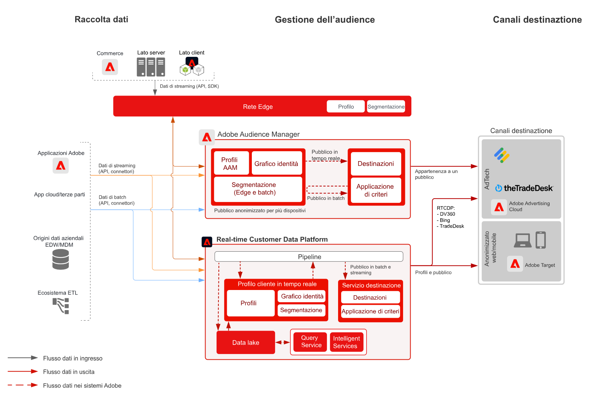

# Blueprint per attivazione del pubblico con dati anonimi

Puoi rivolgerti a un pubblico specifico su canali web e pubblicitari sulla base di dati anonimi e comportamentali dei clienti. Questa funzionalità consente di creare customer experience personalizzate e coerenti in tempo reale su tutti i dispositivi.

## Casi di utilizzo

* Eseguire la personalizzazione e il targeting di un pubblico digitale anonimo.
* Creare tipi di pubblico per il targeting su reti pubblicitarie supportate.

## Applicazioni

* Adobe Audience Manager

## Architettura

## Fasi di implementazione

<!-- These steps should link to help. -->

1. [Implementare Audience Manager](https://experienceleague.adobe.com/docs/audience-manager/user-guide/implementation-integration-guides/implement-audience-manager.html?lang=it#implementation-integration-guides).
1. Raccogliere i dati per Audience Manager.
1. Configurare i segnali e le caratteristiche da utilizzare nelle definizioni dei segmenti.
1. Creare i segmenti in Audience Manager.
1. Configurare le destinazioni in Audience Manager per condividere i tipi di pubblico.

## Documentazione correlata

* [Audience Manager](https://experienceleague.adobe.com/docs/audience-manager.html?lang=it)
* [Experience Cloud [!UICONTROL Audiences]](https://experienceleague.adobe.com/docs/core-services/interface/audiences/audience-library.html?lang=it)
* [Integrare Audience Manager con Target](https://experienceleague.adobe.com/docs/audience-manager/user-guide/implementation-integration-guides/integration-other-solutions/aam-target-integration.html?lang=it)
* [Condivisione dei segmenti Adobe Analytics tramite Audience Manager](https://experienceleague.adobe.com/docs/analytics/components/segmentation/segmentation-workflow/seg-publish.html?lang=it)
