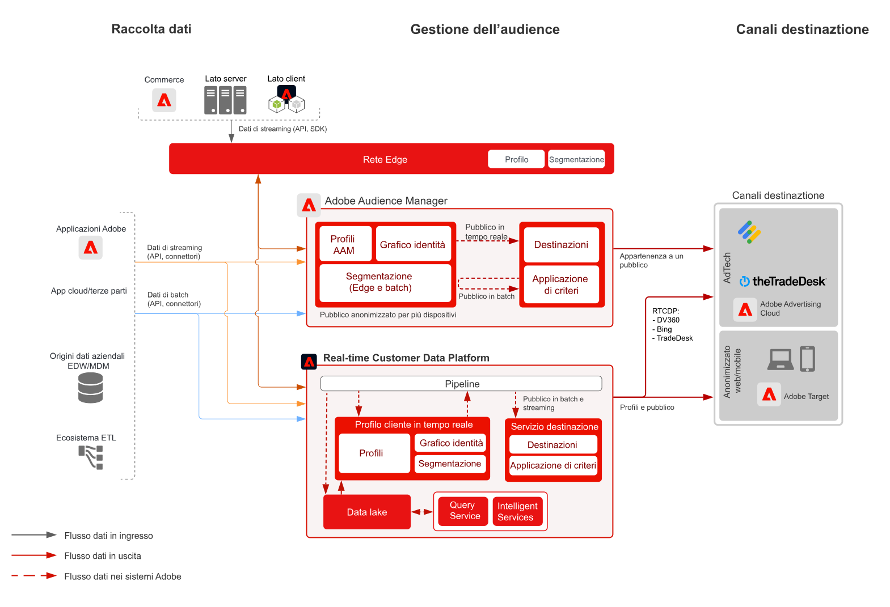

# blueprint Audience Manager

Per “attivazione del pubblico con dati anonimi” si intende la capacità di eseguire targeting e personalizzazione per un pubblico su siti web, app mobili e canali pubblicitari basato su dati anonimi relativi a dispositivo e comportamento.

## Casi di utilizzo

* Eseguire il targeting e la personalizzazione per un pubblico digitale anonimo su siti web, app mobili o canali pubblicitari supportati.
* Ottimizzare le esperienze di pagine di destinazione e pre-autenticazione in base a caratteristiche note relative a dispositivi e comportamento.
* Sfruttare la rete di dati di terze parti di Audience Manager per perfezionare ed estendere ulteriormente il pubblico a cui rivolgersi.

## Applicazioni

* Audience Manager
* Real-time Customer Data Platform

Per l’attivazione del pubblico con dati anonimi sul proprio sito e per destinazioni pubblicitarie, è possibile utilizzare sia Audience Manager che Real-time Customer Data Platform. Real-time Customer Data Platform supporta solo un sottoinsieme di destinazioni pubblicitarie con identificatori di dispositivo anonimi, elencate nella [documentazione sulle destinazioni](https://experienceleague.adobe.com/docs/experience-platform/destinations/catalog/advertising/overview.html?lang=it).

## Architettura

 

## Fasi di implementazione per Audience Manager

* Per informazioni dettagliate sull’implementazione di Audience Manager, consulta la [documentazione](https://experienceleague.adobe.com/docs/audience-manager/user-guide/implementation-integration-guides/implement-audience-manager.html?lang=it) seguente.

## Fasi di implementazione per Real-time Customer Data Platform

* Per informazioni sulle fasi di implementazione per Real-time Customer Data Platform, consulta la [documentazione](https://experienceleague.adobe.com/en/docs/experience-platform/rtcdp/home) seguente.