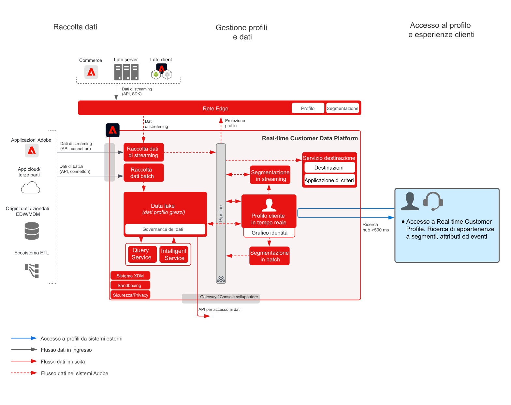

# Blueprint per hub delle attività dei clienti

Il blueprint per hub delle attività dei clienti mostra come le applicazioni esterne possono accedere a [!UICONTROL Real-time Customer Profile] di Adobe Experience Platform.

Le applicazioni esterne possono accedere ai profili mediante una richiesta GET tramite API. Gli attributi, gli eventi, le appartenenze ai segmenti e le funzioni basate sul modello memorizzati nel profilo possono quindi essere utilizzati anche in tali applicazioni esterne non Adobe.

Grazie a questa funzionalità, quando un cliente chiama il call center è possibile far emergere un contesto articolato. Gli operatori del supporto potrebbero, ad esempio, avere visibilità sul valore del ciclo di vita del cliente, sulla sua propensione all’abbandono o sulle campagne di marketing a cui è stato esposto. Gli agenti di vendita possono inoltre trarre vantaggio da un maggior contesto o da una migliore comprensione del cliente.

>[!NOTE]
>
>La latenza corrente supportata dall’API di ricerca profilo è di circa 500 millisecondi, che rende questo approccio inadatto per l’integrazione del profilo con motori di decisione in tempo reale, ad esempio per la personalizzazione web o mobile della pagina corrente.

## Casi di utilizzo

* Contesto del consumatore più approfondito, per le interazioni tramite operatore, come le esperienze di assistenza tecnica o commerciale. Utilizzando la ricerca del profilo in Experience Platform, gli agenti possono ricevere maggiori informazioni di contesto sul cliente, come acquisti recenti, interazioni con le campagne, tendenze, pubblico di appartenenza e altri attributi e informazioni che vengono memorizzati nel profilo del cliente in tempo reale.

## Architettura

## Guardrail

* [Guardrail per i dati di [!UICONTROL Real-time Customer Profile]](https://experienceleague.adobe.com/docs/experience-platform/profile/guardrails.html?lang=it)

## Fasi di implementazione

1. [Creare schemi](https://experienceleague.adobe.com/?recommended=ExperiencePlatform-D-1-2021.1.xdm) per i dati da acquisire.
1. [Creare set di dati](https://experienceleague.adobe.com/docs/platform-learn/tutorials/data-ingestion/create-datasets-and-ingest-data.html?lang=it) per i dati da acquisire.
1. [Configurare correttamente le identità e i relativi spazi dei nomi](https://experienceleague.adobe.com/docs/platform-learn/tutorials/identities/label-ingest-and-verify-identity-data.html?lang=it) nello schema, affinché i dati acquisiti possano essere uniti in un profilo unificato.
1. [Attivare lo schema e i set di dati per il profilo](https://experienceleague.adobe.com/docs/platform-learn/tutorials/profiles/bring-data-into-the-real-time-customer-profile.html?lang=it).
1. [Inserire i dati](https://experienceleague.adobe.com/?recommended=ExperiencePlatform-D-1-2020.1.dataingestion&amp;lang=it) in Experience Platform.
1. [Impostare le regole di unione](https://experienceleague.adobe.com/docs/platform-learn/tutorials/profiles/create-merge-policies.html?lang=it)
1. Utilizzare l’[API delle entità per cercare un attributo di profilo](https://experienceleague.adobe.com/docs/experience-platform/profile/api/entities.html?lang=it) dall’entità record o dall’entità dell’evento dell’esperienza

## Documentazione correlata

* [Descrizione del prodotto Adobe Experience Platform Activation](https://helpx.adobe.com/it/legal/product-descriptions/adobe-experience-platform0.html)
* Documentazione di [[!UICONTROL Real-time Customer Profile]](https://experienceleague.adobe.com/docs/experience-platform/profile/home.html?lang=it)
* [Guardrail per il profilo](https://experienceleague.adobe.com/docs/experience-platform/profile/guardrails.html)
* [API di ricerca profilo](https://www.adobe.io/apis/experienceplatform/home/api-reference.html)
