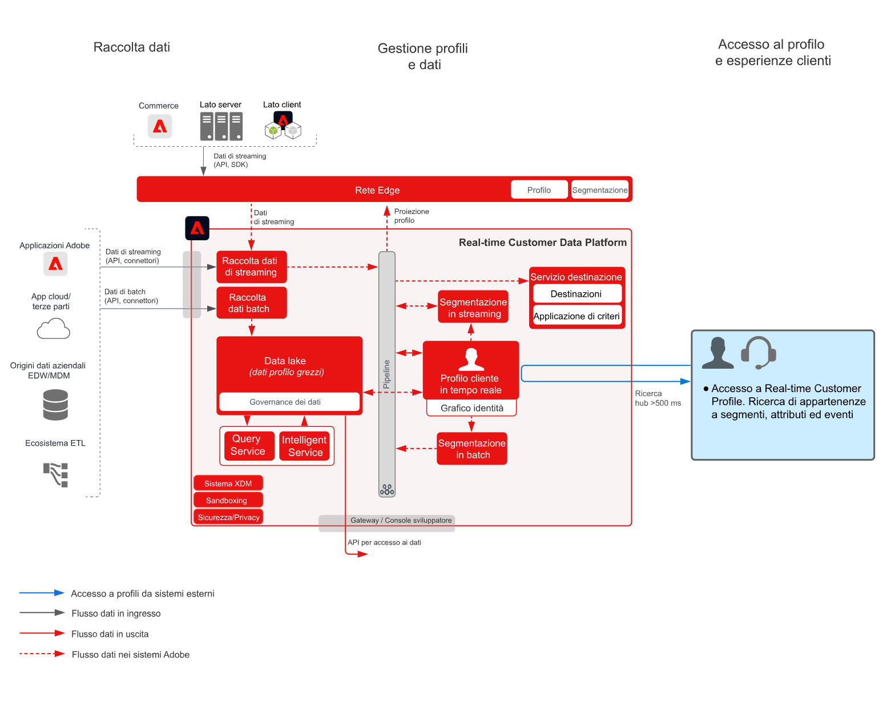

# Accesso al profilo in tempo reale per scenari di supporto e vendita

>[!TIP]
>Questo blueprint è disponibile anche come [modello di casi d&#39;uso](/help/blueprints/use-case-patterns/audience-building-activation/real-time-profile-lookup.md) in Creazione e attivazione pubblico.

Il blueprint Real-time Profile Access for Support and Sales Scenarios mostra come le applicazioni esterne possono accedere al [!UICONTROL Profilo cliente in tempo reale] di Adobe Experience Platform.

Le applicazioni esterne possono accedere ai profili mediante una richiesta GET tramite API. Gli attributi, gli eventi, le appartenenze ai segmenti e le funzioni basate sul modello memorizzati nel profilo possono quindi essere utilizzati anche in tali applicazioni esterne non Adobe.

Grazie a questa funzionalità, quando un cliente chiama il call center è possibile far emergere un contesto articolato. Gli operatori del supporto potrebbero, ad esempio, avere visibilità sul valore del ciclo di vita del cliente, sulla sua propensione all’abbandono o sulle campagne di marketing a cui è stato esposto. Gli agenti di vendita possono inoltre trarre vantaggio da un maggior contesto o da una migliore comprensione del cliente.

>[!NOTE]
>
>La ricerca del profilo nell’hub non è destinata a casi di utilizzo ad alta velocità effettiva e a bassa latenza, come la personalizzazione in entrata web/mobile. La ricerca del profilo nell’hub è destinata a scenari di latenza inferiore, ad esempio per il supporto assistito da agenti o per le interazioni di vendita. Per scenari a bassa latenza e a throughput elevato, come la personalizzazione web/mobile o il Offer Decisioning in tempo reale, è necessario sfruttare il profilo Edge. Il profilo Edge consente l&#39;accesso in tempo reale tramite [Connessione Personalization personalizzata](https://experienceleague.adobe.com/en/docs/experience-platform/destinations/catalog/personalization/custom-personalization) di Real-time Customer Data Platform.

## Casi di utilizzo

* Contesto del consumatore più approfondito, per le interazioni tramite operatore, come le esperienze di assistenza tecnica o commerciale. Utilizzando la ricerca del profilo in Experience Platform, gli agenti possono ricevere maggiori informazioni di contesto sul cliente, come acquisti recenti, interazioni con le campagne, tendenze, pubblico di appartenenza e altri attributi e informazioni che vengono memorizzati nel profilo del cliente in tempo reale.

## Architettura

## Guardrail

* [Guardrail per [!UICONTROL dati Profilo cliente in tempo reale]](https://experienceleague.adobe.com/docs/experience-platform/profile/guardrails.html?lang=it)

## Documentazione correlata

* [Descrizione del prodotto Adobe Experience Platform Activation](https://helpx.adobe.com/it/legal/product-descriptions/adobe-experience-platform0.html)
* [[!UICONTROL Documentazione del profilo cliente in tempo reale]](https://experienceleague.adobe.com/docs/experience-platform/profile/home.html?lang=it)
* [Guardrail del profilo](https://experienceleague.adobe.com/docs/experience-platform/profile/guardrails.html?lang=it)
* [API di ricerca profilo](https://www.adobe.io/apis/experienceplatform/home/api-reference.html)
