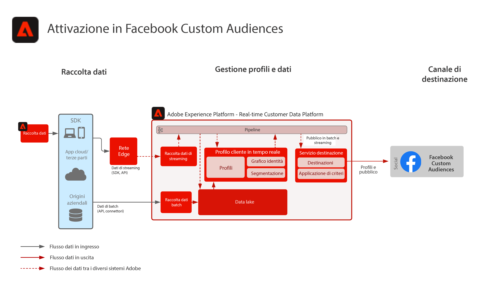

# Attivazione a tipi di pubblico personalizzati Facebook

Acquisisci i dati dei clienti da più sorgenti per creare una singola vista del profilo del cliente, segmenta questi profili a tipi di pubblico generati per il marketing e la personalizzazione, condividi questi tipi di pubblico in Social Ad Networks, come Facebook, per eseguire il targeting e la personalizzazione delle campagne rispetto a tali tipi di pubblico.

## Casi di utilizzo

* Targeting per tipi di pubblico noti su destinazioni social e pubblicitarie.
* Personalizzazione online con attributi online e offline.
Applicazioni
* Real-time Customer Data Platform

## Architettura

## Fasi di implementazione

1. Configura i namespace Identity da utilizzare nelle origini dati Profilo.
   * Utilizza i namespace predefiniti come E-mail, hash SHA256 e-mail, se disponibile.
   * Facebook dispone di un elenco di identità supportate. Per attivare i tipi di pubblico personalizzati di Facebook, una delle identità supportate deve essere presente nei profili da attivare.
   * Facebook supporta attualmente le seguenti identità: GAID, IDFA, phone_sha256, email_lc_sha256, extern_id.
   * Per ulteriori dettagli consulta la sezione [Guida alla destinazione di facebook](https://experienceleague.adobe.com/docs/experience-platform/destinations/catalog/social/facebook.html?lang=en).
   * Crea spazi dei nomi personalizzati in cui gli spazi dei nomi predefiniti non sono disponibili per le identità applicabili.
1. Configura gli schemi e i set di dati dell’origine dati del profilo.
   * Crea schemi di record del profilo per tutti i dati di origine dei record del profilo.
      * Specifica l&#39;identità principale e le identità secondarie per ogni schema.
      * Abilita lo schema per l’acquisizione del profilo.
   * Crea set di dati di record di profilo per tutti i dati di origine dei record di profilo, assegnando lo schema associato.
      * Abilita il set di dati per l’acquisizione del profilo.
   * Crea schemi evento esperienza profilo per tutti i dati sorgente basati su serie temporali del profilo.
      * Specifica l&#39;identità principale e le identità secondarie per lo schema.
   * Abilita lo schema per l’acquisizione del profilo.
   * Crea set di dati evento esperienza profilo per tutti i dati origine evento esperienza profilo, assegnando lo schema associato.
      * Abilita il set di dati per l’acquisizione del profilo.
1. Acquisisci i dati di origine utilizzando un connettore di origine nel set di dati associato configurato in precedenza.
   * Configura l’account del connettore di origine con le credenziali.
   * Configura un flusso di dati per acquisire i dati dal file di origine o dalla posizione della cartella in una pianificazione specifica al set di dati specificato.
   * Mappare tutti i campi dai dati di origine allo schema di destinazione.
   * Trasforma tutti i campi nel formato corretto per l’acquisizione in Experience Platform.
      * Trasformazioni delle date
      * Se appropriato, effettua la trasformazione in minuscolo, ad esempio l’indirizzo e-mail
      * Trasformazioni pattern (ad esempio numero telefonico)
      * Aggiungi ID di record univoci per i record degli eventi di esperienza se non presenti nei dati di origine.
      * Trasforma array e mappa campi di tipo per garantire la corretta mappatura e modellazione di array e mappe per la segmentazione in Experience Platform.
1. Configura i criteri di unione profili per garantire la corretta configurazione del grafico delle identità e quali set di dati devono essere inclusi nell’unione dei profili.
1. Dopo l’esecuzione dei flussi di dati, assicurati che l’inserimento dei dati del profilo sia andato a buon fine senza errori.
   * Inspect è il grafico delle identità di diversi profili per garantire la corretta elaborazione delle relazioni di identità.
   * Inspect gli attributi e gli eventi di diversi profili per garantire la corretta acquisizione di attributi ed eventi ai profili.
1. Creare segmenti per creare tipi di pubblico di profilo
   * Crea segmenti nel generatore di segmenti utilizzando regole per attributi ed eventi.
   * Salva il segmento per la valutazione. I segmenti vengono valutati in base alla pianificazione specificata una volta al giorno.
      * Se le regole del segmento sono idonee per la segmentazione in streaming, il segmento verrà valutato come nuovi dati di streaming vengono acquisiti per i profili. I segmenti in streaming verranno valutati anche una volta al giorno durante la segmentazione batch pianificata.
1. Assicurati che i risultati del segmento siano come previsto.
   * Esamina il conteggio dei risultati del segmento per i segmenti specificati.
   * Investiga il profilo che deve essere incluso nel segmento per verificare che l’appartenenza al segmento sia inclusa nella parte di appartenenza al segmento del profilo.
1. Configura la distribuzione del pubblico alla destinazione nella configurazione di Destinazione.
   * Consulta la sezione [Guida alla destinazione di facebook](https://experienceleague.adobe.com/docs/experience-platform/destinations/catalog/social/facebook.html?lang=en) per ulteriori dettagli sulla configurazione della destinazione Facebook.
   * Durante la configurazione di una destinazione, seleziona il pubblico da attivare nella destinazione.
   * Determina la data di inizio pianificata per cui desideri che il flusso di dati di destinazione inizi a consegnare il pubblico alla destinazione.
   * Ogni destinazione dispone degli attributi obbligatori e facoltativi che verranno inviati.
      * Per Facebook, una delle identità richieste deve essere inclusa e deve essere utilizzata per far corrispondere i profili nei tipi di pubblico di Experience Platform a un profilo di destinazione da Facebook.
   * Ogni destinazione dispone anche di un tipo di consegna specificato, in streaming o batch, in base a file o a payload JSON.
      * Per Facebook, le iscrizioni al pubblico vengono distribuite in streaming a un endpoint Facebook in formato JSON.
      * Le iscrizioni al pubblico verranno consegnate in modo in streaming dopo la valutazione dello streaming o della segmentazione in batch, ad Experience Platform.
1. Assicurati che il flusso di destinazione abbia consegnato il pubblico alla destinazione come previsto.
   * Controlla l’interfaccia di monitoraggio per confermare che il pubblico è stato consegnato con il numero di profili previsti. La dimensione del pubblico deve riflettere il numero previsto di profili attivati, osservando che una destinazione specifica come Facebook richiederà alcuni campi, come un’identità hash e-mail, e se non presente nel profilo membro del pubblico, non verrà attivata nella destinazione.
   * Controlla eventuali profili ignorati per le identità di profilo mancanti o gli attributi mancanti che erano obbligatori.
   * Controlla eventuali altri errori che potrebbero essere da risolvere.
1. Verifica che il pubblico sia stato attivato nella destinazione finale con il numero previsto di appartenenze al pubblico.
   * Accedi al portale Facebook Custom Audience per verificare che il pubblico da Real-time Customer Data Platform sia stato consegnato e che il tasso di corrispondenza dei profili nel pubblico in Facebook corrisponda ragionevolmente al numero di profili nel pubblico da Real-time Customer Data Platform.

## Guardrail

[Guardrail di profilo e segmentazione](https://experienceleague.adobe.com/docs/experience-platform/profile/guardrails.html?lang=it)

## Documentazione correlata

Attivazione a tipi di pubblico personalizzati Facebook - [Configurazione della destinazione](https://experienceleague.adobe.com/docs/experience-platform/destinations/catalog/social/facebook.html?lang=en)