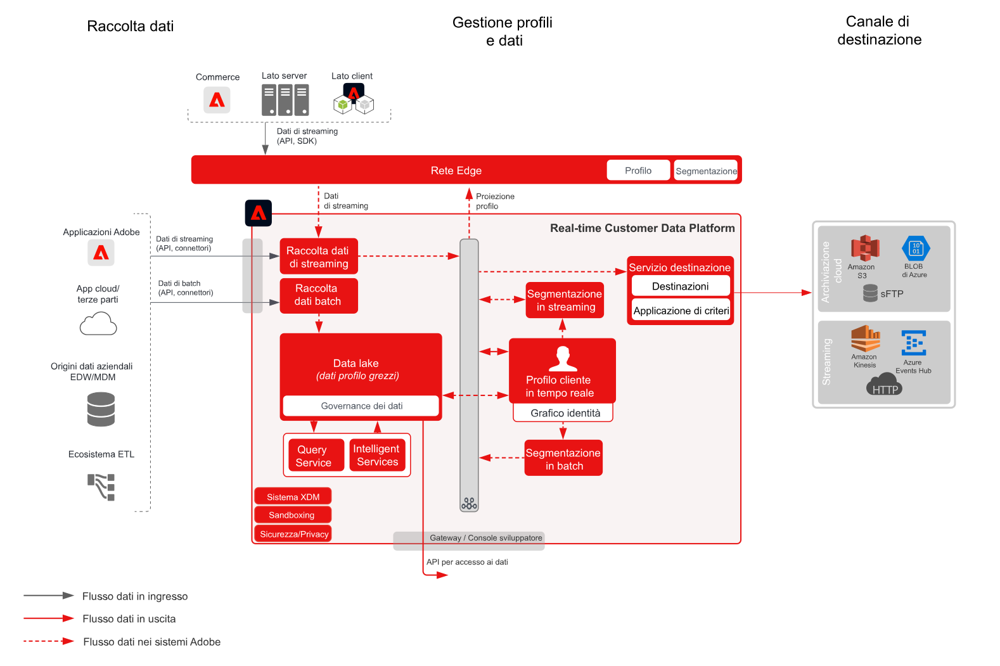

# Attivazione di tipi di pubblico e profili alla blueprint delle destinazioni Enterprise

Condividi modifiche ed eventi di profilo e pubblico in streaming o in batch da [!UICONTROL Real-time Customer Data Platform] agli archivi dati e alle applicazioni aziendali. Questi eventi di profilo e pubblico possono essere utilizzati per avviare un&#39;azione di vendita o supporto al cliente, ad esempio per dare seguito a un processo di applicazione abbandonato o a una registrazione di un webinar oppure per aggiornare le applicazioni aziendali con gli attributi e le informazioni più recenti del cliente da [!UICONTROL Real-time Customer Data Platform].

## Casi di utilizzo

* Attivazione di profili e pubblico su destinazioni di archiviazione cloud o di streaming per il tracciamento, l’archiviazione, l’analisi e l’attivazione di dati e informazioni sui clienti.

## Applicazioni

* Adobe Experience Platform Attivazione

## Architettura

## Guardrail

[Consulta le protezioni descritte nella pagina Panoramica sull’attivazione del pubblico e del profilo .](overview.md)

## Fasi di implementazione

1. [Creare ](https://experienceleague.adobe.com/docs/platform-learn/tutorials/schemas/create-a-schema.html) schemi per l’acquisizione dei dati.
1. [Crea ](https://experienceleague.adobe.com/docs/platform-learn/tutorials/data-ingestion/create-datasets-and-ingest-data.html) set di dati per i dati da acquisire.
1. [Configurare correttamente le identità e i relativi namespace nello schema, affinché i dati acquisiti possano essere uniti in un profilo unificato.](https://experienceleague.adobe.com/docs/platform-learn/tutorials/identities/label-ingest-and-verify-identity-data.html)
1. [Abilita gli schemi e i set di dati per il profilo](https://experienceleague.adobe.com/docs/platform-learn/tutorials/profiles/bring-data-into-the-real-time-customer-profile.html).
1. [Inserire i dati in Experience Platform](https://experienceleague.adobe.com/?recommended=ExperiencePlatform-D-1-2020.1.dataingestion)
1. [Abilitare la condivisione dei segmenti Real-time Customer Data Platform tra Experience Platform e Audience Manager per i tipi di pubblico definiti in Experience Platform da condividere con Audience Manager.](https://www.adobe.com/go/audiences)
1. [Crea ](https://experienceleague.adobe.com/docs/platform-learn/tutorials/segments/create-segments.html?lang=it) segmenti in Experience Platform. Il sistema determina automaticamente se un segmento deve essere valutato in batch o in streaming.
1. [Configurare le destinazioni per condividere gli attributi del profilo e delle appartenenze al pubblico con le destinazioni desiderate.](https://experienceleague.adobe.com/docs/platform-learn/tutorials/destinations/create-destinations-and-activate-data.html)

## Documentazione correlata

* [Documentazione sulle destinazioni](https://experienceleague.adobe.com/docs/experience-platform/destinations/catalog/overview.html?lang=it)
* [Panoramica delle destinazioni di archiviazione cloud](https://experienceleague.adobe.com/docs/experience-platform/destinations/catalog/cloud-storage/overview.html?lang=en#catalog)
* [Destinazione HTTP](https://experienceleague.adobe.com/docs/experience-platform/destinations/catalog/http-destination.html?lang=en#overview)
* [Descrizione del prodotto Real-time Customer Data Platform](https://helpx.adobe.com/it/legal/product-descriptions/real-time-customer-data-platform.html)
* [Linee guida per profili e segmentazione](https://experienceleague.adobe.com/docs/experience-platform/profile/guardrails.html?lang=it)
* [Documentazione sulla segmentazione](https://experienceleague.adobe.com/docs/experience-platform/segmentation/api/streaming-segmentation.html?lang=it)

## Video e tutorial correlati

* [Panoramica di Real-time Customer Data Platform](https://experienceleague.adobe.com/docs/platform-learn/tutorials/application-services/rtcdp/understanding-the-real-time-customer-data-platform.html?lang=it)
* [[!UICONTROL Demo di Real-time Customer Data Platform]](https://experienceleague.adobe.com/docs/platform-learn/tutorials/application-services/rtcdp/demo.html?lang=it)
* [Creare segmenti](https://experienceleague.adobe.com/docs/platform-learn/tutorials/segments/create-segments.html)
