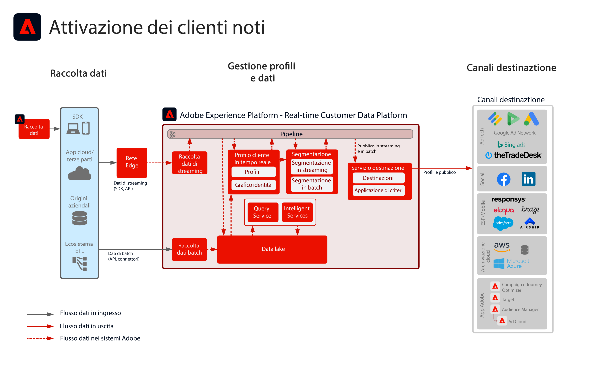

# Attivazione dei tipi di pubblico e profili verso destinazioni aziendali

>[!TIP]
>Questo blueprint è disponibile anche come [modello di casi d&#39;uso](/help/blueprints/use-case-patterns/audience-building-activation/audience-activation-to-destinations.md) in Creazione e attivazione pubblico.

Condividi eventi e modifiche di profili e pubblico in streaming o in batch da [!UICONTROL Real-time Customer Data Platform] con archivi dati e applicazioni aziendali. Gli eventi di profilo e pubblico possono essere utilizzati per avviare un’azione di vendita o supporto al cliente, ad esempio per dare seguito all’abbandono di un processo di iscrizione o di registrazione a un webinar, oppure per aggiornare le applicazioni aziendali con gli attributi e le informazioni più recenti del cliente da [!UICONTROL Real-time Customer Data Platform].

## Casi di utilizzo

* Attivazione di profili e pubblico per destinazioni di archiviazione cloud o di streaming per il tracciamento, l’archiviazione, l’analisi e l’attivazione di dati e informazioni sui clienti.

## Applicazioni

* Real-time Customer Data Platform

## Architettura

## Documentazione correlata

Ulteriori dettagli sulla configurazione dell&#39;archiviazione cloud e delle destinazioni Enterprise sono disponibili nella [documentazione sulle destinazioni](https://experienceleague.adobe.com/en/docs/experience-platform/destinations/catalog/cloud-storage/overview).

## Guardrail

[Consulta i guardrail come descritto nella pagina guardrail.](../experience-platform/guardrails.md)