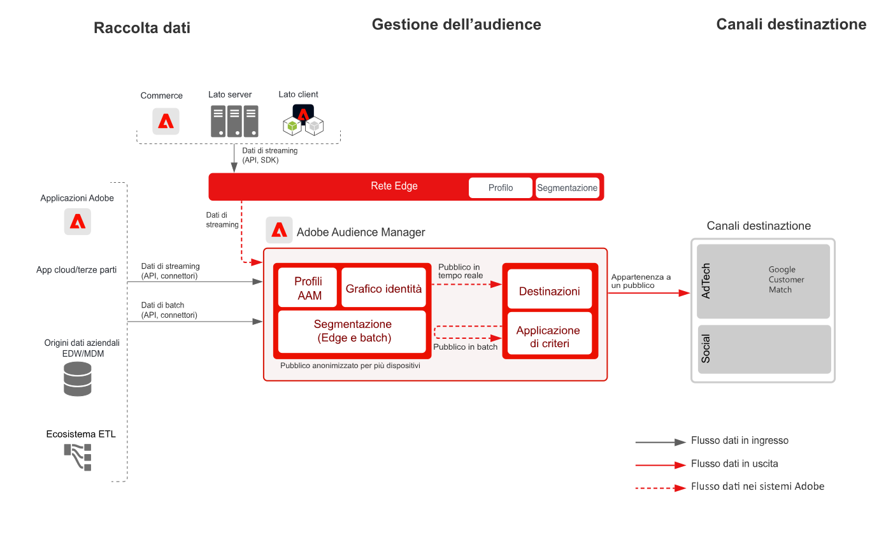

# Blueprint per l’attivazione di clienti noti

Per il targeting e la personalizzazione online, utilizza attributi ed eventi offline come dati da ordini, transazioni, sistemi CRM o programma fedeltà, insieme a dati sul comportamento online.

L’espansione degli identificatori con controlli di governance integrati offre maggiori opportunità di comunicare con clienti noti. Attiva specifici tipi di pubblico in base a destinazioni note basate sul profilo, come provider di posta elettronica, social network e destinazioni pubblicitarie.

Ulteriori dettagli relativi alle integrazioni tra Experience Platform e le applicazioni Experience Cloud sono disponibili nel [blueprint per l’attivazione in base a pubblico e profili con le applicazioni Experience Cloud](platform-and-applications.md).

## Casi di utilizzo

* Targeting per tipi di pubblico noti su destinazioni social e pubblicitarie.
* Personalizzazione online con attributi online e offline.
* Attivazione del pubblico su canali noti, come e-mail e SMS.

## Applicazioni

* [!UICONTROL Real-time Customer Data Platform]
* È possibile sfruttare le destinazioni Audience Manager basate su persone anche per l’attivazione basata su persone in Facebook, LinkedIn e Google Customer Match.

## Architettura

### Attivazione di clienti noti tramite Real-time Customer Data Platform

 

### Attivazione di clienti noti tramite destinazioni Audience Manager basate su persone

 

## Guardrail

[Fai riferimento ai guardrail come indicato nella panoramica Attivazione in base a pubblico e profili](https://experienceleague.adobe.com/docs/blueprints-learn/architecture/audience-activation/overview.html?lang=it#guardrails-for-audience-and-profile-activation-blueprints).

## Fasi di implementazione per Real-time Customer Data Platform

1. [Creare schemi](https://experienceleague.adobe.com/?recommended=ExperiencePlatform-D-1-2021.1.xdm&amp;lang=it) per i dati da acquisire.
1. [Creare set di dati](https://experienceleague.adobe.com/docs/platform-learn/tutorials/data-ingestion/create-datasets-and-ingest-data.html?lang=it) per i dati da acquisire.
1. [Configurare correttamente le identità e i relativi spazi dei nomi](https://experienceleague.adobe.com/docs/platform-learn/tutorials/identities/label-ingest-and-verify-identity-data.html?lang=it) nello schema, affinché i dati acquisiti possano essere uniti in un profilo unificato.
1. [Attivare lo schema e i set di dati per il profilo](https://experienceleague.adobe.com/docs/platform-learn/tutorials/profiles/bring-data-into-the-real-time-customer-profile.html?lang=it).
1. [Inserire i dati](https://experienceleague.adobe.com/?recommended=ExperiencePlatform-D-1-2020.1.dataingestion&amp;lang=it) in Experience Platform.
1. [Abilitare la condivisione dei segmenti [!UICONTROL Real-time Customer Data Platform]](https://www.adobe.com/go/audiences) tra Experience Platform e Audience Manager per i tipi di pubblico definiti in Experience Platform da condividere con Audience Manager.
1. [Creare segmenti](https://experienceleague.adobe.com/docs/platform-learn/tutorials/segments/create-segments.html?lang=it) in Experience Platform. Il sistema determina automaticamente se un segmento deve essere valutato in batch o in streaming.
1. [Configurare le destinazioni](https://experienceleague.adobe.com/docs/platform-learn/tutorials/destinations/create-destinations-and-activate-data.html?lang=it) per condividere gli attributi del profilo e delle appartenenze al pubblico con le destinazioni desiderate.

## Considerazioni sull’implementazione

* Per condividere i dati del profilo con le destinazioni, è necessario includere il valore di identità specifico utilizzato dalla destinazione nel payload. Tutte le identità necessarie per una destinazione target devono essere inserite in Platform e configurate come identità per il [!UICONTROL profilo cliente in tempo reale].

* Consulta la sezione [Blueprint per l’attivazione in base a pubblico e profili con le applicazioni Experience Cloud](platform-and-applications.md) per ulteriori dettagli sulla condivisione di tipi di pubblico da Real-time Customer Data Platform ad Audience Manager, Analytics, Target, Campaign e Journey Optimizer.

## Fasi di implementazione per le destinazioni basate su persone di Audience Manager

* Per informazioni dettagliate sull’implementazione di Audience Manager, consulta la [documentazione](https://experienceleague.adobe.com/docs/audience-manager/user-guide/implementation-integration-guides/implement-audience-manager.html?lang=it) seguente.

* Per informazioni dettagliate sull’implementazione di destinazioni basate di persone in Audience Manager, consulta la [documentazione](https://experienceleague.adobe.com/docs/audience-manager/user-guide/faqs/faq-people-based-destinations.html?lang=it) seguente.

## Documentazione correlata

* Descrizione del prodotto [[!UICONTROL Real-time Customer Data Platform]](https://helpx.adobe.com/it/legal/product-descriptions/real-time-customer-data-platform.html)
* [Linee guida per profili e segmentazione](https://experienceleague.adobe.com/docs/experience-platform/profile/guardrails.html?lang=it)
* [Documentazione sulla segmentazione](https://experienceleague.adobe.com/docs/experience-platform/segmentation/api/streaming-segmentation.html?lang=it)
* [Documentazione sulle destinazioni](https://experienceleague.adobe.com/docs/experience-platform/destinations/catalog/overview.html?lang=it)

## Video e tutorial correlati

* Panoramica di [[!UICONTROL Real-time Customer Data Platform]](https://experienceleague.adobe.com/docs/platform-learn/tutorials/application-services/rtcdp/understanding-the-real-time-customer-data-platform.html?lang=it)
* [Demo di [!UICONTROL Real-time Customer Data Platform]](https://experienceleague.adobe.com/docs/platform-learn/tutorials/application-services/rtcdp/demo.html?lang=it)
* [Creare segmenti](https://experienceleague.adobe.com/docs/platform-learn/tutorials/segments/create-segments.html?lang=it)
