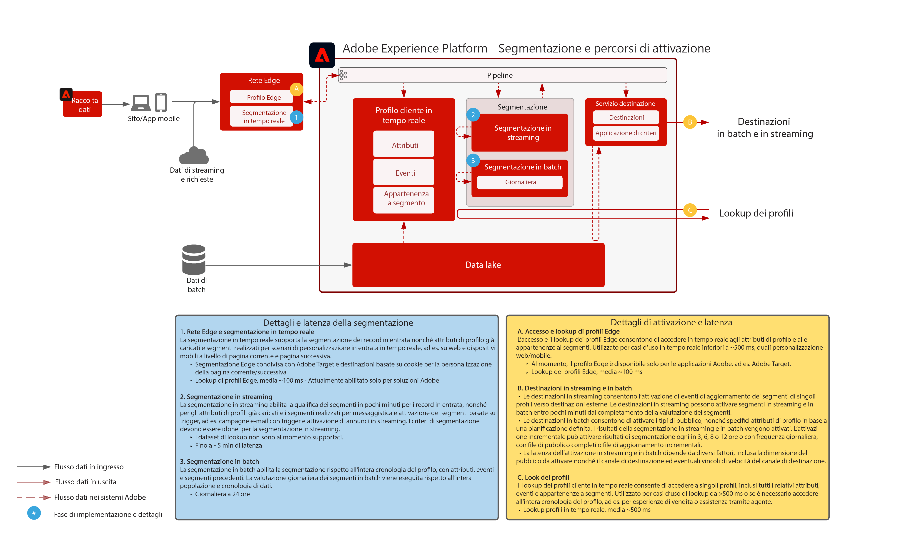

# Attivazione in base a pubblico e profili

L’attivazione in base a pubblico e profili è la chiave del successo nel mondo del data-driven marketing. Tuttavia, molti brand continuano a concentrarsi sull’attivazione in base al canale, che spesso risulta in incoerenza a livello di portata e personalizzazione.

Con l’approccio di priorità al canale, ogni canale funziona come un comparto stagno in cui le attività di personalizzazione si rivolgono solo ai clienti che interagiscono con il brand su quel determinato canale. È una modalità che non riflette la realtà: i clienti infatti interagiscono con i brand tramite diversi punti di contatto. L’attivazione in base a pubblico e profili consente di collegare le interazioni del cliente attraverso più canali, per ottenere dati di pubblico e profili centralizzati che possono essere attivati su tutti i canali.

| Blueprint | Descrizione | Applicazioni Experience Cloud |
|---|---|---|
| **[Attivazione del pubblico con dati anonimi](anonymous.md)** | <ul><li>Rivolgiti a un pubblico attraverso i vari canali web e pubblicitari sulla base di dati anonimi e comportamentali dei clienti.</li><li>Per una maggiore personalizzazione, puoi integrarli con dati sul pubblico di terze parti.</li></ul> | <ul><li>Adobe Audience Manager</li></ul> |
| **[Attivazione dei clienti noti](known.md)** | <ul><li>Attiva specifici tipi di pubblico in base a destinazioni note basate sul profilo, come provider di posta elettronica, social network e destinazioni pubblicitarie. </li><li>Per il targeting e la personalizzazione online, utilizza attributi ed eventi offline come dati da ordini, transazioni, sistemi CRM o programma fedeltà, insieme a dati sul comportamento online.</li></ul> | <ul><li>Adobe Experience Platform</li><li> [!UICONTROL Real-time Customer Data Platform]</li><li>Adobe Audience Manager (opzionale)</li></ul> |
| **[Attivazione in base a pubblico e profili con le applicazioni Experience Cloud](platform-and-applications.md)** | <ul><li>Gestisci profili e pubblico in Experience Platform e condividili con le applicazioni Experience Cloud.</li><li>Crea e condividi segmenti e approfondimenti sui clienti in Experience Platform, e condividili con le applicazioni Experience Cloud.</li></ul> | <ul><li>Adobe Experience Platform</li><li>[!UICONTROL Real-time Customer Data Platform]</li><li>Experience Platform Activation</li><li>Applicazioni Experience Cloud</li></ul> |
| **[Servizio Segment Match](segment-match.md)** | <ul><li>Grazie a migliori sistemi per la gestione della governance, delle autorizzazioni e delle preferenze, gli esperti di marketing possono ottimizzare ulteriormente il pubblico autenticato di prime parti con partner chiave.</li></ul> | <ul><li>Adobe Experience Platform </li></ul> |

## Architettura di Real-time Customer Profile

L’illustrazione seguente illustra i componenti core di Real-time Customer Profile di Experience Platform.

Prima di tutto, le origini dati vengono acquisite in Experience Platform. Se l’origine dati è configurata per l’elaborazione del profilo, viene inserita in Real-time Customer Profile. Viene creato un singolo frammento o documento di profilo per ogni origine dati e ogni record di ID principale configurato per origine dati. Inoltre, quando i dati vengono acquisiti nel profilo, vengono elaborati anche dal servizio di identità. Ogni record dalle origini dati per il quale esistono più identità contrassegnate nello schema e i cui valori sono compilati nel record, verrà elaborato come relazione di identità all’interno del servizio di identità.

I record a cui è associata una sola identità non vengono elaborati dal servizio di identità, in quanto non dispongono di ulteriori collegamenti di identità da inserire nel grafico. Inoltre, il servizio di identità non distingue le identità primarie da quelle secondarie. Vengono semplicemente elaborate le relazioni tra le diverse identità.

L’unione di frammenti di profilo si verifica quando il grafico delle identità fornisce le relazioni tra i vari frammenti di profilo sorgente che sono stati correlati. Il criterio di unione determina quali frammenti di origine e quale grafico di identità utilizzare al momento dell’unione dei frammenti. Ogni volta che si accede al profilo, viene eseguita l’unione dei frammenti di profilo affinché la visualizzazione combinata del profilo sia sempre aggiornata. Le regole di governance e policy garantiscono che solo i segmenti e gli attributi autorizzati possano essere attivati nelle destinazioni specificate.

## Panoramica sulla segmentazione e sulle destinazioni

L’illustrazione seguente descrive i vari metodi di segmentazione e pattern di attivazione di profili e pubblico.

## Guardrail per i blueprint Attivazione in base a pubblico e profili

* [Linee guida per profili e segmentazione](https://experienceleague.adobe.com/docs/experience-platform/profile/guardrails.html?lang=it)

### Attivazione di attributi e identità

* [!UICONTROL Real-time Customer Data Platform] può attivare l’appartenenza a un pubblico e le modifiche di attributi e identità che si verificano per i profili che rientrano nei segmenti selezionati per l’attivazione. Se l’obiettivo è quello di attivare attributi o identità, devi definire un segmento globale che includa tutti i profili a cui vengono inviati gli aggiornamenti di attributi e identità. A questo punto, puoi selezionare il segmento e gli attributi desiderati da attivare come parte della configurazione della destinazione.
* Tieni presente che le destinazioni batch non supportano l’attivazione di eventi di modifica dei soli attributi. È possibile inviare dati completi o incrementali di appartenenza a un pubblico insieme agli attributi selezionati per l’attivazione.

### Attivazione di segmenti batch nelle destinazioni streaming

* È supportata l’attivazione dei segmenti in batch per le destinazioni streaming. Quando l’idoneità dei profili per l’appartenenza al pubblico viene valutata da processi di segmenti in batch, tali informazioni possono essere attivate in streaming.

### Attivazione di segmenti in streaming per destinazioni batch

* È supportata l’attivazione dei segmenti in streaming verso destinazioni batch. In base alla pianificazione della destinazione batch vengono esportate le appartenenze ai segmenti di profilo. Sono incluse le appartenenze ai segmenti determinate tramite sia i metodi di streaming che i metodi batch.

### Attivazione di eventi di esperienza

* L’attivazione di eventi di esperienza non elaborati non è supportata. Per l’attivazione in base agli eventi di esperienza, è necessario creare segmenti con le regole necessarie per includere o escludere la logica dell’evento di esperienza. Si crea così un segmento definito rispetto agli eventi di esperienza e l’appartenenza a tale può essere attivata come proxy per l’attivazione di eventi di esperienza non elaborati. Considera anche l’utilizzo di [!UICONTROL Launch Server Side] per attivare eventi di esperienza non elaborati raccolti tramite SDK.

## Articoli di blog correlati

* [[!DNL Blueprints for Audience Activation in Adobe Experience Platform]](https://medium.com/adobetech/a-blueprint-for-audience-activation-in-adobe-experience-platform-b2b30fae90fd)
* [[!DNL Adobe Experience Platform Web SDK for Audience Management]](https://medium.com/adobetech/adobe-experience-platform-web-sdk-for-audience-management-751fa6d063bc)
