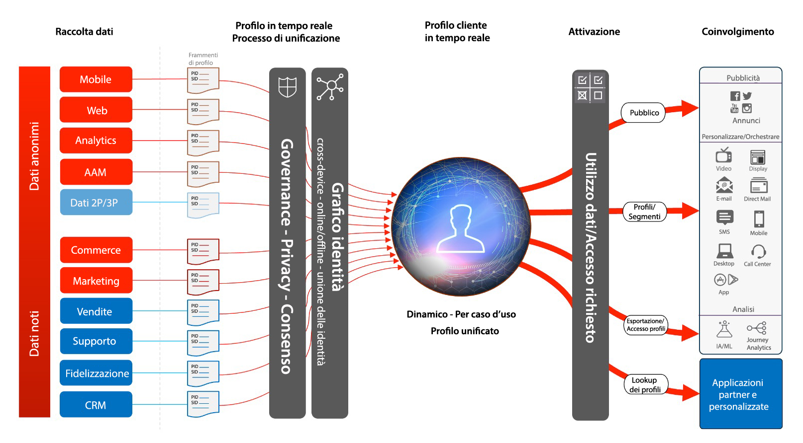

# Blueprint per l’attivazione in base a pubblico e profili

L’attivazione di profili e pubblico è fondamentale per il successo nel mondo del data-driven marketing. Tuttavia, molti brand continuano a concentrarsi sull’attivazione in base al canale, che spesso risulta in incoerenza a livello di portata e personalizzazione.

Con l’approccio di priorità al canale, ogni canale funziona come un comparto stagno in cui le attività di personalizzazione si rivolgono solo ai clienti che interagiscono con il brand su quel determinato canale. È una modalità che non riflette la realtà: i clienti infatti interagiscono con i brand tramite diversi punti di contatto. L’attivazione in base a pubblico e profili consente di collegare le interazioni del cliente attraverso più canali, per ottenere dati di pubblico e profili centralizzati che possono essere attivati su tutti i canali.

Blueprint in Audience e Profile Activation

- [Attivazione del pubblico con dati anonimi ](/help/blueprints/audience-activation/anonymous.md)
- Attivazione cliente nota (RTCDP)
   - [Panoramica](/help/blueprints/audience-activation/known.md)
   - [Attivazione a canali social e pubblicitari](/help/blueprints/audience-activation/advertising-activation.md)
   - [Attivazione per destinazioni di streaming aziendali e su file](/help/blueprints/audience-activation/enterprise-destinations.md)
   - [Hub attività cliente](/help/blueprints/audience-activation/customer-activity.md)
   - [Corrispondenza segmento](/help/blueprints/audience-activation/segment-match.md)
   - [Attivazione con applicazioni Experience Cloud](/help/blueprints/audience-activation/platform-and-applications.md)

## Architettura del profilo cliente in tempo reale

L’illustrazione seguente illustra i componenti core del profilo cliente in tempo reale di Experience Platform.

Per ulteriore documentazione relativa a profilo, segmentazione e attivazione consulta la sezione [Documentazione di panoramica di RTCDP](https://experienceleague.adobe.com/en/docs/experience-platform/rtcdp/home) e [Panoramica del profilo cliente in tempo reale](https://experienceleague.adobe.com/en/docs/experience-platform/profile/home) pagine.

## Guardrail per i blueprint Attivazione in base a pubblico e profili

* Per informazioni dettagliate sui guardrail e le latenze end-to-end, consulta il [documento sui guardrail relativi all’implementazione](../experience-platform/deployment/guardrails.md) e i [guardrail per profili e segmentazione](https://experienceleague.adobe.com/docs/experience-platform/profile/guardrails.html?lang=it)