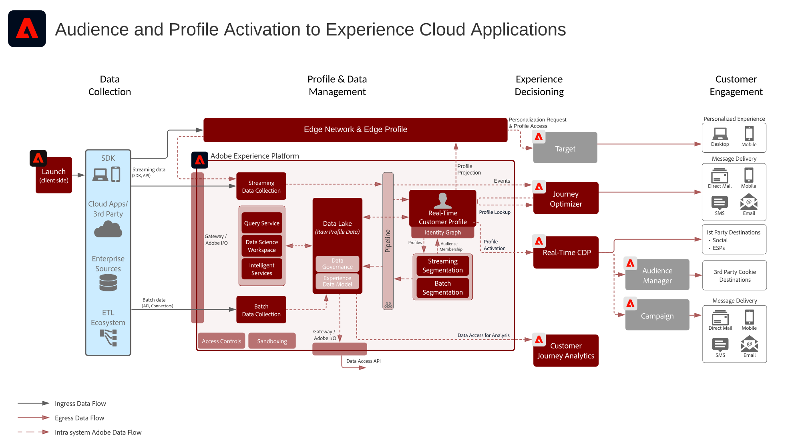

# Attivazione di tipi di pubblico e profili con Blueprint delle applicazioni Experience Cloud

Gestisci profili e tipi di pubblico in Experience Platform e condividerli con Experience Cloud Applications. Crea e condividi segmenti e approfondimenti di clienti avanzati in Experience Platform e condividi tali informazioni con le applicazioni Experience Cloud.

L&#39;attivazione con le applicazioni Experience Cloud è in linea con la [blueprint di Audience Activation online/offline](online-offline.md). Ulteriori dettagli sono forniti in questo modello specifico per le integrazioni tra le applicazioni Experience Platform e Experience Cloud.

## Casi di utilizzo

* Personalizzazione e targeting tra i canali di interazione del cliente basati su Experience Cloud.
* Condivisione di dati di pubblico e profilo con Experience Platform da e verso applicazioni Experience Cloud.

## Applicazioni

* Adobe Experience Platform
* [!UICONTROL Real-time Customer Data Platform]
* Attivazione Experience Platform
* Applicazioni Experience Cloud
   * Audience Manager
   * Target
   * Campaign
   * Journey Optimizer

## Architettura

### Attivazione di pubblico e profilo con applicazioni Experience Cloud

Consulta il [diagramma Adobe Experience Platform &amp; Applications](https://experienceleague.adobe.com/docs/blueprints-learn/architecture/architecture-overview/platform-applications.html) per un diagramma di architettura aggiuntivo relativo ad Experience Platform e alle sue integrazioni con le applicazioni Experience Cloud.

## Guardrail

Consulta le [protezioni nella pagina Panoramica sull&#39;attivazione del pubblico e del profilo](overview.md)

## Documentazione correlata

* [Descrizione del prodotto Real-time Customer Data Platform](https://helpx.adobe.com/it/legal/product-descriptions/real-time-customer-data-platform.html)
* [Linee guida per profili e segmentazione](https://experienceleague.adobe.com/docs/experience-platform/profile/guardrails.html?lang=it)
* [Documentazione sulla segmentazione](https://experienceleague.adobe.com/docs/experience-platform/segmentation/api/streaming-segmentation.html?lang=it)
* [Documentazione sulle destinazioni](https://experienceleague.adobe.com/docs/experience-platform/destinations/catalog/overview.html?lang=it)

## Video e tutorial correlati

* [Panoramica di Real-time Customer Data Platform](https://experienceleague.adobe.com/docs/platform-learn/tutorials/application-services/rtcdp/understanding-the-real-time-customer-data-platform.html?lang=it)
* [[!UICONTROL Demo di Real-time Customer Data Platform]](https://experienceleague.adobe.com/docs/platform-learn/tutorials/application-services/rtcdp/demo.html?lang=it)
* [Creare segmenti](https://experienceleague.adobe.com/docs/platform-learn/tutorials/segments/create-segments.html?lang=it)
