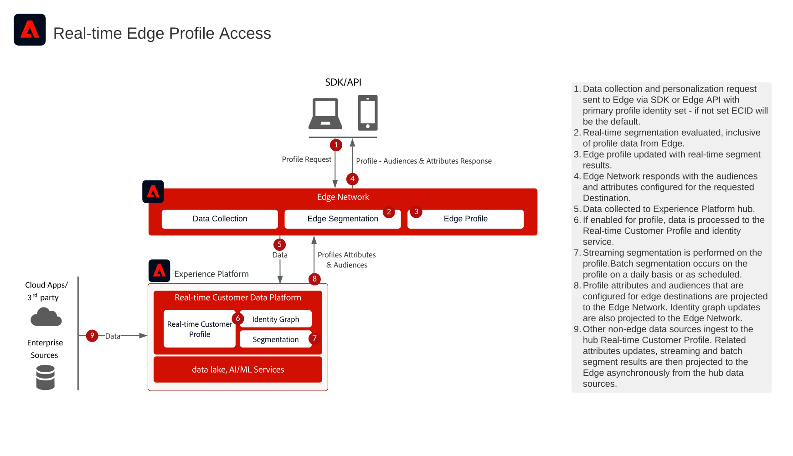

# Accesso in tempo reale al profilo Edge per Personalization web e mobile

>[!TIP]
>Questo blueprint è disponibile anche come [caso d&#39;uso](/help/blueprints/use-case-patterns/personalization/edge-profile-access.md) in Personalization.

Il blueprint Real-time Edge Profile Access for Web and Mobile Personalization mostra come le applicazioni web e mobili possono accedere al [!UICONTROL Profilo cliente in tempo reale] di Adobe Experience Platform alla periferia per una personalizzazione ad alta velocità e bassa latenza.

Le applicazioni possono accedere agli attributi del profilo in tempo reale e ai tipi di pubblico periferici con latenza di millisecondi. Gli attributi, le appartenenze al pubblico e le funzioni basate su modelli memorizzati nel profilo come attributi sono accessibili in tempo reale per la personalizzazione della stessa pagina e della pagina successiva su canali web e mobili.

Con questa funzionalità, puoi fornire esperienze altamente personalizzate sui tuoi siti web e applicazioni mobili basate sul Profilo cliente in tempo reale, inclusi tipi di pubblico derivati da comportamenti in tempo reale, attributi acquisiti nel Profilo cliente in tempo reale e informazioni calcolate.

>[!NOTE]
>
>L’accesso al profilo di Edge è progettato specificamente per casi di utilizzo ad alta velocità effettiva e a bassa latenza, come la personalizzazione in entrata web/mobile e il Offer Decisioning in tempo reale. Per scenari di throughput inferiore, come il supporto assistito da agente o le interazioni di vendita, l’API di ricerca del profilo Hub è più appropriata. Per l&#39;accesso al profilo basato su hub, vedere il blueprint [Real-time Profile Access for Support and Sales Scenarios](customer-activity.md).

## Applicazioni

* Real-time Customer Data Platform
* Raccolta dati di Adobe Experience Platform (Web SDK / Mobile SDK)
* API server di Edge Network

## Casi di utilizzo

* Personalizzazione in tempo reale su canali web e mobili per esperienze cliente note
* Personalizzazione della stessa pagina e della pagina successiva basata su attributi di profilo e pubblico in tempo reale
* Personalizzazione dei contenuti e delle offerte basata sui profili dei clienti, inclusi dati comportamentali in tempo reale, attributi e informazioni calcolate
* Integrazione con motori di personalizzazione, sistemi di gestione dei contenuti e applicazioni esterne per decisioni in tempo reale
* Test e ottimizzazione dei contenuti con contesto di profilo in tempo reale

## Diagramma architettura

## Guardrail

* [Guardrail per [!UICONTROL dati Profilo cliente in tempo reale]](https://experienceleague.adobe.com/docs/experience-platform/profile/guardrails.html?lang=it)
* [Guardrail di Edge Network](https://experienceleague.adobe.com/docs/experience-platform/edge-network-server-api/guardrails.html)
* I profili Edge hanno un TTL (time-to-live) di 14 giorni. Se un utente non è attivo sul server Edge per 14 giorni, il profilo Edge potrebbe scadere e richiedere il recupero dall’hub, il che potrebbe influire sulla personalizzazione della prima pagina.
* La funzione di personalizzazione di Edge supporta la valutazione in tempo reale dell’iscrizione al pubblico per i tipi di pubblico che soddisfano i criteri di segmentazione Edge. I tipi di pubblico in batch e in streaming dall’hub sono disponibili anche al limite con la configurazione appropriata.

## Documentazione correlata

### Configurazioni di destinazione

* [Connessione Personalization personalizzata](https://experienceleague.adobe.com/en/docs/experience-platform/destinations/catalog/personalization/custom-personalization) - Guida all&#39;implementazione primaria
* [Panoramica sulle destinazioni di Personalization](https://experienceleague.adobe.com/en/docs/experience-platform/destinations/catalog/personalization/overview)
* [Attivare i tipi di pubblico per Edge Personalization Destinations](https://experienceleague.adobe.com/en/docs/experience-platform/destinations/ui/activate/activate-edge-personalization-destinations)
* [Cercare in tempo reale gli attributi del profilo sul bordo](https://experienceleague.adobe.com/en/docs/experience-platform/destinations/ui/activate/activate-edge-profile-lookup)

### Documentazione di SDK

* [Documentazione di Experience Platform Web SDK](https://experienceleague.adobe.com/docs/experience-platform/web-sdk/home.html)
* [Documentazione di Experience Platform Mobile SDK](https://developer.adobe.com/client-sdks/home/)
* [Documentazione API del server Edge Network](https://experienceleague.adobe.com/docs/experience-platform/edge-network-server-api/overview.html?lang=it)
* [Documentazione sui tag di Experience Platform](https://experienceleague.adobe.com/docs/experience-platform/tags/home.html?lang=it)
* [Risposte ai comandi in Web SDK](https://experienceleague.adobe.com/docs/experience-platform/web-sdk/commands/command-responses.html)

### Documentazione su profilo e segmentazione

* [[!UICONTROL Documentazione del profilo cliente in tempo reale]](https://experienceleague.adobe.com/docs/experience-platform/profile/home.html)
* [Guardrail del profilo](https://experienceleague.adobe.com/docs/experience-platform/profile/guardrails.html?lang=it)

### Tutorial

* [Personalizzazione dell’hit successivo con Real-Time CDP e Adobe Target](https://experienceleague.adobe.com/docs/platform-learn/tutorials/experience-cloud/next-hit-personalization.html)
* [Configurazione dello stream di dati](https://experienceleague.adobe.com/docs/experience-platform/datastreams/configure.html?lang=it)
