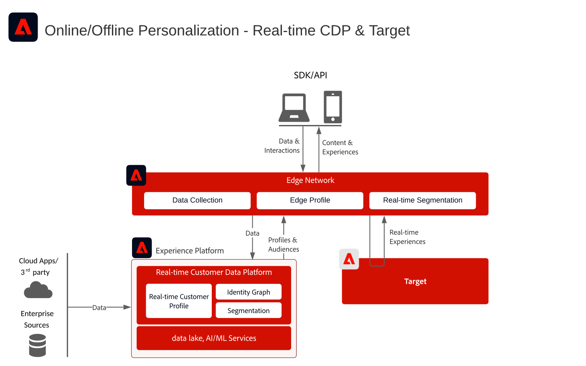
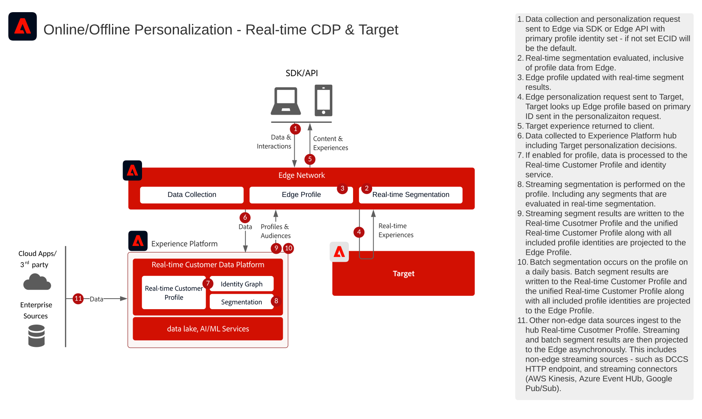
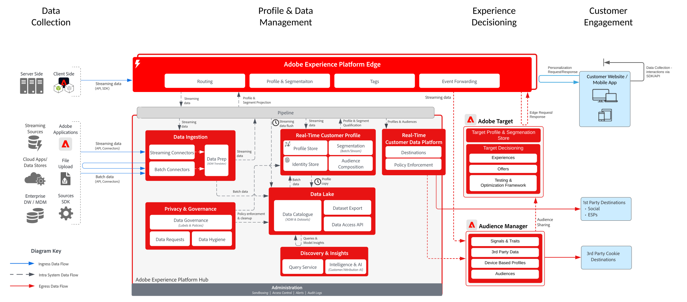

# Customer Personalization noto con Target

>[!TIP]
>Questo blueprint è disponibile anche come [caso d&#39;uso](/help/blueprints/use-case-patterns/personalization/audience-sharing-with-target.md) in Personalization.

## Casi di utilizzo

* Personalizzazione online con dati dei clienti noti
* Ottimizzazione della pagina di destinazione
* Personalizzazione basata su precedenti visualizzazioni di prodotti/contenuti, affinità di prodotti/contenuti, attributi ambientali e dati demografici, nonché dati offline quali dati da transazioni, dal programma fedeltà e dal sistema CRM, e dati modellati
* Condividere e indirizzare i tipi di pubblico definiti in Real-time Customer Data Platform su siti web e app mobili tramite Adobe Target

## Applicazioni

* [!UICONTROL Real-time Customer Data Platform]
* Adobe Target

### Documentazione di riferimento

* [Connessione Adobe Target per Real-time Customer Data Platform](https://experienceleague.adobe.com/docs/experience-platform/destinations/catalog/personalization/adobe-target-connection.html)
* [Configurazione dello stream di dati Edge](https://experienceleague.adobe.com/docs/experience-platform/edge/fundamentals/datastreams.html?lang=it)

## Modelli di integrazione

| Modello di integrazione | Funzionalità | Prerequisiti |
|--------------------|------------|---------------|
| **Valutazione dei segmenti in tempo reale su Edge condivisa da Real-time Customer Data Platform a Target** | : valuta i tipi di pubblico in tempo reale per la personalizzazione della stessa pagina o della pagina successiva in Edge.  - Anche tutti i segmenti valutati in streaming o in modalità batch verranno proiettati in Edge Network per essere inclusi nella valutazione e nella personalizzazione dei segmenti edge. | - È necessario implementare Web/Mobile SDK per l’API server di Edge Network.  - Lo stream di dati deve essere configurato in Experience Edge con l&#39;estensione Target e Experience Platform abilitata.  - La destinazione di destinazione deve essere configurata in Destinazioni Real-time Customer Data Platform.  - L’integrazione con Target richiede la stessa organizzazione IMS usata per l’istanza di Experience Platform. |
| **Condivisione in streaming e in batch del pubblico da Real-time Customer Data Platform a Target tramite l&#39;approccio Edge** | - I tipi di pubblico in streaming e in batch devono essere condivisi da Real-time Customer Data Platform a Target tramite la rete Edge.  - I tipi di pubblico valutati in tempo reale richiedono l&#39;implementazione di Web SDK e Edge Network. | - L’implementazione di SDK per web/mobile o API per Edge di Target non è necessaria per la condivisione di tipi di pubblico RTCDP in streaming o in batch con Target, ma è necessaria per abilitare la valutazione Edge in tempo reale.  - Se si utilizza AT.js, è supportata solo l’integrazione dei profili rispetto allo spazio dei nomi dell’identità ECID.  - Per le ricerche personalizzate dello spazio dei nomi delle identità in Edge, è necessaria la distribuzione API Web SDK/Edge e ogni identità deve essere impostata come identità nella mappa delle identità.  - La destinazione di destinazione deve essere configurata in Destinazioni Real-time Customer Data Platform. È supportata solo la sandbox di produzione predefinita in RTCDP.  - L’integrazione con Target richiede la stessa organizzazione IMS usata per l’istanza di Experience Platform. |
| **Condivisione in streaming e in batch del pubblico da Real-time Customer Data Platform a Target e Audience Manager tramite l&#39;approccio del servizio di condivisione del pubblico** | : questo modello di integrazione può essere utilizzato quando desideri un ulteriore arricchimento dai dati e dai tipi di pubblico di terze parti in Audience Manager. | - Web/Mobile SDK non è richiesto per la condivisione di tipi di pubblico in streaming e in batch su Target, ma è necessario per abilitare la valutazione Edge in tempo reale.  - Se si utilizza AT.js, è supportata solo l’integrazione dei profili rispetto allo spazio dei nomi dell’identità ECID.  - Per le ricerche personalizzate dello spazio dei nomi delle identità in Edge, è necessaria la distribuzione API Web SDK/Edge e ogni identità deve essere impostata come identità nella mappa delle identità.  - È necessario eseguire il provisioning della proiezione del pubblico tramite il servizio di condivisione del pubblico.  - L’integrazione con Target richiede la stessa organizzazione IMS usata per l’istanza di Experience Platform.  - Solo i tipi di pubblico della sandbox di produzione predefinita supportano il servizio core di condivisione del pubblico. |

## Condivisione del pubblico in tempo reale, in streaming e in batch con Adobe Target

Architettura

Dettagli della sequenza

Architettura d’insieme

## Documentazione correlata

### Documentazione di SDK

* [Documentazione di Experience Platform Web SDK](https://experienceleague.adobe.com/docs/experience-platform/edge/home.html?lang=it)
* [Documentazione sui tag di Experience Platform](https://experienceleague.adobe.com/docs/experience-platform/tags/home.html?lang=it)
* [Documentazione del servizio Experience Cloud ID](https://experienceleague.adobe.com/docs/id-service/using/home.html?lang=it)

### Documentazione sulla segmentazione

* [Panoramica sulla segmentazione di Experience Platform](https://experienceleague.adobe.com/docs/experience-platform/segmentation/home.html?lang=it)
* [Segmentazione in tempo reale](https://experienceleague.adobe.com/docs/experience-platform/segmentation/ui/edge-segmentation.html?lang=it)
* [Segmentazione in streaming](https://experienceleague.adobe.com/docs/experience-platform/segmentation/api/streaming-segmentation.html?lang=it)
* [Condivisione dei segmenti di Adobe Analytics tramite Adobe Audience Manager](https://experienceleague.adobe.com/docs/analytics/components/segmentation/segmentation-workflow/seg-publish.html?lang=it)
* [Configurazione criterio di unione](https://experienceleague.adobe.com/docs/experience-platform/profile/merge-policies/ui-guide.html?lang=it#create-a-merge-policy)

### Tutorial

* [Personalizzazione dell’hit successivo con Real-Time CDP e Adobe Target](https://experienceleague.adobe.com/docs/platform-learn/tutorials/experience-cloud/next-hit-personalization.html?lang=it)
