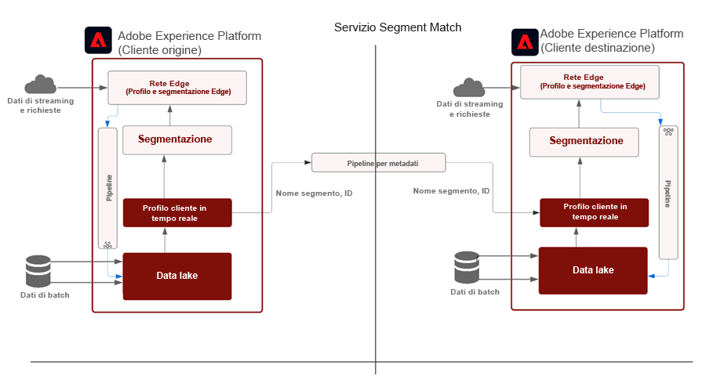
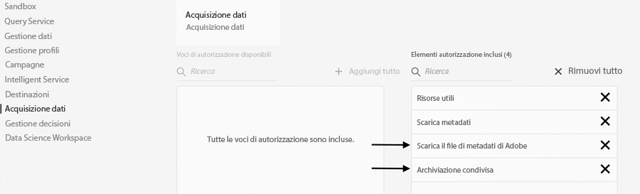
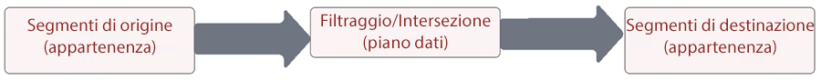
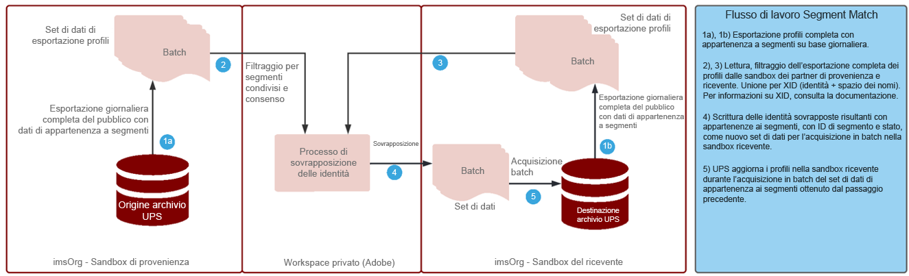

# Blueprint per  il servizio Segment Match 

Il servizio Segment Match consente ai brand partner di condividere i tipi di pubblico nei rispettivi ambienti Experience Platform. Per i brand è importante rivolgersi ai clienti in base ai dati raccolti dalle loro relazioni dirette con i consumatori. Grazie a migliori sistemi per la gestione della governance, delle autorizzazioni e delle preferenze, gli esperti di marketing possono ottimizzare ulteriormente il pubblico autenticato di prime parti con partner chiave.

[!UICONTROL Segment Match] è un servizio di collaborazione sui dati che consente ai clienti di Experience Platform (AEP) (o _partner_) di scambiarsi dati sui segmenti basati su identificatori comuni del settore nel rispetto della privacy e in modo sicuro e gestito.

Questo servizio consente ai clienti di identificare in modo sicuro gli ID corrispondenti in modo neutro e senza dover divulgare l’intero database. I partner ricevono solo gli attributi designati (nome del segmento) per gli ID coincidenti, per una condivisione più rapida e semplice, controllabile e con gestione del consenso.

[!UICONTROL Segment Match] si basa sul framework di AEP per la governance dei dati e il consenso. È disponibile per tutti i clienti Real-time Customer Data Platform B2C e B2P. Funzioni principali del servizio [!UICONTROL [!UICONTROL Segment Match]]:

* Condivisione dei segmenti per i clienti coincidenti che hanno concesso il loro consenso
* Report di sovrapposizione pre-condivisione per informazioni sul volume di corrispondenza stimato
* Criteri DULE completamente integrati e applicazione delle autorizzazioni
* Framework di consenso alla condivisione dei dati
* Feed di dati per l’organizzazione di segmenti e partner

## Applicazioni

Da brand a editore:

Il “caso d’uso per editori” è quello maggiormente interessato dalla rimozione dei cookie di terze parti e dei dati ID per il mobile advertising. Ha un impatto importante sul settore dei media e dell’intrattenimento che si concentra sulla vendita di pubblicità come modello di business. Il servizio [!UICONTROL Segment Match] offre un’opportunità agli editori con un vasto pubblico di prima parte che desiderano collaborare direttamente con i loro inserzionisti. Gli inserzionisti possono collaborare direttamente con gli editori per indirizzare la pubblicità al pubblico corrispondente sulle proprietà dell’editore, a scopo di targeting granulare o campagne di prospecting.

### Da brand a brand

I percorsi dei consumatori non sono mai lineari. Ad esempio, un cliente può essere fedele a una compagnia aerea e all’istituto emittente della sua carta di credito. Mediante il servizio [!UICONTROL Segment Match], la compagnia aerea e l’emittente di carte di credito possono avviare una partnership basata sui dati per comprendere il pubblico coincidente (sovrapposto) e quindi modulare le offerte per offrire esperienze personalizzate ai consumatori fedeli di ciascuna azienda.

### Da business unit a business unit

Per le multinazionali globali, la collaborazione a livello di dati tra business unit indipendenti può risultare complessa. A causa di differenze di informativa sulla privacy, acquisizioni o gestione delle autorizzazioni, ad esempio, potrebbe non essere possibile combinare i dati in un unico ambiente sandbox.

Il servizio [!UICONTROL Segment Match] aiuta i diversi team di marketing di grandi organizzazioni a collaborare in modo più efficiente, pur continuando a operare in autonomia.

## Architettura

{zoomable=&quot;yes&quot;}

Il servizio [!UICONTROL Segment Match] non è un data marketplace per l’acquisto di dati. Si tratta piuttosto di una funzione di AEP che opera con dati di prime parti da specifici partner in cui la collaborazione è agevolata da controlli sulla privacy e sul consenso. Il servizio [!UICONTROL Segment Match] permette di concentrarsi sul miglioramento delle relazioni con i clienti e sulla crescita del brand. È utile nei casi in cui esiste già una relazione tra determinati brand o partner. L’esperienza offerta dal servizio [!UICONTROL Segment Match] è facile da gestire, scalabile e consente agli amministratori di condividere i segmenti in modo controllabile e basato sul consenso.

Il servizio [!UICONTROL Segment Match] offre le seguenti funzionalità:

* Trasferimento sicuro tra organizzazioni diverse di dati sull’appartenenza a segmenti, utilizzando identificatori standard a livello di persona, come numero di telefono o e-mail con hash
* Interfaccia utente e flussi di lavoro per la condivisione del pubblico con notifiche
* Stime di sovrapposizione pre-condivisione
* Configurazione dei partner in modalità self-service
* Sovrapposizioni su specifici spazi dei nomi standardizzati (e-mail o telefono con hash, ECID, IDFA, GAID)
* Applicazione di criteri di consenso per la condivisione dei dati
* Gestione del ciclo di vita del pubblico condiviso
* Applicazione di criteri DULE nel flusso di lavoro di condivisione
* Aggiornamenti con batch giornalieri

Il servizio [!UICONTROL Segment Match] consente di creare esperienze cliente interconnesse. Gli identificatori durevoli supportati sono e-mail con hash, numeri di telefono con hash e identificatori come ECID, IDFA e GAID. I clienti possono creare feed corrispondenti e spostare i dati relativi al pubblico tra gli ambienti sandbox del brand, con robuste funzioni di governance, trasparenza e revoca da utilizzare per l’attivazione di campagne pubblicitarie e di marketing.

## Prerequisiti

Il servizio [!UICONTROL Segment Match] presenta i seguenti prerequisiti:

* RT-CDP con licenza attiva
* Gli identificatori con hash standard supportati sono e-mail con hash SHA256, telefono con hash, ECID, Apple IDFA e GAID
* Framework per la privacy e strategia di consenso
* Accordi sulla condivisione dei dati tra i clienti

## Sicurezza

### Controllo degli accessi basato sul ruolo (RBAC)

Il flusso del servizio [!UICONTROL Segment Match] per la gestione dei partner è protetto dal controllo degli accessi basato sul ruolo (RBAC). Solo le persone che dispongono di specifiche autorizzazioni possono avviare, accettare o gestire i partner. Tali operazioni possono essere eseguite nella sezione Acquisizione dati del profilo di prodotto. Sono necessarie le seguenti autorizzazioni:

{zoomable=&quot;yes&quot;}

| Autorizzazione | Descrizione |
|---|---|
| **Gestire le connessioni di condivisione del pubblico** | Questa autorizzazione consente di completare il processo di handshake del partner, per collegare due organizzazioni IMS e abilitare i flussi del servizio [!UICONTROL Segment Match]. |
| **Gestire le condivisioni del pubblico** | Questa autorizzazione consente di creare, modificare e pubblicare i feed (pacchetti di dati utilizzati per le funzioni di [!UICONTROL Segment Match]) con i partner attivi (collegati dall’utente amministratore con diritti di accesso di tipo **Connessioni per condivisione del pubblico**). |

Per ulteriori informazioni sulle autorizzazioni, consulta la [documentazione ufficiale](https://experienceleague.adobe.com/docs/experience-platform/segmentation/ui/segment-match/overview.html?lang=it#understanding-segment-match-permissions).

### ID di connessione

Il processo di connessione del partner è gestito dall’**[!UICONTROL ID di connessione],** un identificatore generato in modo casuale associato a una specifica sandbox di AEP. L’ID di connessione è necessario per avviare e gestire gli ambienti sandbox dei partner. Inoltre, se necessario, è possibile generare di nuovo l’ID di connessione per riconfigurare una connessione partner.

### Governance

Tutti i set di dati o attributi di dati a cui è stata assegnata l’etichetta per contratti *C11* sono soggetti a restrizioni per il servizio [!UICONTROL Segment Match]. I segmenti che utilizzano tali attributi non possono essere utilizzati per [!UICONTROL Segment Match]. Questo consente di controllare quali segmenti possono essere utilizzati o meno per [!UICONTROL Segment Match]. Inoltre, vengono applicati anche eventuali criteri personalizzati e azioni di marketing. Per impostazione predefinita, i criteri sono disabilitati; per applicarli, devono essere esplicitamente abilitati. Anche eventuali restrizioni (ad esempio per e-mail marketing e pubblicità sul sito) scelte al momento di condividere i segmenti vengono propagate e condivise con i partner.

### Consenso

Le impostazioni di consenso per il servizio [!UICONTROL Segment Match] possono essere gestite nei seguenti modi:

* A livello di organizzazione, durante l’onboarding, utilizzando l’impostazione di rinuncia o consenso per i controlli del consenso.

   Questa impostazione determina se è possibile condividere i dati utente. Per default è inizialmente impostata su Rinuncia: indica quindi che i dati utente possono essere condivisi purché il cliente di AEP abbia già ricevuto il necessario consenso alla condivisione dei dati. Per modificare questa impostazione su Consenti, contatta il tuo Adobe Account Manager, per definire un controllo aggiuntivo affinché i clienti di AEP possano tracciare esplicitamente il consenso.

* Impostazione dell’attributo di condivisione specifico per le identità (idSpecific) utilizzando il [gruppo di campi Consents e Preferences](https://experienceleague.adobe.com/docs/experience-platform/xdm/field-groups/profile/consents.html?lang=it).

   Questo gruppo di campi fornisce un singolo campo di tipo oggetto, “consents”, per acquisire i dati sul consenso e sulle preferenze. Per impostazione predefinita, il servizio [!UICONTROL Segment Match] include tutte le identità per le quali non è stata esplicitamente espressa la rinuncia, ad esempio:

   ```
   "share": {
   `                `"val": "n"
   `     `}
   ```

   Per modificare questa impostazione, contatta il tuo Adobe Account Manager per includere solo le identità con consenso esplicito, ad esempio:

   ```
   "share": {
   `                `"val": "y"
   `     `}
   ```

### Avvisi

Gli avvisi vengono generati quando si avvia una connessione partner o quando i feed di segmenti vengono condivisi con i partner.

## Flusso di lavoro di configurazione

Il flusso di lavoro per configurare la connessione partner viene gestito mediante il controllo degli accessi basato sul ruolo (RBAC) come indicato in precedenza. Una volta impostate le autorizzazioni appropriate, la connessione all’ambiente sandbox di un partner richiede la condivisione dell’ID di connessione di tale sandbox o istanza all’interno dell’organizzazione del partner.

Quando la connessione viene richiesta dal partner di provenienza, deve essere approvata dal partner ricevente per garantire la configurazione sicura del partner. L’handshake di connessione del partner garantisce l’esistenza di un accordo tra le due organizzazioni e consente ad Adobe di consentire il processo [!UICONTROL Segment Match] per conto dell’organizzazione. Una volta che la connessione è approvata e attiva, il processo di condivisione dei segmenti può essere avviato da entrambi i lati.

### Condivisione dei segmenti

La condivisione dei segmenti con il partner avviene solo quando esiste una corrispondenza per l’identificatore selezionato. Può esistere una relazione tra partner di tipo uno-a-molti, ossia i segmenti possono essere condivisi con più partner.

Dopo l’impostazione della connessione partner, per avviare la condivisione dei segmenti il partner di provenienza deve creare un feed. Quindi, deve selezionare i casi di utilizzo o le azioni di marketing da cui i dati dei segmenti devono essere esclusi e gli identificatori durevoli. È quindi possibile aggiungere al feed i segmenti rilevanti da condividere.

In questo flusso di lavoro di condivisione dei segmenti, il partner di provenienza può individuare potenziali segmenti di alto valore tramite sovrapposizioni stimate prima che vengano trasferiti i dati effettivi.

Il flusso complessivo del processo è il seguente:

{zoomable=&quot;yes&quot;}

Le stime di sovrapposizione offrono informazioni chiave, discovery dei partner e dati per alimentare gli accordi di collaborazione sui dati. Per ottenere queste metriche di stima della sovrapposizione, tra le sandbox non vengono mai spostati dati di clienti o di segmenti. Le identità applicabili selezionate dal cliente e pre-hash in una data sandbox vengono aggiunte a una struttura di dati probabilistici che consente ad Adobe di eseguire operazioni di unione e intersezione. Queste operazioni consentono al servizio [!UICONTROL Segment Match] di ottenere l’intersezione stimata di due strutture di dati composte da identità da due diverse sandbox, senza confrontarne i valori effettivi.

Il processo di sovrapposizione delle identità dipende dal set di dati di **esportazione giornaliera completa di profili** dalla sandbox del partner di provenienza a quella del partner ricevente, al fine di identificare i profili di identità comuni appartenenti ai segmenti condivisi. Il flusso dettagliato del processo di sovrapposizione è illustrato di seguito:

{zoomable=&quot;yes&quot;}

Completata la condivisione dei segmenti da parte del partner di provenienza, al partner ricevente viene inviata una notifica sul feed di segmenti condivisi. Il feed di segmenti deve essere abilitato affinché un profilo del partner ricevente possa avviare il flusso di dati di appartenenza ai segmenti. Soltanto i dati di appartenenza a un segmento vengono acquisiti nei frammenti di profilo sovrapposti dell’organizzazione IMS ricevente; dal partner di provenienza al partner ricevente non viene trasmessa alcun altro dato di identità.

Il segmento condiviso è disponibile nella sezione `AEPSegmentMatch` della scheda **[!UICONTROL Tipi di pubblico]** nel **[!UICONTROL Generatore di segmenti]** e può essere utilizzato per includere o sopprimere tipi di pubblico quando si creano i segmenti nella sandbox del partner ricevente.

Il processo di sovrapposizione giornaliera mantiene l’appartenenza ai segmenti sincronizzata tra i partner di provenienza e ricevente. Il partner ricevente può disabilitare un profilo per il feed di segmenti ricevuto, mettendo così in pausa il processo di condivisione dei segmenti.

#### Uscita/entrata in un segmento

Come parte dell’esportazione completa dei profili, gli ID dei segmenti condivisi a scopo di appartenenza a segmenti per i profili possono avere i seguenti valori di stato: _realized_ (realizzato), _exited_ (uscito) oppure _existing_ (esistente), in base allo stato corrente.

Durante il processo di sovrapposizione delle identità giornaliera, se esiste un’identità corrispondente nell’ambiente sandbox del ricevente, lo stato di appartenenza ai segmenti condivisi viene inviato al ricevente che potrà quindi acquisirlo.

#### Revoca dei segmenti

La revoca o eliminazione del segmento da parte del partner di provenienza avviene mediante un processo on-demand in cui l’elenco di tutti i profili con gli ID dei segmenti revocati viene ottenuto dal ricevente. Gli ID dei segmenti vengono rimossi dall’appartenenza ai segmenti di tali identità e riacquisiti presso il partner ricevente. Questa azione sovrascrive il frammento di appartenenza a segmenti esistente, il che a sua volta elimina l’appartenenza per il segmento interessato.

## Ulteriori informazioni

* [Servizio Segment Match](https://experienceleague.adobe.com/docs/experience-platform/segmentation/ui/segment-match/overview.html?lang=it#)
* [Autorizzazioni](https://experienceleague.adobe.com/docs/experience-platform/access-control/home.html?lang=it)
* [Risoluzione dei problemi](https://experienceleague.adobe.com/docs/experience-platform/segmentation/ui/segment-match/troubleshooting.html?lang=it)
* [XID](https://experienceleague.adobe.com/docs/experience-platform/identity/api/list-native-id.html?lang=it)
