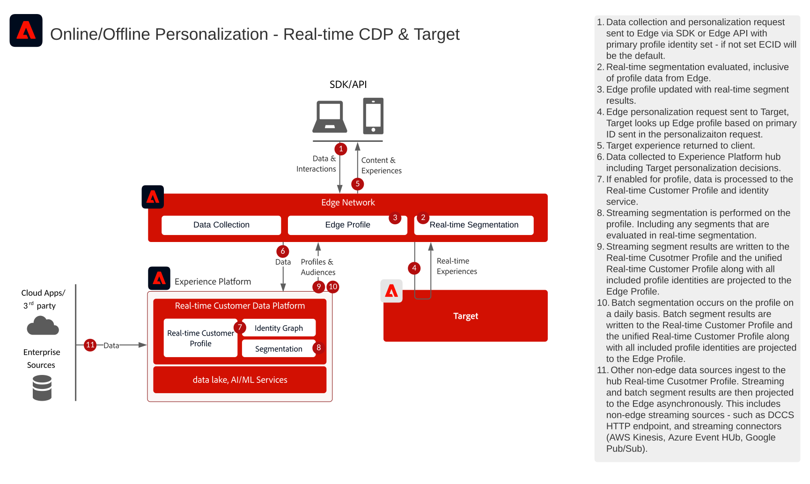

# Personalizzazione web/mobile con blueprint nota dei dati dei clienti

## Casi di utilizzo

* Personalizzazione online con dati dei clienti noti
* Ottimizzazione della pagina di destinazione
* Personalizzazione basata su precedenti visualizzazioni di prodotti/contenuti, affinità di prodotti/contenuti, attributi ambientali e dati demografici, nonché dati offline quali dati da transazioni, dal programma fedeltà e dal sistema CRM, e dati modellati
* Utilizza Adobe Target per la condivisione e il targeting dei tipi di pubblico definiti in Real-time Customer Data Platform su siti web e app mobili.

## Applicazioni

* [!UICONTROL Real-time Customer Data Platform]
* Adobe Target
* Adobe Audience Manager (opzionale): consente di aggiungere dati di pubblico di terze parti
* Adobe Analytics o Customer Journey Analytics (opzionale): consente di creare segmenti in base ai dati storici dei clienti e ai dati comportamentali con segmentazione granulare

### Documentazione di riferimento

* [Connessione Adobe Target per Real-time Customer Data Platform](https://experienceleague.adobe.com/docs/experience-platform/destinations/catalog/personalization/adobe-target-connection.html)
* [Configurazione dello stream di dati Edge](https://experienceleague.adobe.com/docs/experience-platform/edge/fundamentals/datastreams.html?lang=it)
* [Condivisione dei segmenti Experience Platform con Audience Manager e altre soluzioni Experience Cloud](https://experienceleague.adobe.com/docs/audience-manager/user-guide/implementation-integration-guides/integration-experience-platform/aam-aep-audience-sharing.html?lang=it)

## Modelli di integrazione

| Modello di integrazione | Funzionalità | Prerequisiti |
|---|---|---|
| Valutazione dei segmenti in tempo reale sul server Edge condiviso da Real-time Customer Data Platform a Target | <ul><li>Valutare i tipi di pubblico in tempo reale sul server Edge per la personalizzazione della pagina corrente o successiva.</li><li>Inoltre, tutti i segmenti valutati in streaming o in modalità batch verranno proiettati nel [!DNL Edge Network] da includere nella valutazione e nella personalizzazione dei segmenti edge.</li></ul> | <ul><li>L&#39;SDK per web/dispositivi mobili deve essere implementato o [!DNL Edge Network] API server</li><li>Lo stream di dati deve essere configurato in Experience Edge con l’estensione Target ed Experience Platform abilitata.</li><li>La destinazione Target deve essere configurata nelle destinazioni di Real-time Customer Data Platform.</li><li>Per l’integrazione con Target, è necessario utilizzare la stessa organizzazione IMS usata per l’istanza di Experience Platform.</li></ul> |
| Condivisione dei tipi di pubblico in streaming e in batch da Real-time Customer Data Platform a Target tramite l’approccio Edge | <ul><li>Condividere i tipi di pubblico in streaming e in batch da Real-time Customer Data Platform a Target tramite [!DNL Edge Network]. I tipi di pubblico valutati in tempo reale richiedono Web SDK e [!DNL Edge Network] implementazione.</li></ul> | <ul><li>La condivisione di tipi di pubblico in streaming e in batch con Target non richiede Web/Mobile SDK o l’implementazione dell’API Edge; tuttavia sono richiesti per la valutazione dei segmenti Edge in tempo reale.</li><li>Se si utilizza AT.js, è supportata solo l’integrazione dei profili rispetto allo spazio dei nomi dell’identità ECID.</li><li>Per le ricerche tramite identità da spazi dei nomi personalizzati nella rete Edge, è necessario implementare Web SDK o l’API Edge e ogni identità deve essere impostata nella mappa delle identità.</li><li>La destinazione Target deve essere configurata nelle destinazioni di Real-time Customer Data Platform. È supportata solo la sandbox di produzione predefinita in RTCDP.</li><li>Per l’integrazione con Target, è necessario utilizzare la stessa organizzazione IMS usata per l’istanza di Experience Platform.</li></ul> |
| Condivisione dei tipi di pubblico in streaming e in batch da Real-time Customer Data Platform a Target e Audience Manager tramite il servizio Audience Sharing | <ul><li>Questo modello di integrazione può essere sfruttato se i dati devono essere ulteriormente arricchiti con dati di terze parti e tipi di pubblico in Audience Manager.</li></ul> | <ul><li>Web/Mobile SDK non è necessario per la condivisione di tipi di pubblico in streaming e in batch con Target, ma serve per la valutazione dei segmenti Edge in tempo reale.</li><li>Se si utilizza AT.js, è supportata solo l’integrazione dei profili rispetto allo spazio dei nomi dell’identità ECID.</li><li>Per le ricerche tramite identità da spazi dei nomi personalizzati nella rete Edge, è necessario implementare Web SDK o l’API Edge e ogni identità deve essere impostata nella mappa delle identità.</li><li>È necessario il provisioning della proiezione del pubblico tramite il servizio di condivisione del pubblico.</li><li>Per l’integrazione con Target, è necessario utilizzare la stessa organizzazione IMS usata per l’istanza di Experience Platform.</li><li>Il servizio core di condivisione del pubblico è supportato solo dai tipi di pubblico della sandbox di produzione predefinita.</li></ul> |

## Condivisione del pubblico in tempo reale, in streaming e in batch con Adobe Target

Architettura

Dettagli della sequenza

Architettura d’insieme

## Modelli di implementazione

La personalizzazione per clienti noti è supportata tramite diversi approcci di implementazione.

### Schema di implementazione 1 - [!DNL Edge Network] con Web/Mobile SDK o [!DNL Edge Network] API (approccio consigliato)

* Utilizzo di [!DNL Edge Network] con Web/Mobile SDK. La segmentazione Edge in tempo reale richiede l’implementazione di Web/Mobile SDK o dell’API Edge.
* [Consulta l’Experience Platform Blueprint per SDK web e mobile.](../../experience-platform/deployment/websdk.md) per l’implementazione basata su SDK.
* Per poter essere utilizzata in Mobile SDK, l’[estensione Adobe Journey Optimizer - Decisioning](https://aep-sdks.gitbook.io/docs/using-mobile-extensions/adobe-journey-optimizer-decisioning) deve essere installata in Mobile SDK.
* [Consulta la sezione [!DNL Edge Network] API server](https://experienceleague.adobe.com/docs/experience-platform/edge-network-server-api/overview.html?lang=it) per un’implementazione di Adobe Target con profilo Edge basata su API.

### Modello di implementazione 2 - SDK per specifiche applicazioni

Mediante SDK tradizionali per specifiche applicazioni (ad esempio, AT.js e AppMeasurement.js). La valutazione dei segmenti Edge in tempo reale non è supportata da questo approccio di implementazione. Tuttavia, questo approccio supporta la condivisione del pubblico in streaming e in batch dall’hub di Experience Platform.

[Consulta la documentazione relativa al connettore Adobe Target.](https://experienceleague.adobe.com/en/docs/experience-platform/destinations/catalog/personalization/adobe-target-connection)
[Consulta la blueprint dell’SDK specifico per l’applicazione](../../experience-platform/deployment/appsdk.md)

## Considerazioni sull’implementazione

Prerequisiti per l’identità

* Qualsiasi identità primaria può essere utilizzata quando si utilizza il modello di implementazione 1 descritto in precedenza con [!DNL Edge Network] e Web SDK. La personalizzazione del primo accesso richiede che l’identità primaria del set di richieste di personalizzazione corrisponda all’identità primaria del profilo da Real-time Customer Data Platform.

## Documentazione correlata

### Documentazione di SDK

* [Documentazione di Experience Platform Web SDK](https://experienceleague.adobe.com/docs/experience-platform/edge/home.html?lang=it)
* [Documentazione sui tag di Experience Platform](https://experienceleague.adobe.com/docs/experience-platform/tags/home.html?lang=it)
* [Documentazione del servizio Experience Cloud ID](https://experienceleague.adobe.com/docs/id-service/using/home.html?lang=it)

### Documentazione sulla segmentazione

* [Panoramica sulla segmentazione in Experience Platform](https://experienceleague.adobe.com/docs/experience-platform/segmentation/home.html?lang=it)
* [Segmentazione in tempo reale](https://experienceleague.adobe.com/docs/experience-platform/segmentation/ui/edge-segmentation.html?lang=it)
* [Segmentazione in streaming](https://experienceleague.adobe.com/docs/experience-platform/segmentation/api/streaming-segmentation.html?lang=it)
* [Condivisione dei segmenti di Adobe Analytics tramite Adobe Audience Manager](https://experienceleague.adobe.com/docs/analytics/components/segmentation/segmentation-workflow/seg-publish.html?lang=it)
* [Configurazione dei criteri di unione](https://experienceleague.adobe.com/docs/experience-platform/profile/merge-policies/ui-guide.html?lang=it#create-a-merge-policy)

### Tutorial

* [Personalizzazione con hit successivo con Real-Time CDP e Adobe Target](https://experienceleague.adobe.com/docs/platform-learn/tutorials/experience-cloud/next-hit-personalization.html?lang=it)

### Articoli di blog correlati

* [Adobe annuncia la personalizzazione avanzata sulla stessa pagina con Adobe Target e Real-time Customer Data Platform](https://blog.adobe.com/en/publish/2021/10/05/adobe-announces-same-page-enhanced-personalization-with-adobe-target-real-time-customer-data-platform)
* [[!DNL Blueprint for Web Personalization using Adobe Experience Platform Real-Time Customer Profile]](https://medium.com/adobetech/blueprint-for-web-personalization-using-adobe-experience-platform-real-time-customer-profile-fef2ce7a4b2f)
* [[!DNL Adobe Experience Platform's Identity Service — How to Solve the Customer Identity Conundrum]](https://medium.com/adobetech/adobe-experience-platforms-identity-service-how-to-solve-the-customer-identity-conundrum-f95e22d16ea9)
* [[!DNL Adobe Experience Platform Web SDK for Audience Management]](https://medium.com/adobetech/adobe-experience-platform-web-sdk-for-audience-management-751fa6d063bc)
* [[!DNL Implementing Adobe Experience Platform Real-Time Customer Profile through our "Customer Zero" Program]](https://medium.com/adobetech/implementing-adobe-experience-platform-real-time-customer-profile-through-our-customer-zero-32e7cd952896)
* [[!DNL Segmentation in Seconds: How Adobe Experience Platform Made Real-time Customer Profiles a Reality]](https://medium.com/adobetech/segmentation-in-seconds-how-adobe-experience-platform-made-real-time-customer-profiles-a-reality-a7a8552b0847)
