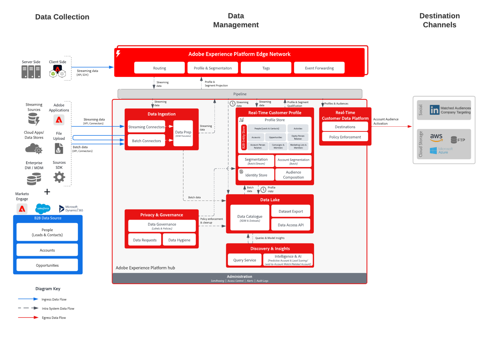

# Attivazione dell’account B2B su destinazioni di file e annunci pubblicitari

Il coinvolgimento basato sull’account consente agli esperti di marketing B2B di creare tipi di pubblico di account (ad esempio, elenchi di aziende) e di indirizzare tali aziende tramite destinazioni come LinkedIn che accettano elenchi di aziende come input o esportazione in destinazioni di archiviazione cloud per il targeting e l’outreach delle vendite.

## Casi di utilizzo

Utilizzando il coinvolgimento basato sull’account, gli esperti di marketing possono sbloccare tre casi d’uso chiave:

* **Colmare le lacune nei gruppi di acquisto:** Un addetto al marketing può fare pubblicità su account in cui non ha ancora contatti per i ruoli CMO o CIO. Possono innanzitutto creare un pubblico di account senza un contatto con il titolo &quot;CMO&quot; o &quot;CIO&quot; e quindi attivare il pubblico su LinkedIn. All’interno della destinazione, LinkedIn, può quindi avviare una campagna indirizzata a quel pubblico e a persone specifiche con titoli di lavoro &quot;CMO&quot; o &quot;CIO&quot; per raggiungere questi nuovi contatti ed evidenziare i vantaggi delle loro offerte.
* **Upselling o cross-selling ad altre divisioni di una società che è un cliente esistente:** Un addetto al marketing può creare un pubblico di clienti che ha acquistato il prodotto X tra 3 e 9 mesi fa ma non possiede ancora il prodotto Y. Possono quindi attivare, evidenziando i vantaggi del prodotto Y per quel pubblico di destinazione.
* **Aziende di destinazione che utilizzano prodotti concorrenti:** Un addetto al marketing può vendere ad account per sostituire i prodotti di un concorrente, anche senza alcun contatto con tali account. Possono creare un pubblico di account in base ai dati dei partner che mostrano la proprietà o l’utilizzo di un prodotto di un concorrente, quindi attivarli tramite LinkedIn per contattare l’origine presso gli account target per l’espansione.

## Applicazioni

* Real-time Customer Data Platform B2B Edition

## Modelli di integrazione

* Origini dati B2B (Marketo, Salesforce, ecc.) -> Real-time Customer Data Platform B2B edition -> Destinazioni.
* È possibile utilizzare diverse origini dati B2B per mappare i dati di account, lead, opportunità e persone su B2B edition di Real-time Customer Data Platform.

## Architettura

## Destinazioni del pubblico dell’account

* (Aziende) LinkedIn Tipi Di Pubblico Corrispondenti
* Destinazioni archiviazione cloud
   * Data lake di Azure
   * Zona di destinazione dati
   * SFTP
   * Blob Azure
   * AWS S3

## Guardrail

* Limitato a 50 segmenti di account per sandbox.
* Valutazione della segmentazione batch.
   * Valutato automaticamente ogni 24 ore dopo il completamento dei processi di esecuzione batch del pubblico e di esportazione del profilo.
   * Nessun supporto per la valutazione Edge, streaming o ad hoc.
* Gli attributi dell’account sono disponibili per l’esportazione.
* Eventi di persone.
   * Fino a 30 giorni di lookback di eventi, senza alcun ordine di predicati di eventi.
   * AND/OR sono supportati (quindi si può dire &quot;A e B devono accadere&quot;,  ma non si può dire &quot;A deve accadere 3 giorni prima di B&quot;).
* Per le destinazioni di archiviazione cloud, la pianificazione dell’esportazione supporta l’opzione &quot;Dopo la valutazione del segmento&quot;.
* [Profilo B2B E Guardrail Di Segmentazione](https://experienceleague.adobe.com/it/docs/experience-platform/rtcdp/intro/rtcdpb2b-intro/b2b-guardrails).

## Passaggi per l’implementazione di Real-time Customer Data Platform B2B edition, la creazione di tipi di pubblico per gli account e l’attivazione

* Per i passaggi di implementazione di Real-time Customer Data Platform B2B edition, consulta la [Guida introduttiva a Real-Time Customer Data Platform B2B Editiond](https://experienceleague.adobe.com/it/docs/experience-platform/rtcdp/intro/rtcdpb2b-intro/b2b-tutorial).
* Per i passaggi relativi alla creazione del pubblico dell&#39;account, consulta la documentazione [Tipi di pubblico dell&#39;account](https://experienceleague.adobe.com/it/docs/experience-platform/segmentation/ui/account-audiences).
* Per i passaggi di Audience Activation dell&#39;account, consulta la documentazione di [Attivare il pubblico dell&#39;account](https://experienceleague.adobe.com/it/docs/experience-platform/destinations/ui/activate/activate-account-audiences).
   * Mappatura richiesta per [(Companies) LinkedIn Corrispondente a Audiences destinazione](https://experienceleague.adobe.com/it/docs/experience-platform/destinations/ui/activate/activate-account-audiences#required-mappings).

## Considerazioni sull’implementazione

I tipi di pubblico di LinkedIn corrispondenti hanno alcuni requisiti, tra cui la dimensione minima di pubblico di 300 membri corrispondenti. Se il pubblico dell’account attivato per la destinazione del pubblico corrispondente della società collegata non soddisfa il requisito, è necessario modificare la definizione del pubblico per aumentare la dimensione del pubblico e avviare una campagna LinkedIn.

## Documentazione correlata

* [B2B edition di Real-time Customer Data Platform](https://experienceleague.adobe.com/it/docs/experience-platform/rtcdp/intro/rtcdpb2b-intro/b2b-overview)
* [Video tutorial su come creare e attivare il pubblico dell’account](https://experienceleague.adobe.com/it/docs/platform-learn/tutorials/audiences/create-audiences-with-b2b-data)
* [Creare tipi di pubblico per account](https://experienceleague.adobe.com/it/docs/experience-platform/segmentation/ui/account-audiences)
* [Attivare il pubblico dell’account](https://experienceleague.adobe.com/it/docs/experience-platform/destinations/ui/activate/activate-account-audiences)
* [Adobe Experience Platform - Connettore di destinazione LinkedIn](https://experienceleague.adobe.com/it/docs/experience-platform/destinations/catalog/social/linkedin)
