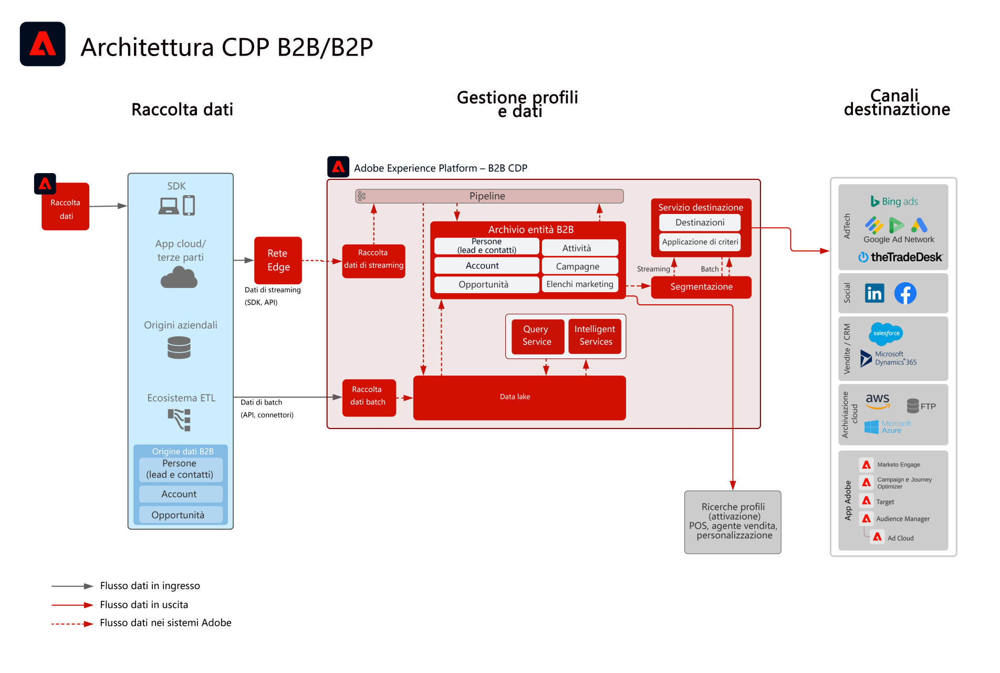

# Blueprint per l’attivazione di profili e pubblico B2B

Associa a un singolo cliente le informazioni relative all’account, alle opportunità e ai lead, per creare profili B2B con cui migliorare la personalizzazione e il targeting su tutti i canali.

## Casi di utilizzo

* Crea un pubblico basato su persone e utilizzalo per il targeting e la personalizzazione su canali diversi, grazie a dati B2B quali account, opportunità e lead.
* Attiva uno specifico pubblico in qualsiasi destinazione di Experience Platform per attività di targeting e personalizzazione.

## Applicazioni

* Real-time Customer Data Platform B2B Edition

## Modelli di integrazione

* Origini dati B2B (Marketo, Salesforce, ecc.) -> Real-time Customer Data Platform B2B Edition -> Destinazioni
È possibile utilizzare diverse origini dati B2B per associare i dati da account, lead, opportunità e persone a Real-time Customer Data Platform B2B Edition.

## Architettura

 

## Guardrail

* I guardrail e le fasi di implementazione relative a Marketo Engage sono applicabili solo quando si usa Marketo Engage come origine e/o destinazione.

* Per ulteriori dettagli e guardrail per le latenze end-to-end, consulta il [documento sui guardrail relativi all’implementazione](../experience-platform/deployment/guardrails.md)

### Supporto di più istanze e organizzazioni IMS:

Di seguito sono descritti i pattern supportati per la mappatura delle istanze di Experience Platform e Marketo Engage.

#### Marketo come origine dati per Experience Platform:

* Sono supportate più istanze di Marketo Engage per una istanza di Experience Platform.
* Non sono supportate più istanze di Marketo Engage per più istanze di Experience Platform.
* Non è supportata una istanza di Marketo Engage per più istanze di Experience Platform.
* È supportata una istanza di Marketo Engage per una istanza di Experience Platform e più sandbox.

#### Marketo come destinazione per Experience Platform:

* È supportato Experience Platform per più istanze di Marketo Engage
* Sono supportate più istanze di Experience Platform per una istanza di Marketo Engage

#### Guardrail per segmentazione e profili Experience Platform:

* Vedi i guardrail relativi a profili e segmentazione per Experience Platform: [Guardrail per profili e segmentazione](https://experienceleague.adobe.com/docs/experience-platform/profile/guardrails.html?lang=it)
* I segmenti B2B che includono account, lead e opportunità utilizzano relazioni con più entità e pertanto la valutazione dei segmenti viene eseguita in batch. La segmentazione in streaming è supportata per i segmenti limitati a persone ed eventi.

#### Connettore tra Experience Platform e origine Marketo Engage:

* Il recupero di dati storici può richiedere fino a 7 giorni, a seconda del volume di dati.
* Gli aggiornamenti e le modifiche dei dati in corso da Marketo vengono inviati ad Experience Platform tramite l’API di streaming, con una latenza fino a circa 5 minuti per il profilo e circa 15 minuti per il data lake, a seconda del volume.

#### Connettore tra Experience Platform e destinazione Marketo:

* La condivisione in streaming dei segmenti da Real-time Customer Data Platform a Marketo Engage può richiedere fino a 5 minuti.
* La segmentazione in batch viene condivisa una volta al giorno in base al programma di segmentazione di Experience Platform. I segmenti B2B che includono account, lead e opportunità utilizzano relazioni con più entità e pertanto la valutazione dei segmenti viene eseguita in batch.

#### Guardrail per Marketo Engage:

* I contatti e i lead devono essere acquisiti e definiti direttamente in Marketo Engage affinché il pubblico Real-time Customer Data Platform possa essere associato a un contatto e un lead di Marketo Engage.

#### Guardrail per destinazione

* Per informazioni specifiche sulle destinazioni, consulta la relativa documentazione. [Guardrail per destinazione](https://experienceleague.adobe.com/docs/experience-platform/destinations/guardrails.html?lang=it)

## Fasi di implementazione

Per informazioni su come implementare e configurare Real-time Customer Data Platform B2B Edition, consulta la relativa documentazione. [Real-time Customer Data Platform B2B Edition](https://experienceleague.adobe.com/docs/experience-platform/rtcdp/b2b-overview.html?lang=it)

Sono disponibili due modelli di implementazione: per acquisire dati e profili B2B da Marketo Engage, o per acquisire dati B2B da altri origini di dati CRM.

## Considerazioni sull’implementazione

Considerazioni chiavi e configurazioni del blueprint.

* Integrazione CRM con e senza Marketo: 
Se l’implementazione utilizzerà Marketo Engage come origine, e Marketo Engage è connesso al sistema CRM, per acquisire i dati CRM in Experience Platform dovrai utilizzare il connettore di origine Marketo. Se dovranno essere acquisite altre tabelle di dati, utilizza il connettore di origine Experience Platform. Se nell’implementazione non viene utilizzato Marketo Engage come origine, connetti l’origine CRM direttamente ad AEP mediante il connettore per origine CRM di Experience Platform.
* Si sconsiglia invece di avviare e seguire i lead unicamente da Real-time Customer Data Platform B2B Edition. Per questo caso di utilizzo si consiglia di utilizzare piuttosto uno strumento specifico, ad esempio Marketo Engage.
* Il connettore di destinazione Marketo Engage per AEP che invia il pubblico a Marketo Engage per l’attivazione, invia solo indirizzi e-mail ed ECID. Se il contatto non esiste già, non viene creato un nuovo lead e sarà quindi necessario inserire i dati del profilo e del lead in Marketo Engage.

## Documentazione correlata

* [Real-time Customer Data Platform B2B Edition](https://experienceleague.adobe.com/docs/experience-platform/rtcdp/b2b-overview.html?lang=it)
* [Adobe Experience Platform](https://experienceleague.adobe.com/docs/experience-platform.html?lang=it)
* [Marketo Engage](https://experienceleague.adobe.com/docs/marketo/using/home.html?lang=it)
* [Connettore tra Adobe Experience Platform e origine Marketo](https://experienceleague.adobe.com/docs/experience-platform/sources/connectors/adobe-applications/marketo/marketo.html?lang=it)
* [Connettore tra Adobe Experience Platform e destinazione Marketo](https://experienceleague.adobe.com/docs/marketo/using/product-docs/core-marketo-concepts/smart-lists-and-static-lists/static-lists/push-an-adobe-experience-cloud-segment-to-a-marketo-static-list.html?lang=it)
