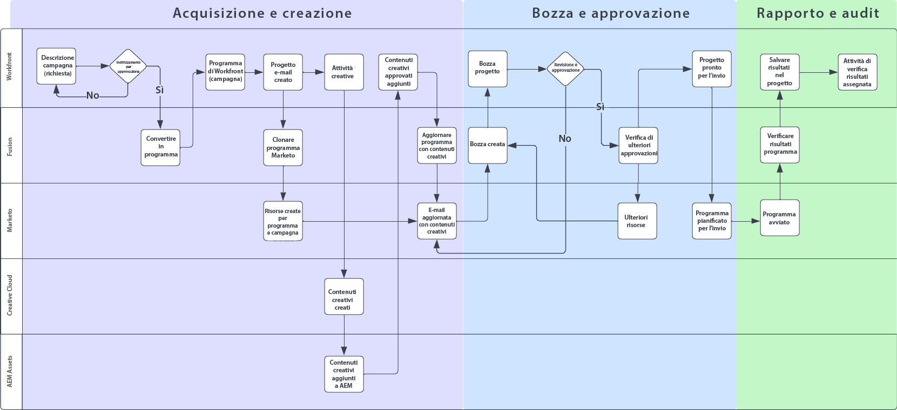
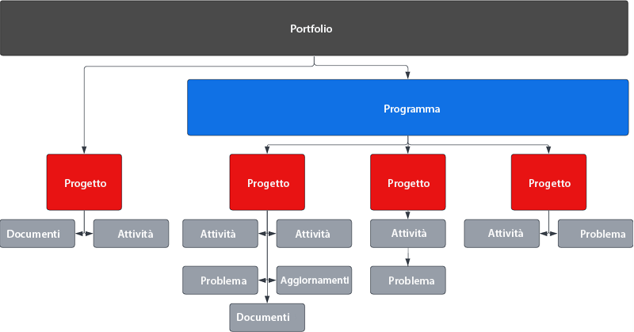
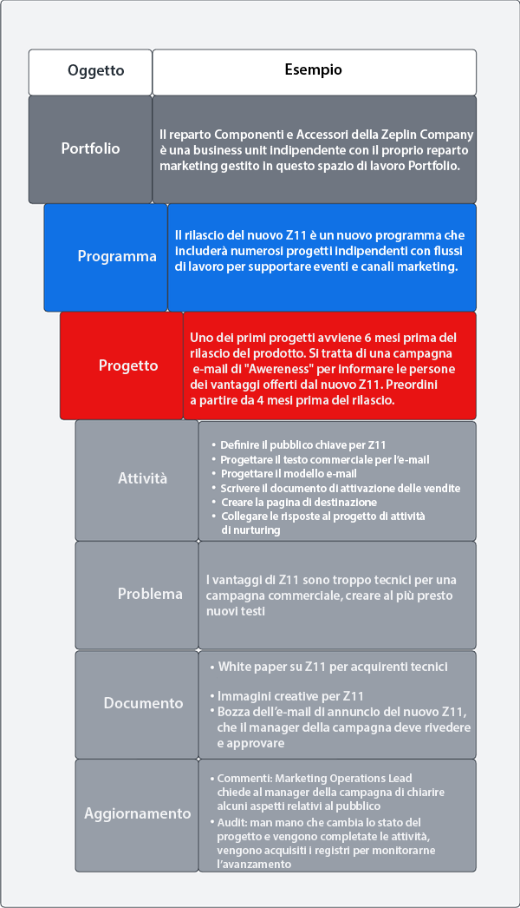
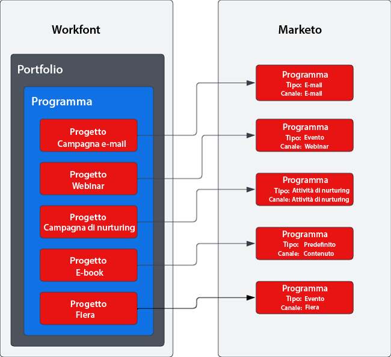

# Campaign Supply Chain con Marketo e Workfront blueprint {#overview}

## Raggiungere il time-to-market più velocemente grazie alla catena di fornitura ottimizzata per le campagne {#achieving-faster-time-to-market-with-optimized-campaign-supply-chain}

Con l’arrivo di ogni nuovo canale e nuovi modi di personalizzare le comunicazioni, il carico di lavoro per gli addetti al marketing continua a crescere. I team di marketing hanno bisogno di nuove modalità di automazione che consentano loro di evolversi e rispondere alle esigenze di marketing in continuo mutamento in tutto il mondo.

**“Il vero obiettivo è sempre stato il ROI. Va benissimo puntare ai ricavi, ma non ad ogni costo, specialmente oggi.” - CMO, settore dei servizi alle imprese**

Le organizzazioni che riescono a ottenere un ROI più elevato e un aumento dei ricavi hanno razionalizzato il processo di sviluppo delle campagne, ottimizzato la velocità di esecuzione delle campagne e migliorato la visibilità su tutte le operazioni di marketing.

Se la tua organizzazione desidera raggiungere obiettivi simili, questo documento ti sarà utile:

* Ampliare le operazioni relative alle campagne per supportare team di marketing cross-functional
* Velocizzare il time-to-market grazie a un processo più snello di richiesta delle campagne
* Creare un sistema di registrazione per aumentare la visibilità tra tutte le parti interessate nelle campagne
* Rivedere e approvare le risorse da usare nelle campagne (immagini, testo per e-mail)

I team operativi che si occupano delle campagne hanno bisogno di sistemi che consentano loro di pianificare ed eseguire le campagne di marketing in modo efficiente ed efficace. Che si tratti di e-mail, webinar, eventi, paid media, formazione o diffusione dei contenuti, ai team di marketing serve una soluzione centrale con cui organizzare i collaboratori, i materiali da consegnare e l’esecuzione stessa delle campagne.

Integrando il sistema di attivazione marketing multicanale (Marketo Engage) con la pianificazione marketing e il sistema di registrazione (Workfront), puoi velocizzare la realizzazione delle campagne e fornire una migliore visibilità alle parti interessate.

Con Workfront Fusion, i team delle operazioni di marketing possono eliminare molti dei passaggi manuali e soggetti a errori che, al momento, sono necessari per passare dal marketing brief alla campagna vera e propria. Workfront Fusion offre un livello di integrazione preconfigurato tra Workfront e Marketo Engage che offre flessibilità ed efficienza nello sviluppo di flussi di lavoro tra i due sistemi. Per saperne di più su come impostare l’integrazione e sulle azioni da intraprendere per automatizzare i flussi di lavoro, [fai clic qui](https://experienceleague.adobe.com/docs/workfront/using/adobe-workfront-fusion/fusion-apps-and-modules/marketo-modules.html?lang=it){target="_blank"}.

## Pianificazione delle campagne all’esecuzione - casi di utilizzo dell’automazione {#campaign-planning-to-execution-automation-use-cases}

* Supporta i team di marketing automatizzando la creazione di campagne in Marketo Engage tramite richieste di acquisizione in Workfront
* Condividi con Workfront le bozze di messaggi e-mail e pagine di destinazione create in Marketo Engage e richiedi ai team cross-functional interessate di rivederle e approvarle
* Condividi i risultati delle campagne da Marketo Engage a Workfront per agevolare l’accesso alle metriche delle campagne

Il diagramma seguente illustra un flusso di lavoro per il processo di sviluppo di una campagna e-mail richiesta. Puoi anche vedere il ruolo che può avere Workfront Fusion tra Workfront e Marketo Engage, per promuovere l’automazione dei flussi di lavoro e dei processi nell’intero ciclo di sviluppo della campagna.

Prendi nota delle diverse fasi del processo di sviluppo di una campagna.

1. Acquisizione e creazione: la campagna viene richiesta e le risorse della campagna vengono assemblate in modo programmatico.

1. Bozza e approvazione: una volta assemblata la campagna, le parti interessate devono rivedere e approvare le risorse che verranno utilizzate nella campagna, come messaggi e-mail e pagine di destinazione.

1. Rapporto e audit: condividi i risultati delle campagne in Workfront per offrire maggiore visibilità a tutte le parti interessate, nei vari reparti.

>[!NOTE]
>
>Nell’esempio precedente, Workfront gestisce e pianifica le attività durante l’intero ciclo di vita del programma di Marketo Engage. Ma grazie alla sua flessibilità, Workfront può estendersi anche alla gestione di tutte le attività del team di marketing. Queste possono comprendere, ad esempio, marketing basato su account, supply chain per i contenuti marketing, gestione delle agenzie, gestione delle campagne digitali e social, e programmi a sostegno delle vendite.

## Informazioni sulla rappresentazione delle iniziative di marketing in Workfront {#understanding-how-marketing-initiatives-are-represented-in-workfront}

Adobe Workfront consente alle organizzazioni di gestire il lavoro in modo da renderne più efficiente l’esecuzione. Workfront utilizza una gerarchia di oggetti che forniscono un framework per la pianificazione, la gestione delle risorse e la collaborazione tra i vari team.

Per comprendere il rapporto tra Workfront e Marketo Engage, è importante capire come mappare il processo aziendale su questi oggetti.

### Gerarchia di Portfolio definita {#portfolio-hierarchy-defined}

<table> 
  <tr> 
   <td><b>Oggetto</b></td>
   <td><b>Definizione</b></td>
  </tr>
  <tr> 
   <td>Portfolio</td>
   <td>In Workfront, è possibile organizzare i progetti in portfolio e programmi. Organizzando i progetti, potrai confrontare progetti simili e determinare dove conviene investire le risorse.  
   (Ad esempio, puoi creare un portfolio per una business unit che si occupa della vendita di servizi e/o prodotti.)</td>
  </tr>
  <tr>
   <td>Programma</td>
   <td>È possibile utilizzare i programmi di Workfront per organizzare i progetti. Organizzando i progetti, potrai confrontare progetti simili e determinare dove conviene investire le risorse.  
   (Ad esempio, una strategia di marketing con una finalità di alto livello, come aumentare l’awareness e stimolare la domanda per il lancio di un nuovo prodotto).</td>
  </tr>
  <tr>
   <td>Progetto</td>
   <td>Un progetto di Workfront è una raccolta di elementi di lavoro che devono essere completati per raggiungere uno specifico obiettivo o prodotto, determinati materiali da consegnare, ecc.  
   (Ad esempio, una tattica di marketing come una campagna e-mail o di nurturing, un webinar o un evento in presenza. Un singolo progetto può anche essere più complesso e includere più tattiche di marketing, come un’e-mail, un annuncio display, una pagina di destinazione e un white paper da scaricare, tutti volti a conseguire lo stesso risultato.)</td>
  </tr>
  <tr>
   <td>Attività</td>
   <td>Le attività di Workfront sono elementi di lavoro pianificati che possono far parte di un progetto o di un’iniziativa. Le attività vengono assegnate agli utenti o ai team che dovranno completarle.  
   (Ad esempio, un’attività di creazione di un segmento di pubblico o una bozza di e-mail potrebbe essere associata a un progetto per sviluppare un programma e-mail in Marketo Engage.)</td>
  </tr>
  <tr>
   <td>Problema</td>
   <td>I problemi sono elementi di lavoro non pianificati in Workfront. Possono essere problemi che si verificano durante un progetto o richieste inviate tramite una coda di richieste.  
   (Ad esempio, si può registrare un problema se l’immagine di un banner e-mail è di dimensioni errate.)</td>
  </tr>
  <tr>
   <td>Documento</td>
   <td>I documenti possono essere documenti tradizionali, come documenti Word o presentazioni. Possono anche essere file di immagini. Workfront consente di rivedere le risorse inserendo commenti e annotazioni su documenti e immagini, agevolando la collaborazione tra i vari team coinvolti.  
   (Ad esempio, l’immagine per l’intestazione di un’e-mail che deve essere rivista.)</td>
  </tr>
  <tr>
   <td>Aggiornamento</td>
   <td>Include commenti e registri di audit per tenere traccia del lavoro e agevolare la collaborazione in Workfront.  
   (Ad esempio, il registro di audit di una nuova versione di un’immagine.)</td>
  </tr>
  </tbody>
</table>

## Esempio di gestione del lavoro di un&#39;iniziativa di marketing {#marketing-initiative-work-management-example}

Diamo un’occhiata al ruolo della gerarchia dei portfolio Workfront in un esempio concreto.

La Zeplin Company sta rilasciando una versione aggiornata di un accessorio per trattorini, lo Z11, più robusto e personalizzabile rispetto al precedente modello Z10. Deve quindi pianificare, sviluppare ed eseguire la strategia di marketing per stimolare la domanda e aumentare l’awarness per il nuovo prodotto rilasciato dalla divisione Trattori della società. La strategia di marketing deve includere diverse tattiche di marketing per stimolare l’awareness, rivolte sia a nuovi clienti sia a chi ha già acquistato il modello Z10.

La gerarchia seguente mostra come la strategia, le tattiche, le attività e le risorse vengono mappate in Workfront per questa campagna di marketing.

## Mappatura da Workfront a Marketo {#mapping-workfront-to-marketo}

Quando si utilizza Workfront come sistema a monte per la pianificazione marketing e l’organizzazione dei progetti, è importante comprendere in che modo le informazioni possono essere condivise tra Marketo Engage e Workfront.

Affinché questi sistemi possano funzionare in tandem nello sviluppo di nuove iniziative di marketing, è necessario capire in che modo i diversi tipi di record di Workfront vengono mappati sui tipi di record di Marketo Engage.

### Mappatura di progetti Workfront a programmi Marketi Engage {#mapping-workfront-projects-to-marketo-engage-programs}

Utilizzando Workfront Fusion come livello di integrazione, puoi mappare i progetti di Workfront su un programma Marketo Engage. Ad esempio, nel caso di cui sopra, la Zeplin Company vuole aumentare l’awareness per il suo nuovo modello. Crea quindi un nuovo programma in Workfront con più tattiche di marketing rappresentate come progetti. Una tattica consiste nell’inviare un’e-mail di awareness a chi ha già acquistato il modello Z10, per informarli del nuovo modello Z11. In Workfront viene quindi creato un progetto per questa tattica di e-mail, a cui vengono associate le attività necessarie per creare il pubblico, ottenere i contenuti creativi per le immagini da inserire nell’e-mail e assemblare l’e-mail in Marketo Engage. Il progetto in Workfront può essere mappato su un programma e-mail in Marketo Engage in modo che le informazioni possano essere sincronizzate tra i due sistemi.

Di seguito è riportato un esempio di come un programma può includere più progetti, e come tali progetti Workfront possono essere mappati su programmi in Marketo Engage.

Per un’iniziativa di marketing su grande scala, potrebbe essere necessario inserire più progetti Workfront in un programma Workfront. Per una richiesta una tantum, invece, ad esempio per un webinar o un’e-mail, sarà sufficiente creare un singolo progetto Workfront. Qualunque siano le tue esigenze, Workfront, Workfront Fusion e Marketo Engage offrono al tuo team tutta la flessibilità necessaria per integrare il processo di sviluppo delle campagne senza soluzione di continuità, dalla pianificazione all’esecuzione.

### Mappatura delle attività Workfront sulle risorse del Marketo Engage {#mapping-workfront-tasks-to-marketo-engage-assets}

Quando inizi a mappare il processo di sviluppo della campagna in Workfront, considera anche quali attività sono associate a lavori eseguiti in Marketo Engage, nonché come acquisire le informazioni in Workfront, per migliorare la coerenza, l’efficienza e l’accuratezza nella supply chain per lo sviluppo della campagna.

I progetti di Workfront possono essere utilizzati come modelli in modo che il processo possa essere definito chiaramente ogni volta che esegui una specifica tattica di marketing. Ad esempio, nella realizzazione di una campagna e-mail, la tua organizzazione dovrà completare un set di attività standard. Queste possono includere una riunione iniziale con le parti interessate, la creazione delle risorse creative, l’approvazione dei contenuti creativi, la definizione del pubblico target, la creazione dell’e-mail, la traduzione del testo dell’e-mail, l’approvazione dell’e-mail e la condivisione dei risultati della campagna e-mail con le parti interessate.

Alcune di queste attività possono essere associate direttamente a lavori da eseguire in Marketo Engage. Ad esempio, la reazione dell’e-mail in Workfront può essere personalizzata con campi che trasmetteranno informazioni a Marketo Engage per automatizzare l’assemblaggio dell’e-mail. Tali informazioni possono includere, ad esempio, l’oggetto, il testo e le immagini da usare nell’e-mail.

## Passaggi successivi {#next-steps}

Dopo questa introduzione a come Workfront e Marketo Engage possono essere utilizzati per conseguire nuove efficienze nella supply chain per lo sviluppo delle campagne, consulta i documenti e le risorse seguenti su come utilizzare Workfront Fusion per automatizzare i flussi di lavoro e i processi tra Marketo Engage e Workfront.

### Guida introduttiva all&#39;integrazione con Workfront Fusion, Workfront e Marketo Engage {#getting-started-with-workfront-fusion}

* [Acquisizione e creazione](/help/blueprints/b2b/campaign-supply-chain/intake-and-create.md){target="_blank"} - Automazione per lo sviluppo di campagne con Marketo Engage e Workfront

* Bozze e approvazione (disponibile a breve)

* Rapporti e audit (disponibile a breve)

### Gestione dei nomi delle campagne dei Marketi Engage e degli URL associati {#managing-marketo-engage-campaign-names}

L’utilizzo di convenzioni di standardizzazione per i nomi delle campagne e gli URL agevola la gestione accurata dei programmi in Marketo Engage e contribuisce a creare processi più coerenti nell’intera supply chain per campagne marketing. Se cerchi strumenti per aiutarti, ti consigliamo di estrarre alcuni strumenti open source gratuiti da [Adobe servizi di successo](https://main--marketo-campaign-tools--dr-adobe.hlx.live/){target="_blank"} che consentono di creare un approccio coerente alla creazione e alla gestione di campagne di Marketo Engage e dei relativi URL.

### Risorse {#resources}

* [Workfront Fusion per Marketo Engage](https://experienceleague.adobe.com/docs/workfront/using/adobe-workfront-fusion/fusion-apps-and-modules/marketo-modules.html?lang=it){target="_blank"}

* [Workfront Fusion per Workfront](https://experienceleague.adobe.com/docs/workfront/using/adobe-workfront-fusion/fusion-apps-and-modules/workfront-modules.html?lang=it){target="_blank"}
