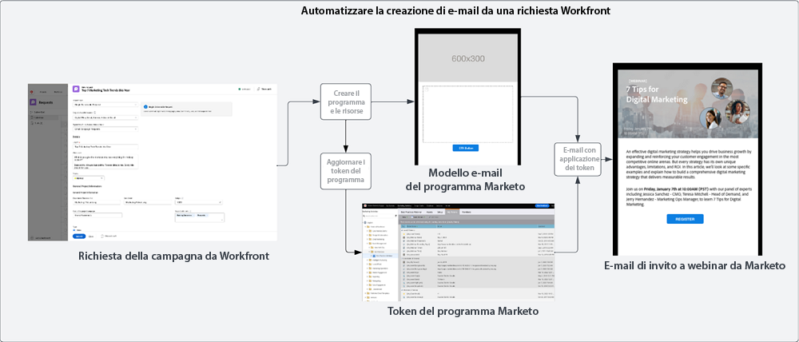
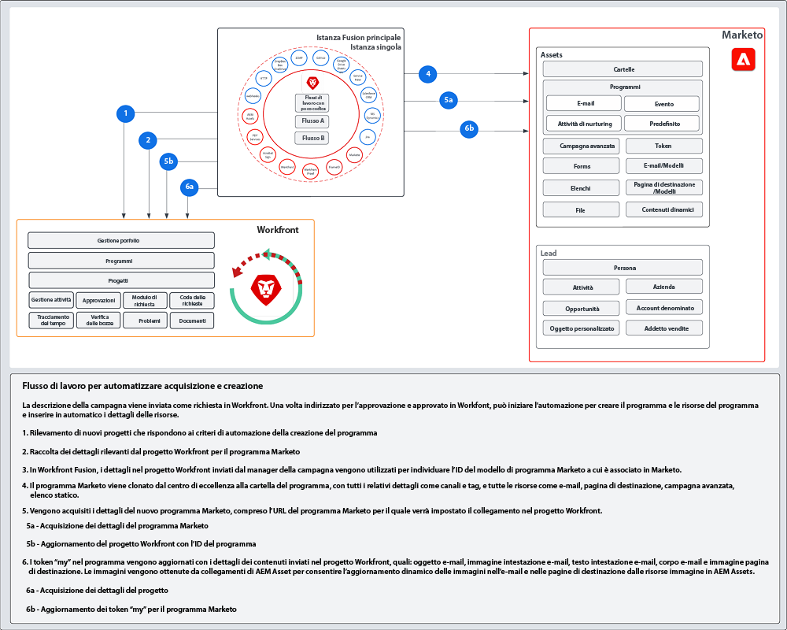

# Blueprint per l’acquisizione e la creazione {#intake-and-create}

La mole di richieste marketing che un team di marketing deve gestire per lanciare nuove campagne può generare un susseguirsi di attività ripetitive, con conseguente sfinimento del team e stagnazione dell’innovazione.

Definendo un processo per l’invio delle richieste relative alle campagne e automatizzando la creazione delle campagne marketing più frequenti, puoi: velocizzare le campagne, ridurre gli errori, indirizzare le richieste alla persona giusta nel team delle operazioni marketing, bilanciare e migliorare l’utilizzo delle risorse e focalizzare le operazioni marketing sulle attività più strategiche.

Con Workfront e Marketo Engage, una connessione tra i due sistemi permette di ottenere i dettagli da un [modulo di richiesta Workfront](https://experienceleague.adobe.com/docs/workfront/using/administration-and-setup/customize/custom-forms/create-or-edit-a-custom-form.html?lang=it){target="_blank"} per creare un programma Marketo Engage, e quindi inserire variabili chiave come: oggetto e testo dell’e-mail, immagini, data e ora, informazioni sull’evento e altro ancora.

Per ottenere questo tipo di integrazione, si utilizza Workfront Fusion, un livello di automazione del lavoro che consente di automatizzare i flussi di lavoro tra Workfront e altri sistemi.

Il flusso di lavoro illustrato di seguito mostra una richiesta relativa a un webinar effettuata dal manager di una campagna utilizzando un modulo di richiesta Workfront. I dettagli inviati nella richiesta attivano quindi un programma e un’e-mail da creare in Marketo Engage per il webinar. Inoltre, dal modulo di richiesta vengono ricavati i dettagli con cui compilare il contenuto dell’e-mail.

{zoomable=&quot;yes&quot;}

>[!TIP]
>
>Per ulteriori informazioni sui diversi tipi di oggetti in Workfront utilizzati per organizzare il lavoro delle campagne di marketing e su come vengono mappati su un programma di Marketo Engage, consulta la [panoramica di Marketo e Workfront](/help/blueprints/b2b/campaign-supply-chain/overview.md){target="_blank"}.

## Preparare per l’automazione il processo di sviluppo delle campagne {#prepare-your-campaign-development-process-for-automation}

L’automazione di un flusso di lavoro si basa su un processo definito in modo che i team e tutte le parti interessate possano trarre il massimo dall’automazione.

**Quali tipi di richieste marketing riceverai?**

Pensa alle diverse tattiche di marketing che dovrai eseguire, come e-mail, attività di nurturing, webinar di prima parte ed eventi, e magari anche webinar di terze parti o annunci display. È importante considerare ognuna di queste richieste, in quanto potrebbero servire campi di input specifici nel modulo di richiesta da mappare su vari modelli di programma in Marketo Engage che verranno clonati.

Inoltre, è importante sapere se alcune campagne dovranno essere eseguite per più aree geografiche. In questo caso, occorrerà prevedere un progetto in Workfront da cui vengano creati più programmi in Marketo Engage, uno per ogni lingua.

È importante definire fin da subito quali tipi di richieste di marketing si prevede di ricevere, affinché ogni richiesta possa essere gestita in modo automatico.

**Quali informazioni devono essere acquisite nella richiesta di una campagna?**

Pensa alle informazioni chiave che dovranno essere acquisite nel modulo di richiesta per ciascuna delle diverse tattiche. Ecco alcuni esempi di informazioni che potrai acquisire in un modulo di Workfront per consentire l’automazione dello sviluppo della campagna.

<table> 
  <tr> 
   <td><b>Tattica di marketing</b></td>
   <td><b>Informazioni da acquisire</b></td>
  </tr>
  <tr> 
   <td>Invio di e-mail</td>
   <td>• Oggetto dell’e-mail 
• Data pianificata 
• Testo dell’e-mail 
• Invito all’azione 
• Immagini - È possibile fare riferimento direttamente agli URL di AEM Assets da utilizzare in Marketo 
• Criteri di qualificazione del pubblico</td>
  </tr>
  <tr>
   <td>Webinar/Evento</td>
   <td>• Nome dell’evento 
• Data dell’evento 
• Ora dell’evento 
• Città in cui si terrà l’evento 
• Descrizione dell’evento 
• Pagina della registrazione del webinar - URL pagina on-demand 
• Nomi dei relatori 
• Titoli dei relatori 
• Immagini dei relatori 
• E-mail necessarie (invito, conferma, promemoria, follow-up) 
• Immagini per l’intestazione dell’e-mail 
• Criteri di qualificazione del pubblico</td>
  </tr>
  <tr>
   <td>Attività di nurturing</td>
   <td>• Numero di e-mail 
• Testo delle e-mail 
• Intestazioni delle e-mail 
• Invito all’azione 
• Criteri di qualificazione del pubblico</td>
  </tr>
  </tbody>
</table>

>[!NOTE]
>
>Ad oggi, la creazione programmatica del pubblico tramite l’automazione è limitata in Marketo Engage poiché i token non sono supportati negli elenchi avanzati. Un utente dovrà quindi creare il pubblico in Marketo Engage; oppure, se comunichi sempre con un pubblico predeterminato, puoi includere nel modello di programma un elenco avanzato configurato che verrà clonato durante il processo di automazione.

### Creare il centro di eccellenza {#establish-your-center-of-excellence}

Se desideri automatizzare la creazione dei programmi, avrai bisogno di un centro di eccellenza in Marketo Engage. Un centro di eccellenza include programmi e risorse basati su modelli che consentano di accelerare e standardizzare il processo di sviluppo delle campagne. Ad esempio, puoi avere un modello di programma per ogni diversa esigenza delle campagne: e-mail, attività di nurturing, evento in presenza e webinar. Inoltre, puoi avere più modelli di programma e-mail, uno per ogni area geografica o per ogni tipo di annuncio e-mail.

La creazione di un centro di eccellenza basato su modelli di programma in Marketo Engage rappresenta uno dei primi passi da compiere per un approccio più programmatico all’esecuzione delle campagne e fungerà da base per l’automazione delle richieste delle campagne.

Una volta impostato un set di modelli di programma riutilizzabili, sarà possibile potenziare ulteriormente le capacità e velocizzare lo sviluppo delle campagne mediante l’automazione descritta in questo blueprint.

Per saperne di più sulla creazione di un centro di eccellenza, consulta le best practice che trovi nella [Community Marketo](https://nation.marketo.com/t5/product-blogs/marketo-master-class-center-of-excellence-with-chelsea-kiko/ba-p/243221){target="_blank"}.

### Utilizzare i token per popolare i contenuti {#use-tokens-to-populate-content}

Con Marketo Engage, è possibile utilizzare i token per popolare i contenuti nelle risorse delle campagne. Ad esempio, dopo aver clonato un modello di e-mail dal centro di eccellenza, Workfront Fusion può trasmettere i dettagli dalla richiesta della campagna da Workfront ai token “my” nel programma di Marketo Engage. I valori dei token possono quindi essere ereditati direttamente nell’e-mail per creare il messaggio e-mail stesso.

{zoomable=&quot;yes&quot;}

### Popolare immagini da AEM Assets {#populate-images-from-aem-assets}

Puoi automatizzare ulteriormente lo sviluppo delle e-mail e pagine di destinazione utilizzando i token di Marketo Engage in combinazione con i collegamenti alle risorse in AEM Assets. Chi richiede una campagna può inviare, nel processo di richiesta, i collegamenti a immagini pubblicati da AEM Assets. Workfront Fusion può quindi incorporare tali collegamenti nel codice HTML di un’e-mail mediante i token di Marketo Engage.

Ricorda che, per utilizzare i token “my” in modo che Fusion possa aggiornare i valori dei token con le informazioni inviate in Workfront, è necessario creare i programmi e i modelli di programma in Marketo Engage.

>[!NOTE]
>
>Per supportare questo flusso di lavoro, non è necessario disporre di AEM Assets; tuttavia, AEM Assets può consentire un processo più diretto per la gestione delle risorse nell’intera supply chain per lo sviluppo delle campagne.

### Assemblare una libreria di ricerca per tutti i tipi di richieste di programma {#assemble-a-lookup-library-for-all-program-request-types}

Quando si automatizza la creazione di nuovi programmi Marketo Engage mediante richieste Workfront, è importante includere nell’automazione Workfront Fusion un passaggio che consenta di usare le informazioni presenti nella richiesta di Workfront per trovare i modelli di programma appropriati da clonare in Marketo Engage.

A questo scopo, puoi importare in Workfront Fusion un set di dati che includa un elenco di tutti i diversi modelli di programma nel centro di eccellenza di Marketo Engage.

Ecco alcune informazioni di base da includere nella libreria di ricerca dei modelli di programma:

<table> 
  <tr> 
   <td><b>Colonna</b></td>
   <td><b>Descrizione</b></td>
  </tr>
  <tr> 
   <td>Tipo di campagna</td>
   <td>Ad esempio: e-mail, webinar, attività di nurturing, evento, webinar di terze parti, importazione di elenchi, ecc.. Il tipo di campagna funge da descrizione leggibile per ciò che viene richiesto.</td>
  </tr>
  <tr> 
   <td>Tipo di richiesta Workfront</td>
   <td>Tipo di richiesta selezionato nel modulo di Workfront; può essere uguale al tipo di campagna, ad esempio e-mail, webinar, attività di nurturing o evento. Viene utilizzato per mappare l’input selezionato nel modulo di Workfront su un modello di programma in Marketo.</td>
  </tr>
  <tr> 
   <td>ID modulo di Workfront</td>
   <td>ID univoco del modulo di richiesta di Workfront utilizzato per convalidare la richiesta di scrittura da mappare sul modello di programma di Marketo Engage.</td>
  </tr>
  <tr> 
   <td>ID programma di Marketo</td>
   <td>ID del modello di programma in Marketo Engage, associato alla richiesta in corso. Se queste informazioni sono immediatamente disponibili in Workfront Fusion, sarà possibile inviare la richiesta a Marketo Engage e individuare esattamente il programma da clonare.</td>
  </tr>
  </tbody>
</table>

## Flusso di automazione per acquisizione e creazione {#intake-and-create-automation-flow}

Ecco un esempio di come è possibile assemblare la logica del flusso di lavoro in Fusion utilizzando i moduli preconfigurati di [Workfront](https://experienceleague.adobe.com/docs/workfront/using/adobe-workfront-fusion/fusion-apps-and-modules/workfront-modules.html?lang=it){target="_blank"} and [Marketo Engage](https://experienceleague.adobe.com/docs/workfront/using/adobe-workfront-fusion/fusion-apps-and-modules/marketo-modules.html?lang=it){target="_blank"} che consentono di distribuire più rapidamente l’automazione.

Utilizzare i token per popolare i contenuti

## Risorse {#resources}

* [Moduli Adobe Marketo Engage](https://experienceleague.adobe.com/docs/workfront/using/adobe-workfront-fusion/fusion-apps-and-modules/marketo-modules.html?lang=it){target="_blank"}

* [Moduli Adobe Workfront](https://experienceleague.adobe.com/docs/workfront/using/adobe-workfront-fusion/fusion-apps-and-modules/workfront-modules.html?lang=it){target="_blank"}

* [Panoramica di Marketo e Workfront](/help/blueprints/b2b/campaign-supply-chain/overview.md){target="_blank"}
