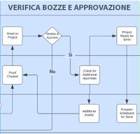
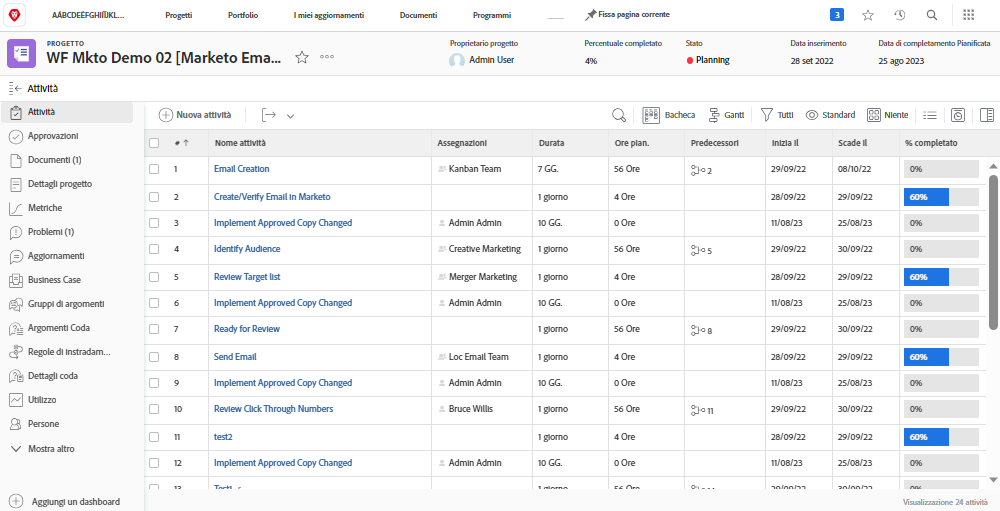
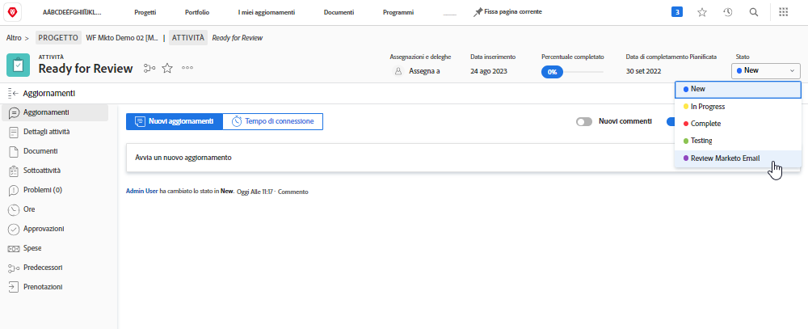
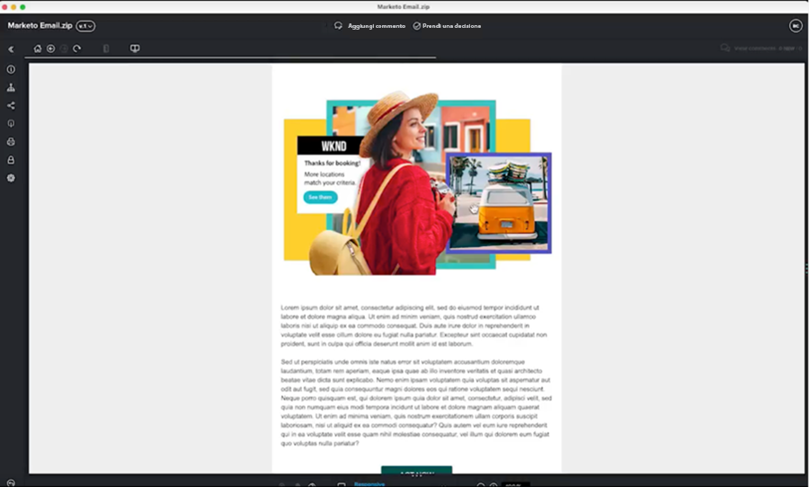

# Revisione e approvazione della blueprint {#review-and-approve-blueprint}

Per fare in modo che le risorse e le campagne di marketing soddisfino le aspettative e gli standard di un’azienda, occorre andare oltre la distribuzione di contenuti e messaggi appropriati al pubblico giusto. Le organizzazioni hanno anche la responsabilità di sostenere le politiche interne, le normative di settore e persino i prerequisiti legali quando intraprendono nuove iniziative di marketing. Incorporando i passaggi di revisione e approvazione nel processo di sviluppo della campagna, i team di marketing possono garantire che i contenuti e i messaggi siano accurati e conformi ai loro standard di settore, in particolare per settori come finanza, sanità e prodotti farmaceutici.

Con Workfront e Marketi Engage, i team di marketing hanno l’opportunità di disporre di un sistema di marketing strettamente connesso, con messaggi accurati e conformi alle normative.

## Sblocca bozze e approvazioni avanzate per il Marketo Engage con Workfront {#unlock-proofing-and-advanced-approvals}

Quando pensiamo alla creazione di campagne di marketing, dobbiamo tenere presente che più sistemi supportano i diversi passaggi coinvolti, tra cui: pianificazione, creazione, revisione, feedback, approvazione ed esecuzione. Con Workfront e Marketi Engage, i team dispongono di tutti gli strumenti necessari per svolgere il processo di pianificazione e lancio di una nuova campagna di marketing. Inoltre, i team possono semplificare ulteriormente il processo di revisione e approvazione per aumentare la velocità di sviluppo delle campagne, garantendo al contempo che la precisione e la conformità siano mantenute ai massimi standard.

### Revisione e approvazione dei casi d’uso sbloccati con il Marketo Engage e Workfront {#review-and-approve-use-cases-unlocked-with-marketo-engage-and-workfront}

* Eliminazione di feedback eterogenei e aumento della collaborazione in un luogo centralizzato grazie all&#39;utilizzo delle funzionalità di annotazione e commento di Workfront sulle risorse di Marketo Engage.

* Centralizza le approvazioni attivandole in Marketo Engage dai flussi di lavoro di approvazione Workfront.

* Supporta e semplifica complessi flussi di lavoro di approvazione delle risorse di marketing utilizzando le funzionalità avanzate di approvazione di Workfront con le risorse di Marketo Engage.

* Semplifica l’accesso alle bozze di marketing estraendo in modo programmatico le risorse Marketo in Workfront per la revisione da parte di più parti interessate.

* Tieni traccia delle modifiche e crea un percorso cartaceo centralizzando tutto il lavoro di revisione e verifica per le risorse di Marketo Engage in Workfront.

## Pianificazione del flusso di lavoro di bozza e approvazione {#planning-your-proof-and-approval-workflow}

Prima di impostare l’integrazione di bozza e approvazione tra il Marketo Engage e Workfront, considera i seguenti aspetti:

* Quali risorse dovranno essere riviste e approvate?
* Chi deve essere l&#39;approvatore?
* Sono necessari più approvatori prima che una risorsa di marketing possa essere pubblicata?
* In quale momento del processo di sviluppo della campagna le risorse di marketing verranno assemblate e pronte per essere riviste?

Rispondere a queste domande ti aiuterà a ottenere una linea di base per l’aspetto del flusso di approvazione e per capire come iniziare a configurare l’istanza di Workfront.

## Creazione di un flusso di lavoro di bozza e approvazione tra il Marketo Engage e Workfront {#building-a-proof-and-approval-workflow}

Per semplificare il processo di verifica e approvazione tra Workfront e Marketi Engage, è possibile integrare le due soluzioni utilizzando Workfront Fusion. Workfront Fusion fornisce un’interfaccia di flusso di lavoro per attivare azioni e trasmettere informazioni tra le istanze di Workfront e di Marketo Engage.

A questo scopo, considera i passaggi seguenti come parte del processo per un’esperienza di revisione e approvazione integrata.

1. Configura il progetto Workfront con un&#39;attività Pronto per la revisione.
1. Attiva l&#39;e-mail di Marketo Engage per la sincronizzazione con Workfront con una modifica dello stato dell&#39;attività.
1. Converti il file e-mail del Marketo Engage in bozza visualizzabile in Workfront.
1. Utilizza la verifica Workfront per collaborare tramite commenti e annotazioni.
1. Approva Workfront Proof per attivare l’approvazione delle risorse in Marketi Engage, quindi contrassegna l’attività come completata.

### Configurare un progetto Workfront con un&#39;attività Pronto per la revisione {#configure-a-workfront-project-with-a-ready-for-review-task}

Utilizzare [modelli di progetto](https://experienceleague.adobe.com/docs/workfront/using/manage-work/projects/create-and-manage-project-templates/project-template-overview.html){target="_blank"} acquisire la maggior parte dei processi, delle informazioni e delle impostazioni ripetibili associati ai progetti dell&#39;organizzazione. È possibile definire attività, mettere in coda argomenti, creare moduli personalizzati e allegare documenti nel modello.

Nel modello di progetto in Workfront, includi le attività per la revisione delle risorse che fanno parte della campagna di marketing. È inoltre possibile aggiungere un processo di approvazione per gestire approvazioni singole o più complesse.

Se desideri avviare una nuova campagna e-mail, devi disporre di un modello di progetto che includa un’attività di revisione dell’e-mail e un processo di approvazione per garantire che l’e-mail sia approvata dalle parti interessate prima che possa essere inviata.

{zoomable=&quot;yes&quot;}

### Attiva l&#39;e-mail di Marketo Engage per la sincronizzazione con Workfront con la modifica dello stato dell&#39;attività {#trigger-your-marketo-engage-email-to-sync-to-workfront}

Come parte del processo di revisione, vorrai poter sincronizzare le e-mail con il progetto Workfront una volta che saranno pronte per la revisione da parte del team di marketing. A questo scopo, si consiglia di impostare un&#39;attività Pronto per la revisione con un [stato attività](https://experienceleague.adobe.com/docs/workfront/using/manage-work/projects/update-work-on-a-project/update-task-status.html){target="_blank"} che indica quando l’e-mail è pronta per essere rivista. Nel nostro esempio, abbiamo aggiunto all’attività lo stato Rivedi e-mail Marketo che può essere selezionato quando la bozza dell’e-mail è pronta per essere rivista dalle parti interessate.

Con questo stato impostato nel progetto Workfront, puoi configurare lo scenario Workfront Fusion in modo che ascolti l’attività Pronto per la revisione e si aggiorni a &quot;Rivedi e-mail Marketo&quot;. Una volta aggiornato, lo scenario può recuperare l’e-mail di Marketo Engage come file HTML, comprimerla e salvarne una copia nei documenti del progetto Workfront da rivedere.

{zoomable=&quot;yes&quot;}

### Conversione dell’e-mail di Marketo Engage in bozza visualizzabile in Workfront {#convert-your-marketo-engage-email-to-reviewable-proof-in-workfront}

Dopo aver spostato l’attività Pronto per la revisione sullo stato &quot;Rivedi e-mail Marketo&quot; e aver salvato l’e-mail di Marketo Engage in Workfront, puoi configurare lo scenario Workfront Fusion per convertire l’e-mail in una bozza Workfront.

### Utilizza la verifica Workfront per collaborare tramite commenti e annotazioni {#use-workfront-proofing-to-collaborate}

[Prove Workfront](https://experienceleague.adobe.com/docs/workfront/using/review-and-approve-work/proofing/proofing-overview/proofing-basics.html){target="_blank"} Le funzionalità consentono al team marketing di acquisire una nuova risorsa, ad esempio un’immagine o un messaggio e-mail, e collaborare tramite commenti e annotazioni. Quando una bozza è pronta per essere pubblicata, i responsabili decisionali possono approvare la risorsa dallo strumento di bozza.

{zoomable=&quot;yes&quot;}

### Approva bozza Workfront e attiva l’approvazione delle risorse nel Marketo Engage, contrassegna l’attività come completata {#approve-workfront-proof-and-trigger-asset-approval-in-marketo-engage}

Workfront Fusion può rilevare quando l’e-mail è stata approvata dalle parti interessate e inviare una richiesta al Marketo Engage per approvare l’e-mail all’interno di Marketo.

Con l’e-mail rivista/approvata dai membri del team giusto, l’e-mail è pronta per essere pubblicata in Marketo Engage.

## Modelli di scenario Fusion {#fusion-scenario-templates}

Per semplificare lo sviluppo dei flussi di lavoro di revisione e approvazione nella tua istanza di Workfront e Marketo Engage, abbiamo creato modelli di fusione che ti aiuteranno a iniziare a utilizzare l’integrazione. Puoi utilizzare questi modelli ricercando &quot;Marketo&quot; nella sezione Modelli pubblici di Fusion e scaricandoli nella tua istanza.

### Rivedi una bozza e-mail di verifica del Marketo Engage in Workfront {#review-an-email-proof-of-your-marketo-engage-email-draft-in-workfront}

Lo scenario di fusione riportato di seguito illustra la prima metà del flusso di revisione e approvazione, in cui la bozza dell’e-mail può essere prelevata dal Marketo Engage e salvata in Workfront come bozza. Una volta salvata come bozza nei documenti del progetto Workfront, può essere rivista dalle parti interessate del marketing, commentata e annotata come parte del processo di revisione.

{zoomable=&quot;yes&quot;}

### Approva un’e-mail in Workfront che attiva l’approvazione della risorsa nel Marketo Engage {#approve-an-email-in-workfront-that-triggers-approval}

Lo scenario di fusione riportato di seguito può essere utilizzato per rilevare quando una bozza in Workfront è stata approvata e inoltrarla al Marketo Engage per aggiornare la bozza e-mail in modo che sia live e pronta per essere utilizzata in un programma di Marketo Engage.

{zoomable=&quot;yes&quot;}

Insieme, questi due scenari possono essere utilizzati per creare un percorso bidirezionale per richiamare risorse di marketing dal Marketo Engage nei solidi flussi di lavoro di revisione e approvazione di Workfront e per inviare nuovamente le approvazioni al Marketo Engage da Workfront.
