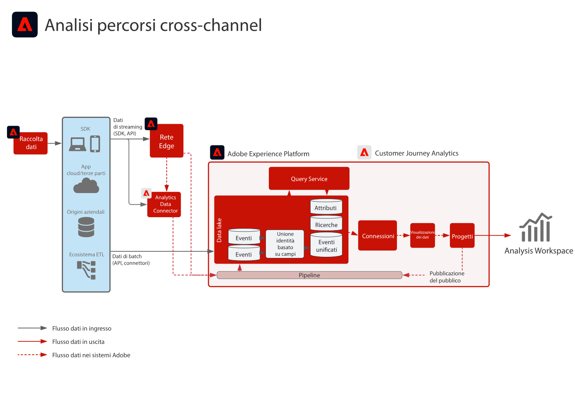

# Blueprint per Customer Journey Analytics B2B

Customer Journey Analytics B2B edition consente la generazione di report e analisi basati sull&#39;account per le organizzazioni B2B. A differenza delle analisi B2C incentrate sulle persone, questo blueprint colloca l&#39;**account** al centro del modello dati, in modo da poter analizzare percorsi di acquisto B2B complessi tra più stakeholder, gruppi di acquisto e cicli di vendita. Utilizza [!DNL Customer Journey Analytics] per unificare i dati comportamentali con dimensioni B2B (account, opportunità, campagne ed elenchi di marketing) per approfondimenti basati sul percorso e la creazione di tipi di pubblico.

## Applicazioni

* Adobe [!DNL Customer Journey Analytics] (B2B edition)
* Adobe Experience Platform (per dati B2B ed evento)

## Casi di utilizzo

* **Ottimizza il marketing dell&#39;account**: analizza l&#39;impatto del marketing su campagne, canali e contenuti per i gruppi di acquisto all&#39;interno degli account, la progressione della pipeline e le opportunità di upselling/cross-selling.
* **Aumento degli account chiave**: identifica punti di contatto di valore elevato tra i gruppi di acquisto all&#39;interno degli account chiave per informare le azioni di marketing e vendita e calcola il valore del ciclo di vita del cliente a livello di account.
* **Genera valore prodotto**: misura l&#39;impatto delle versioni e dell&#39;utilizzo dei prodotti sulla soddisfazione del cliente a livello di account e utente per ottimizzare le funzionalità e informare lo sviluppo.
* **Analisi B2B basata su persona**: combina il contesto dell&#39;account e delle opportunità con il comportamento dei singoli utenti per il punteggio di lead, il coinvolgimento e l&#39;analisi di percorso.

## Prerequisiti

* [!DNL Customer Journey Analytics] diritto B2B edition.
* Dati B2B e comportamentali in Adobe Experience Platform: set di dati B2B (account, opportunità, persone, campagne, elenchi di marketing, attività B2B) e dati evento (web, mobile o altri canali) disponibili in una [connessione CJA](https://experienceleague.adobe.com/docs/analytics-platform/using/cja-connections/create-connection.html?lang=it).
* Denominazione [B2B per CJA](https://experienceleague.adobe.com/docs/analytics-platform/using/cja-dataviews/b2b.html): impostazioni di visualizzazione dati specifiche per B2B (ID account, ID opportunità e dimensioni correlate) configurate per la connessione.

## Architettura

{zoomable="yes"}

I dati scorrono da Experience Platform (set di dati B2B ed evento) in [!DNL Customer Journey Analytics] tramite una connessione CJA. Le dimensioni B2B sono esposte nelle visualizzazioni dati in modo che l’analisi e i tipi di pubblico possano essere creati a livello di account, opportunità e persona.

## Guardrail

* Per informazioni sui limiti e i diritti dei prodotti B2B edition, vedere la [descrizione del prodotto Customer Journey Analytics B2B](https://helpx.adobe.com/it/legal/product-descriptions/customer-journey-analytics-b2b.html).
* Per i limiti tecnici di Analytics Platform e CJA, vedi [Guardrail di Analytics Platform](https://experienceleague.adobe.com/it/docs/analytics-platform/using/technotes/guardrails).
* Per informazioni sui limiti di connessione e di acquisizione dei dati di CJA, consulta [Guardrail di acquisizione dati di Customer Journey Analytics](https://experienceleague.adobe.com/docs/experience-platform/sources/connectors/adobe-applications/analytics.html?lang=it#what-is-the-expected-latency-for-analytics-data-on-platform%3F).
* Se pubblichi tipi di pubblico di CJA in Real-time Customer Data Platform, consulta [Guardrail di condivisione del pubblico di Customer Journey Analytics](https://experienceleague.adobe.com/docs/analytics-platform/using/cja-components/audiences/publish.html?lang=it#latency).
* Per le latenze end-to-end e i guardrail della piattaforma, consulta il [documento sui guardrail di distribuzione](../experience-platform/guardrails.md).

## Fasi di implementazione

1. **Inserire dati B2B ed evento in Experience Platform**. Inserimento di dati di account, opportunità, persona, campagna e attività, oltre a eventi comportamentali, tramite [origini](https://experienceleague.adobe.com/docs/experience-platform/sources/home.html?lang=it) (ad esempio [!DNL Marketo Engage], CRM o altri connettori B2B).
2. **Creare una connessione CJA** — [Aggiungere i set di dati Experience Platform rilevanti](https://experienceleague.adobe.com/docs/analytics-platform/using/cja-connections/create-connection.html?lang=it) (B2B ed evento) a una connessione Customer Journey Analytics.
3. **Configura B2B nella visualizzazione dati** — Abilita la denominazione [B2B e le dimensioni chiave](https://experienceleague.adobe.com/docs/analytics-platform/using/cja-dataviews/b2b.html) (ID account, ID opportunità, ecc.) nelle visualizzazioni dati della connessione.
4. **Genera analisi e tipi di pubblico basati sull&#39;account**. Utilizza [Casi d&#39;uso B2B di CJA e generazione di rapporti](https://experienceleague.adobe.com/docs/analytics-platform/using/cja-usecases/b2b.html?lang=it) per creare rapporti, raggruppamenti e tipi di pubblico a livello di account e opportunità; facoltativamente [pubblica tipi di pubblico in Real-time CDP](https://experienceleague.adobe.com/docs/analytics-platform/using/cja-components/audiences/publish.html?lang=it) per l&#39;attivazione.

## Documentazione correlata

### Customer Journey Analytics B2B edition

* [Customer Journey Analytics B2B edition](https://experienceleague.adobe.com/docs/analytics-platform/using/cja-overview/cja-b2b/cja-b2b-edition.html?lang=it)
* [Casi d’uso B2B](https://experienceleague.adobe.com/docs/analytics-platform/using/cja-usecases/b2b.html?lang=it)
* [Panoramica sui casi di utilizzo di B2B edition](https://experienceleague.adobe.com/docs/analytics-platform/using/cja-usecases/b2b/b2b-edition/use-cases-overview.html?lang=it)
* [Un esempio di progetto B2B basato su persona](https://experienceleague.adobe.com/docs/analytics-platform/using/cja-usecases/b2b/example.html?lang=it)

### Connessioni e visualizzazioni dati

* [Creare una connessione](https://experienceleague.adobe.com/docs/analytics-platform/using/cja-connections/create-connection.html?lang=it)
* [Impostazioni delle visualizzazioni dati B2B](https://experienceleague.adobe.com/docs/analytics-platform/using/cja-dataviews/b2b.html)

### Pubblico e guardrail

* [Pubblicare tipi di pubblico di CJA in Real-time CDP](https://experienceleague.adobe.com/docs/analytics-platform/using/cja-components/audiences/publish.html?lang=it)
* [Experience Platform e guardrail delle applicazioni](../experience-platform/guardrails.md)
