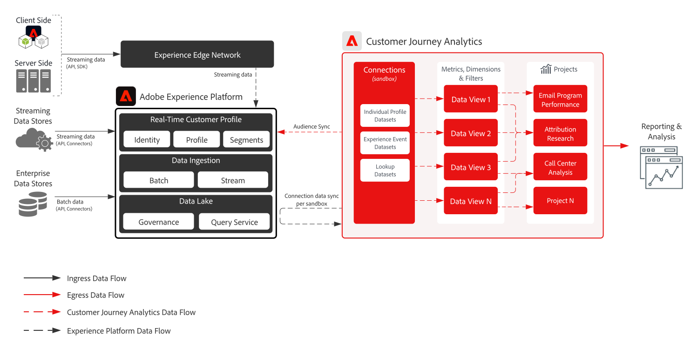

# Blueprint per analisi del percorso destinate alla riduzione delle chiamate

Analizza il comportamento di un cliente su desktop e dispositivi mobili prima del contatto con il call center. Identifica le opportunità per migliorare il percorso del cliente, comprendendo quali azioni tenta di completare, quali contenuti visualizza e quali termini cerca prima di contattare l’assistenza clienti. Determina i contenuti e gli strumenti self-service che possono essere migliorati per aiutare i clienti a risolvere i problemi in autonomia, senza ricorrere all’assistenza clienti.

## Casi di utilizzo

* Analizzare il comportamento del cliente prima della richiesta di supporto
* Individuare opportunità di miglioramento delle funzionalità self-service

## Applicazioni

* Adobe Experience Platform
* Customer Journey Analytics

## Pattern di integrazione

* Adobe Experience Platform → Customer Journey Analytics

## Architettura

## Fasi di implementazione

1. [Creare schemi](https://experienceleague.adobe.com/docs/platform-learn/tutorials/schemas/create-a-schema.html?lang=it) per i dati da acquisire.
1. [Creare set di dati](https://experienceleague.adobe.com/docs/platform-learn/tutorials/data-ingestion/create-datasets-and-ingest-data.html?lang=it) per i dati da acquisire.
1. [Inserire i dati](https://experienceleague.adobe.com/?recommended=ExperiencePlatform-D-1-2020.1.dataingestion&amp;lang=it) in Experience Platform
I dati devono essere acquisiti in Platform prima di essere acquisiti in Customer Journey Analytics.
1. Analizzare i set di dati di eventi multicanale. I set di dati analizzati in unione devono avere un ID di namespace comune o essere riconfigurati tramite la funzionalità di unione basata sul campo di Customer Journey Analytics. 

   >[!NOTE]
   >
   >Customer Journey Analytics attualmente non utilizza il profilo o i servizi di identità di Experience Platform per l’unione dei dati.

1. Eseguire sui dati eventuali operazioni di preparazione personalizzata o unione delle identità basate sul campo, affinché in Customer Journey Analytics venga inserita una chiave comune per tutti i set di dati delle serie temporali.
1. Nei dati di ricerca, fornire un ID primario che può essere associato a un campo nei dati dell’evento. Ai fini delle licenze conta come righe.
1. Impostare lo stesso ID primario per i dati del profilo e i dati degli eventi.
1. Configurare una connessione per l’acquisizione di dati da Experience Platform a Customer Journey Analytics. Una volta inseriti nel data lake, i dati vengono elaborati in Customer Journey Analytics entro 90 minuti.
1. Configurare una vista dati sulla connessione per selezionare dimensioni e metriche specifiche da includere nella vista. Anche le impostazioni di attribuzione e allocazione vengono configurate nella vista dati. Queste impostazioni vengono calcolate al momento della generazione del rapporto.
1. Creare un progetto per configurare dashboard e rapporti in Analysis Workspace.

## Considerazioni sull’implementazione

### Considerazioni sull’unione delle identità

* I dati delle serie temporali da unire devono avere lo stesso ID di namespace su ogni record. Per connettere i dati del call center a dati anonimi di un dispositivo, l’ID digitale deve essere associato all’ID chiamante. Sono possibili diversi meccanismi per questa connessione:
   * il numero di telefono deve essere univoco per quel visitatore in quel momento e una tabella di lookup tiene traccia della relazione.
   * L’utente deve autenticarsi prima di richiedere assistenza e questa autenticazione deve essere associata a un identificatore determinato dall’operatore che risponde alla chiamata (ad esempio, numero di telefono o e-mail).
   * Appoggiandosi a un partner di onboarding, è possibile associare l’identificatore del dispositivo online con identificatori noti della richiesta di assistenza.
* Il processo di unione di set di dati eterogenei richiede una chiave persona/entità primaria comune a tutti i set di dati.
* Le unioni basate su chiave secondaria attualmente non sono supportate.
* Il processo di unione delle identità basate sul campo consente di riconfigurare le identità in righe in base a successivi record di ID transitori, come gli ID di autenticazione. Questo processo consente di risolvere diversi record in un unico ID per l’analisi a livello di persona invece che a livello di dispositivo o cookie.
* L’unione avviene una volta alla settimana, con successiva ripetizione.

## Domande frequenti

* Quali sono gli impatti a valle dei modelli di dati in Customer Journey Analytics?

   In Customer Journey Analytics gli oggetti e gli attributi dello stesso campo XDM si fondono in un’unica dimensione. Per unire più attributi di vari set di dati nella stessa dimensione di CJA, i set di dati devono fare riferimento allo stesso campo o schema XDM.

## Documentazione correlata

* [Descrizione del prodotto Customer Journey Analytics](https://helpx.adobe.com/it/legal/product-descriptions/customer-journey-analytics.html)
* [Documentazione di Customer Journey Analytics](https://experienceleague.adobe.com/docs/customer-journey-analytics.html?lang=it)
* [Tutorial su Customer Journey Analytics](https://experienceleague.adobe.com/docs/customer-journey-analytics-learn/tutorials/overview.html?lang=it)
