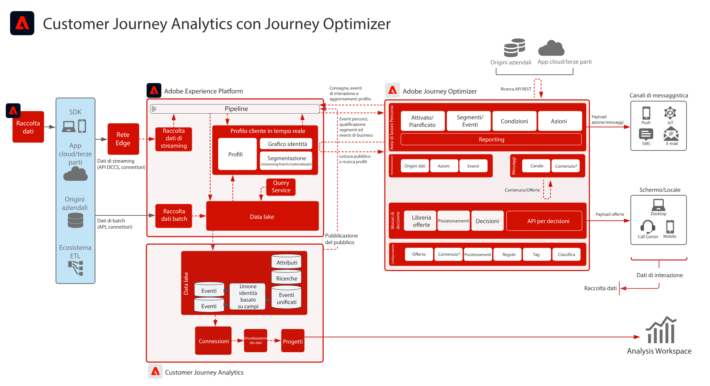

# Blueprint per  Customer Journey Analytics con Journey Optimizer

I dati di Journey Optimizer sono condivisi con il data lake di Experience Platform e disponibili per le funzioni di acquisizione, analisi e reporting di Customer Journey Analytics. I dati sulla distribuzione, sul livello di interazione e sull&#39;efficacia dei percorsi possono essere analizzati e raccolti direttamente in Customer Journey Analytics.

Inoltre, i tipi di pubblico creati in Customer Journey Analytics possono essere pubblicati nel profilo cliente in tempo reale di Experience Platform e sono disponibili per l’esecuzione dei percorsi in Journey Optimizer.

## Guida all’implementazione

Consulta la seguente documentazione per informazioni su come implementare e configurare i dati di Journey Optimizer all’interno di Customer Journey Analytics. [Documentazione](https://experienceleague.adobe.com/docs/journey-optimizer/using/reporting/reports/sharing-overview.html?lang=it)

## Architettura per Customer Journey Analytics con Journey Optimizer

{zoomable=&quot;yes&quot;}
