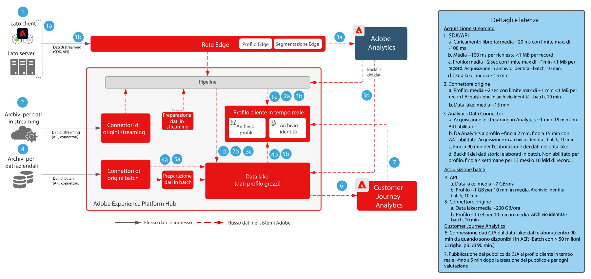

# Customer Journey Analytics con blueprint Real-time Customer Data Platform

Crea e pubblica i tipi di pubblico identificati da Customer Journey Analytics (CJA) nel profilo cliente in tempo reale in Adobe Experience Platform, per eseguire attività di targeting dei clienti e personalizzazione. Questa soluzione è ideale per creare tipi di pubblico sulla base di dati storici, nonché tipi di pubblico più mirati con filtri granulari e campi calcolati in Customer Journey Analytics.

## Guida alla pubblicazione dei tipi di pubblico in Customer Journey Analytics

Consulta la seguente documentazione per informazioni su come implementare e configurare la pubblicazione dei tipi di pubblico da Customer Journey Analytics a Real-time Customer Data Platform. [Documentazione](https://experienceleague.adobe.com/docs/analytics-platform/using/cja-components/audiences/publish.html?lang=it)

## Architettura per i blueprint per Customer Journey Analytics

{zoomable="yes"}

## Diagramma dei guardrail per i blueprint per Customer Journey Analytics

* Per informazioni dettagliate sui guardrail e le latenze end-to-end, consulta il [documento sui guardrail relativi all’implementazione](../experience-platform/deployment/guardrails.md).

{zoomable="yes"}

## Domande frequenti

* Se in RTCDP non esiste un profilo corrispondente inviato da CJA, verrà creato un nuovo profilo oppure i tipi di pubblico vengono registrati da CJA solo per i profili già presenti? Sì, verrà creato un nuovo profilo. Di conseguenza, se l’implementazione RTCDP è solo per i clienti noti, le regole del pubblico CJA dovrebbero essere scritte in modo da filtrare solo i profili con identità note. Si evita così, se necessario, che il conteggio dei profili RTCDP venga incrementato dai profili anonimi.

* Quali identità vengono inviate da CJA? CJA invia tutte le identità che sono state configurate come “ID persona” durante la configurazione di CJA.

* Cosa viene impostato come identità principale? Viene impostata l’identità selezionata dall’utente come ID di “persona” al momento della configurazione di CJA.

* I messaggi di CJA vengono elaborati anche dal servizio Identity? Ad esempio, CJA è in grado di aggiungere identità a un grafo di identità profilo tramite la condivisione del pubblico? No, il servizio Identity non elabora i messaggi di CJA.