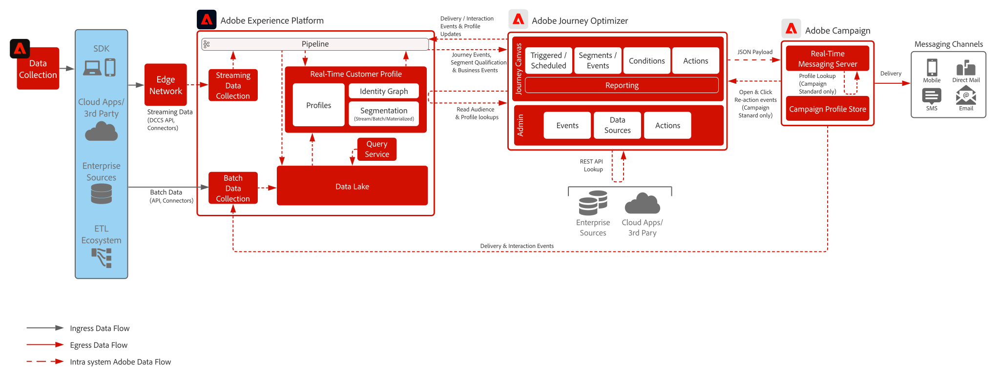

# Blueprint per Journey Optimizer con Adobe Campaign v8

Dimostra come Adobe [!DNL Journey Optimizer] può essere utilizzato con Adobe [!DNL Campaign] in modo nativo per inviare messaggi utilizzando il server di messaggistica in tempo reale in [!DNL Campaign].

## Architettura

>[!IMPORTANT]
>È possibile utilizzare sia Journey Optimizer che Campaign per inviare messaggi in modo indipendente l’uno dall’altro, ma occorre tenere conto di alcuni aspetti tecnici. Se si desidera seguire questo percorso, collaborare con l&#39;architetto aziendale pre-vendita per assicurarsi di avere una visione di ciò che sarà necessario per supportare l&#39;implementazione

 

## Prerequisiti

Esamina i seguenti prerequisiti per ciascuna applicazione.

### Adobe Experience Platform

* Gli schemi e i set di dati devono essere configurati nel sistema prima di poter configurare le origini dati di Journey Optimizer.
* Per gli schemi basati su classi Experience Event, aggiungi &quot;Gruppo di campi ID evento di orchestrazione&quot; quando desideri che venga attivato un evento che non sia un evento basato su regole
* Per gli schemi basati su singole classi di profilo, aggiungi il gruppo di campi &quot;Dettagli test profilo&quot; per poter caricare i profili di test da utilizzare con Journey Optimizer
* Journey Optimizer e Campaign devono entrambi essere presenti nella stessa organizzazione IMS.

### Campaign v8

* Adobe Managed Cloud Services deve ospitare l’istanza di esecuzione del servizio di messaggistica in tempo reale (ad esempio il Centro messaggi)
* L’authoring dei messaggi viene eseguito direttamente nell’istanza di Campaign.

## Guardrail

* [Limitazioni del prodotto Journey Optimizer Guardrail](https://experienceleague.adobe.com/it/docs/journey-optimizer/using/get-started/guardrails)

* [Guardrail e indicazioni sulla latenza end-to-end](https://experienceleague.adobe.com/docs/blueprints-learn/architecture/architecture-overview/guardrails.html?lang=it)

## Fasi di implementazione

Segui le implementazioni per ciascuna applicazione descritta di seguito.

### Adobe Experience Platform

#### Schema/set di dati

1. [Configurare singoli schemi di profilo, di esperienza e di entità multiple](https://experienceleague.adobe.com/?recommended=ExperiencePlatform-D-1-2021.1.xdm&lang=it) in Experience Platform, in base ai dati forniti dal cliente
1. (Facoltativo) Crea schemi basati su classi Experience Event per le tabelle Adobe Campaign broadLog, trackingLog e indirizzi non consegnabili.
1. [Creare set di dati](https://experienceleague.adobe.com/docs/platform-learn/tutorials/data-ingestion/create-datasets-and-ingest-data.html?lang=it) in Experience Platform per i dati da acquisire.
1. [Aggiungere etichette di utilizzo dati](https://experienceleague.adobe.com/docs/platform-learn/tutorials/data-governance/classify-data-using-governance-labels.html?lang=it) ai set di dati in Experience Platform a scopo di governance.
1. [Creare le policy](https://experienceleague.adobe.com/docs/platform-learn/tutorials/data-governance/create-data-usage-policies.html?lang=it) che necessarie per applicare la governance alle destinazioni

#### Profilo/identità

1. [Creare namespace specifici per il cliente](https://experienceleague.adobe.com/docs/platform-learn/tutorials/identities/label-ingest-and-verify-identity-data.html?lang=it)
1. [Aggiungere le identità agli schemi](https://experienceleague.adobe.com/docs/platform-learn/tutorials/identities/label-ingest-and-verify-identity-data.html?lang=it)
1. [Attivare lo schema e i set di dati per il profilo](https://experienceleague.adobe.com/docs/platform-learn/tutorials/profiles/bring-data-into-the-real-time-customer-profile.html?lang=it)
1. [Impostare i criteri di unione](https://experienceleague.adobe.com/docs/platform-learn/tutorials/profiles/create-merge-policies.html?lang=it) per viste diverse del [!UICONTROL profilo cliente in tempo reale] (opzionale)
1. Creare segmenti da utilizzare in Journey

#### Origini/destinazioni

1. [Acquisisci dati in [!DNL Experience Platform]](https://experienceleague.adobe.com/?recommended=ExperiencePlatform-D-1-2020.1.dataingestion&lang=it) utilizzando API di streaming e connettori di origine.

### Blueprint per

1. Configura l&#39;origine dati [!DNL Experience Platform] e determina i campi da memorizzare in cache
1. I dati di streaming utilizzati per avviare un percorso del cliente devono prima essere configurati in Journey Optimizer per ottenere un ID di orchestrazione. Questo ID di orchestrazione viene quindi fornito allo sviluppatore che potrà utilizzarlo con l’acquisizione.
1. Configurare le origini dati esterne.
1. Configura azioni personalizzate per l’istanza Campaign.

### Campaign v8

* I modelli di messaggistica devono essere configurati con il contesto di personalizzazione appropriato.
* Per lo standard [!DNL Campaign]: i flussi di lavoro di esportazione devono essere configurati per esportare nuovamente i registri di messaggistica transazionale in Experience Platform. Il consiglio è di eseguire al massimo ogni quattro ore.
* Per [!DNL Campaign] v8.4 è possibile sfruttare il connettore Managed Services Source di Adobe [!DNL Campaign] in Experience Platform per sincronizzare gli eventi di consegna e tracciamento da Campaign ad Experience Platform. Per ulteriori informazioni, consulta la documentazione di [Source Connector](https://experienceleague.adobe.com/docs/experience-platform/sources/home.html?lang=it).

### Configurazione push mobile (opzionale)

1. Implementa [!DNL Experience Platform] Mobile SDK per raccogliere i token push e le informazioni di accesso per ricollegarsi ai profili cliente noti.
1. Utilizzare i tag di Adobe e creare una proprietà mobile con la seguente estensione:
   * Adobe [!DNL Journey Optimizer] | Adobe [!DNL Campaign Classic] | Adobe [!DNL Campaign Standard]
   * Adobe [!DNL Experience Platform] [!DNL Edge Network]
   * Identità per [!DNL Edge Network]
   * Mobile Core
1. Assicurati di disporre di un flusso di dati dedicato per le distribuzioni di app mobili rispetto alle distribuzioni web.
1. Per ulteriori informazioni, consulta la [Guida di Adobe Journey Optimizer Mobile](https://developer.adobe.com/client-sdks/edge/adobe-journey-optimizer/push-notification/).

   >[!IMPORTANT]
   >Per poter inviare comunicazioni in tempo reale tramite Journey Optimizer e notifiche push in batch tramite Campaign, potrebbe essere necessario raccogliere token mobili sia in Journey Optimizer che in Campaign. Per l’acquisizione dei token push, Campaign v8 richiede l’utilizzo esclusivo di Campaign SDK.

## Documentazione correlata

* [Documentazione di Journey Optimizer](https://experienceleague.adobe.com/docs/journey-optimizer/using/ajo-home.html?lang=it)
* [Descrizione del prodotto Journey Optimizer](https://helpx.adobe.com/it/legal/product-descriptions/adobe-journey-optimizer.html)
* [Documentazione di Campaign v8](https://experienceleague.adobe.com/docs/campaign-v8.html?lang=it)
