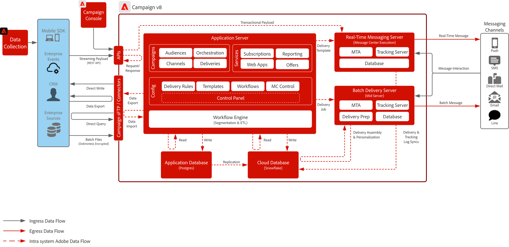

# Blueprint per Campaign v8

Adobe Campaign v8 è una piattaforma di gestione delle campagne di nuova generazione progettata per i canali di marketing tradizionali come e-mail e direct mail. Offre solide funzionalità di ETL e gestione dei dati per supportare segmentazione complessa e targeting del pubblico, insieme a un potente motore di orchestrazione per la creazione di programmi di marketing multi-touch basati su batch.

Include inoltre un server di messaggistica scalabile in tempo reale che consente comunicazioni transazionali, ad esempio reimpostazioni di password, conferme di ordini e ricevute elettroniche, accettando payload completi da sistemi esterni per la consegna immediata.

## Casi di utilizzo

>[!BEGINTABS]

>[!TAB Esecuzione campagna batch]

- Progetta e distribuisci campagne di marketing pianificate su larga scala tramite e-mail, SMS e direct mail.
- Ideale per annunci promozionali, newsletter e offerte stagionali con segmentazione complessa e targeting.

>[!TAB Orchestrazione multi-touch]

- Crea programmi multicanale in più passaggi che guidano i clienti attraverso un percorso di marketing predefinito.
- Supporta il rientro del pubblico, la logica condizionale e le transizioni basate sul tempo.

>[!TAB Gestione dati e ETL]

- Acquisisci, trasforma e gestisci i dati dei clienti da varie origini per supportare il targeting preciso.
- Abilita la creazione di schemi personalizzati, campi calcolati e definizioni di pubblico.

>[!TAB Messaggistica transazionale]

- Inviare messaggi predefiniti in tempo reale attivati da sistemi esterni (ad esempio reimpostazioni di password, conferme d’ordine, ricevute elettroniche).
- Utilizza un server di messaggistica scalabile che accetta payload completi dai sistemi IT per una consegna immediata.

>[!ENDTABS]

 

## Diagrammi architettura

Ulteriori informazioni sui [modelli di distribuzione di Campaign v8](https://experienceleague.adobe.com/docs/campaign/campaign-v8/config/architecture/architecture.html#ac-deployment){target="_blank"}.

### Distribuzione aziendale di Campaign (FFDA)

 

### Distribuzione FDA di Campaign v8

 

## Modelli di integrazione

| Scenario | Descrizione | Considerazioni tecniche |
| :-- | :--- | :--- |
| [[!DNL Real-time Customer Data Platform] con Adobe [!DNL Campaign]](rtcdp-and-campaign-v8.md) | Mostra come Adobe Experience Platform e il suo Real-Time Customer Profile e lo strumento di segmentazione centralizzata possono essere utilizzati con Adobe [!DNL Campaign] per fornire conversazioni personalizzate | <ul><li>Condivisione di profili e tipi di pubblico da [!DNL Real-Time CDP] ad Adobe [!DNL Campaign] tramite l&#39;utilizzo di scambio di file di archiviazione cloud e flussi di lavoro di acquisizione di Adobe [!DNL Campaign] </li><li>Condividi facilmente i dati di consegna e interazione delle conversazioni con i clienti in [!DNL Real-Time CDP] da Adobe [!DNL Campaign] per migliorare Real-Time Customer Profile e fornire rapporti cross-channel sulle campagne di messaggistica</li></ul> |
| [[!DNL Journey Optimizer] con Adobe [!DNL Campaign]](ajo-and-campaign-v8.md) | Mostra come utilizzare Adobe Journey Optimizer per orchestrare 1:1 esperienze utilizzando Real-Time Customer Profile e come sfruttare il sistema nativo di messaggistica transazionale Adobe [!DNL Campaign] per inviare il messaggio | <ul><li>È possibile inviare fino a 1 milione di messaggi all’ora tramite il server di messaggi in tempo reale.<li>Non viene eseguita alcuna limitazione da [!DNL Journey Optimizer]. Assicurarsi quindi che un Enterprise Architect pre-vendita effettui il controllo tecnico</li><li>La funzionalità Gestione delle decisioni non è supportata nei payload per Campaign v8.</li></ul> |

 

## Prerequisiti

Per questo blueprint esistono i seguenti prerequisiti.

### Server applicazioni e server per messaggistica in tempo reale

- Per interagire e utilizzare il software [!DNL Campaign] v8 è necessaria la console client di Adobe [!DNL Campaign]. Si tratta di un client basato su Windows che utilizza protocolli Internet standard (SOAP, HTTP, ecc.). Assicurati che nella tua organizzazione siano state abilitate le autorizzazioni necessarie per distribuire, installare ed eseguire software.

- Inserimento di indirizzi IP nell’elenco Consentiti:
   - Identifica gli intervalli IP utilizzati da tutti gli utenti durante l’accesso alla console client.
   - Identifica i sistemi aziendali autorizzati a comunicare con il server di messaggistica in tempo reale e verifica che dispongano di un IP o di un intervallo assegnato in modo statico e che sia possibile inserire nell’elenco Consentiti.
   - Può essere configurato e controllato tramite il Pannello di controllo Campaign.
- Gestione chiave sFTP:
   - Assicurati di avere le chiavi pubbliche SSH da utilizzare con l’sFTP per Campaign. Può essere configurato e controllato tramite il Pannello di controllo Campaign.

### E-mail

- Disponi di un sottodominio pronto per essere utilizzato per l’invio dei messaggi.
- Il sottodominio può essere delegato completamente ad Adobe (scelta consigliata) oppure è possibile utilizzare i CNAME per puntare a server DNS specifici di Adobe (personalizzati).
- È necessario un record TXT di Google per ogni sottodominio per garantire un buon recapito messaggi.

### Push per dispositivi mobili

- Disporre di uno sviluppatore mobile per distribuire, configurare e generare l’app mobile.
- Adobe fornisce solo un SDK per la raccolta delle informazioni necessarie da FCM (Android) e APNS (iOS) per inviare i payload dei messaggi ai propri server. Il cliente è responsabile di come l’app mobile deve essere codificata, implementata, gestita e sottoposta a debug.

### Web app (facoltativo)

- Può delegare un ulteriore sottodominio per le pagine di destinazione e di annullamento dell’abbonamento ospitate da Campaign.
- Il certificato SSL è vivamente consigliato.

 

## Guardrail

### Determinare la dimensione del server delle applicazioni

- Lo storage può essere scalato fino a 200 milioni di profili, con possibilità di scalabilità fino a 1 miliardo di profili.
- Imposta e controlla l&#39;accesso utente tramite Adobe [!DNL Admin Console].
- Il caricamento dei dati in [!DNL Campaign] deve essere eseguito tramite file batch:
   - Il supporto per il caricamento dei dati API è principalmente per la gestione di profili o oggetti semplici nel database (creazione e aggiornamento). Non è pensato per essere utilizzato per l’upload di grandi volumi di dati né operazioni in batch.
   - Non è supportato l’utilizzo delle API per leggere i dati ai fini di un’applicazione personalizzata.
   - I dati caricati tramite API vengono memorizzati nel database delle applicazioni e quindi replicati ogni ora nel database Cloud.
- Si applicano limiti alle chiamate API. Ulteriori informazioni sono disponibili nella [Descrizione del prodotto Adobe Campaign](https://helpx.adobe.com/it/legal/product-descriptions/adobe-campaign-managed-cloud-services.html){target="_blank"}.

### Determinare la dimensione del server per messaggistica in batch

- È possibile gestire fino a 20 milioni di messaggi all’ora.

### Determinare la dimensione del server di messaggistica in tempo reale

- È possibile inviare fino a 1 milione di messaggi all’ora.
- Per impostazione predefinita, sono previsti due server per la messaggistica in tempo reale. È possibile aumentarli fino a otto server per la messaggistica in tempo reale.

### Configurazione SMS

- Campaign offre la possibilità di integrazione con un provider SMS. Il provider viene fornito dal cliente e integrato con campaign per l’invio di messaggi basati su SMS.
- Il supporto avviene tramite il protocollo SMPP.
- Ci sono tre (3) diversi tipi di SMS, tutti supportati da Adobe:
   - SMS MT (Mobile Terminated): SMS emesso da Adobe [!DNL Campaign] nei confronti di telefoni cellulari tramite il provider SMPP.
   - SMS MO (Mobile Originated): SMS inviato da un dispositivo mobile ad Adobe [!DNL Campaign] tramite il provider SMPP.
   - SMS SR (Status Report) o DR o DLR (Delivery Receipt): una ricevuta di ritorno inviata dal dispositivo mobile a Adobe [!DNL Campaign] tramite il provider SMPP che indica che l’SMS è stato ricevuto correttamente. Adobe [!DNL Campaign] potrebbe inoltre ricevere un messaggio SR che indica che non è stato possibile recapitare il messaggio, spesso con una descrizione dell&#39;errore.

 

## Fasi di implementazione

Consulta la guida introduttiva per l’[implementazione di Adobe Campaign v8](https://experienceleague.adobe.com/docs/campaign/campaign-v8/implement/implement.html).

## Documentazione correlata

- [Documentazione di Campaign v8](https://experienceleague.adobe.com/docs/campaign-v8.html)
- [Descrizione del prodotto Campaign v8](https://helpx.adobe.com/it/legal/product-descriptions/adobe-campaign-managed-cloud-services.html)
- [Documentazione sui tag di Experience Platform](https://experienceleague.adobe.com/docs/launch.html)
- [Documentazione di Experience Platform Mobile SDK](https://experienceleague.adobe.com/docs/mobile.html)