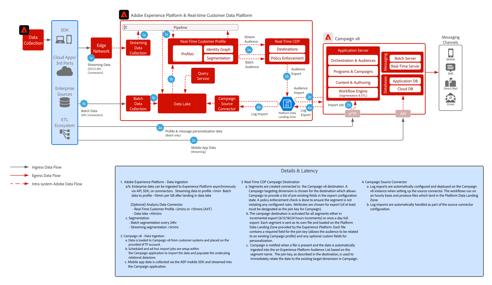

# [!DNL Real-Time CDP] con modello di integrazione di Adobe [!DNL Campaign] v8

Mostra come Adobe [!DNL Experience Platform], il suo Real-Time Customer Profile e lo strumento di segmentazione centralizzata possono essere utilizzati con Adobe Campaign per fornire conversazioni personalizzate.

## Applicazioni

* Adobe [!DNL Experience Platform Real-Time CDP]
* Adobe [!DNL Campaign] v8

## Architettura

 

## Prerequisiti

* Provisioning del cliente per Experience Cloud con un’organizzazione IMS valida
* Si consiglia di eseguire il provisioning di Adobe Experience Platform e [!DNL Campaign] nella stessa organizzazione IMS per un singolo URL di accesso
* È necessario eseguire il provisioning del cliente per l&#39;istanza V8 di [!DNL Campaign]
* Il cliente deve essere idoneo e deve avere accesso a RTCDP, alle origini e alle destinazioni.
* Il contesto di prodotto di Adobe [!DNL Campaign] deve esistere

 

## Fasi di implementazione

Consulta la seguente documentazione su come configurare il connettore di origini di Campaign v8 per Adobe Experience Platform, e il connettore di destinazioni di Real-time Customer Data Platform per Campaign v8.
[Connettori per Campaign e AEP](https://experienceleague.adobe.com/docs/campaign/campaign-v8/connect/ac-aep.html?lang=it)

## Guardrail

### Adobe Campaign

* Consulta la documentazione del connettore di origini per Campaign - [Connettore origine per Campaign](https://experienceleague.adobe.com/docs/experience-platform/sources/ui-tutorials/create/adobe-applications/campaign.html?lang=it)
* Supporta solo le implementazioni di Adobe Campaign per singole unità organizzative

### Condivisione dei segmenti Experience Platform Real-time Customer Data Platform

* Consulta la documentazione sul connettore di destinazioni RTCDP per Campaign - [Connessione di RTCDP per Campaign](https://experienceleague.adobe.com/docs/experience-platform/destinations/catalog/email-marketing/adobe-campaign-managed-services.html?lang=it)

* Vedi i guardrail per l’acquisizione di profili e dati per AEP - [Collegamento](https://experienceleague.adobe.com/docs/experience-platform/profile/guardrails.html?lang=it)
