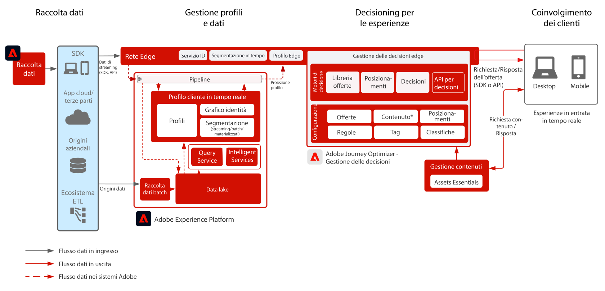

# Journey Optimizer - Gestione delle decisioni tramite rete Edge

Per ulteriori informazioni sul servizio Gestione delle decisioni, consulta la documentazione del prodotto (disponibile [QUI](https://experienceleague.adobe.com/docs/journey-optimizer/using/offer-decisioniong/get-started-decision/starting-offer-decisioning.html?lang=it)) e la panoramica di Gestione delle decisioni (disponibile [QUI](https://experienceleague.adobe.com/docs/blueprints-learn/architecture/customer-journeys/journey-optimizer/decision-management/decision-management-overview.html?lang=en)).

La funzionalità Gestione delle decisioni è un servizio Adobe fornito come parte di Adobe Journey Optimizer. Questo blueprint riassume i casi di utilizzo e le capacità tecniche dell’applicazione e descrive nel dettaglio i vari componenti dell’architettura di Gestione delle decisioni e le relative considerazioni.

Il servizio Gestione delle decisioni può essere implementato in due modi. Il primo approccio prevede l’utilizzo dell’hub Adobe Experience Platform, un’architettura con un singolo datacenter. Con questo approccio mediante “hub”, le offerte vengono eseguite, personalizzate e distribuite con una latenza di pochi secondi. Pertanto, l’architettura con hub è più adatta per esperienze del cliente che non richiedono latenze inferiori al secondo, ad esempio per decisioni di offerta destinate a chioschi o esperienze assistite da agenti, come call center o interazioni con persone.

Il secondo approccio prevede l’utilizzo della rete Experience Edge, un’infrastruttura geograficamente distribuita a livello globale per la distribuzione rapida di esperienze con una latenza inferiore al secondo o di millisecondi. Per ridurre al minimo la latenza, l’esperienza del consumatore finale viene eseguita dall’infrastruttura Edge geograficamente più vicina. Il servizio Gestione delle decisioni sulla rete Edge è progettato per offrire ai consumatori esperienze in tempo reale, comprese le richieste di personalizzazione in entrata per web e dispositivi mobili.

Questo blueprint tratta le specifiche di Gestione delle decisioni sulla rete Edge.

Per ulteriori informazioni su Gestione delle decisioni tramite hub, consulta il blueprint [Gestione delle decisioni tramite hub](https://experienceleague.adobe.com/docs/blueprints-learn/architecture/customer-journeys/journey-optimizer/decision-management/decision-management-hub.html?lang=en).

## Casi di utilizzo per Gestione delle decisioni tramite rete Edge

* Personalizzazione online tramite esperienze web o mobile in entrata.
* Esecuzione di percorsi cross-channel: offerte coerenti su web, dispositivi mobili, e-mail e altri canali di interazione tramite Adobe Journey Optimizer.

 

## Architettura

 

## Pattern di integrazione

| Integrazione | Descrizione |
| :-- | :--- |
| [Gestione delle decisioni con Adobe Target](https://experienceleague.adobe.com/docs/target/using/integrate/ajo/offer-decision.html?lang=it) | La funzionalità Gestione delle decisioni può essere integrata con Adobe Target in modo che le offerte possano essere testate e consegnate come esperienze Target. |

## Prerequisiti

Adobe Experience Platform

* Gli schemi e i set di dati devono essere configurati nel sistema prima di poter configurare le origini dati di Journey Optimizer.
* Per poter attivare un evento non basato su regole, aggiungi il gruppo di campi Orchestration eventID agli schemi di eventi Experience basati su classi.
* Per poter caricare profili di test da utilizzare con Journey Optimizer, aggiungi il gruppo di campi “Profile test details” agli schemi per singoli profili basati su classi.

 

## Guardrail

* Per i guardrail relativi a Journey Optimizer, consulta i seguenti [Guardrail per Journey Optimizer](https://experienceleague.adobe.com/docs/journey-optimizer/using/get-started/limitations.html?lang=it).
* Per i guardrail relativi a Gestione delle decisioni, fai riferimento alla [Descrizione del prodotto Gestione delle decisioni](https://helpx.adobe.com/it/legal/product-descriptions/offer-decisioning-app-service.html).
* Richieste al secondo = 5000.
* Latenza di risposta &lt; 250 ms.
* Accesso al profilo Edge in tempo reale. Nel profilo saranno disponibili solo i tipi di pubblico e gli attributi di profilo Edge proiettati.
* Se vuoi applicare la personalizzazione alla prima esperienza, è preferibile utilizzare l’approccio tramite hub, con profilo completo. Per la prima esperienza Edge, infatti, il profilo Edge deve essere sincronizzato dall’hub. Pertanto, la prima esperienza tramite rete Edge non includerà i dati del profilo precedentemente caricati sull’hub.

### Guardrail per l’acquisizione dei dati

 

### Guardrail per l’attivazione

 

## Modelli di implementazione

* Per implementare Gestione delle decisioni in ambienti in cui è stato implementato l’SDK, utilizza Web SDK o Mobile SDK per la distribuzione su siti web e applicazioni mobili.
   * [Blueprint per Web/Mobile SDK](https://experienceleague.adobe.com/docs/blueprints-learn/architecture/architecture-overview/deployment/websdk.html?lang=en)
   * [Web SDK](https://experienceleague.adobe.com/docs/experience-platform/edge/personalization/offer-decisioning/offer-decisioning-overview.html?lang=it)
   * [Mobile SDK](https://aep-sdks.gitbook.io/docs/)

Oppure

* Per un’implementazione da server a server basata su API, utilizza Edge Network Server API per l’implementazione diretta di Gestione delle decisioni da server a server.
   * [Edge Network Server API](https://experienceleague.adobe.com/docs/journey-optimizer/using/offer-decisioniong/api-reference/offer-delivery/deliver-offers.html?lang=it)

 

## Fasi di implementazione

### Adobe Experience Platform

#### Schema/set di dati

1. [Configurare singoli schemi di profilo, di esperienza e di entità multiple](https://experienceleague.adobe.com/?recommended=ExperiencePlatform-D-1-2021.1.xdm) in Experience Platform, in base ai dati forniti dal cliente
1. [Creare set di dati](https://experienceleague.adobe.com/docs/platform-learn/tutorials/data-ingestion/create-datasets-and-ingest-data.html?lang=it) in Experience Platform per i dati da acquisire.
1. [Aggiungere etichette di utilizzo dati](https://experienceleague.adobe.com/docs/platform-learn/tutorials/data-governance/classify-data-using-governance-labels.html?lang=it) ai set di dati in Experience Platform a scopo di governance.
1. [Creare i criteri](https://experienceleague.adobe.com/docs/platform-learn/tutorials/data-governance/create-data-usage-policies.html?lang=it) necessari per applicare la governance alle destinazioni

#### Profilo/Identità

1. [Creare namespace specifici per il cliente](https://experienceleague.adobe.com/docs/platform-learn/tutorials/identities/label-ingest-and-verify-identity-data.html?lang=it)
1. [Aggiungere le identità agli schemi](https://experienceleague.adobe.com/docs/platform-learn/tutorials/identities/label-ingest-and-verify-identity-data.html)
1. [Attivare lo schema e i set di dati per il profilo](https://experienceleague.adobe.com/docs/platform-learn/tutorials/profiles/bring-data-into-the-real-time-customer-profile.html?lang=it)
1. [Impostare i criteri di unione](https://experienceleague.adobe.com/docs/platform-learn/tutorials/profiles/create-merge-policies.html?lang=it) per le diverse viste di [!UICONTROL Real-time Customer Profile] (opzionale)
1. Creare segmenti da utilizzare in Journey

#### Origini/Destinazioni

1. [Inserire i dati in Experience Platform](https://experienceleague.adobe.com/?recommended=ExperiencePlatform-D-1-2020.1.dataingestion&amp;lang=it) utilizzando API di streaming e connettori di origini.

## Documentazione correlata

* [Adobe Experience Platform](https://experienceleague.adobe.com/docs/experience-platform.html?lang=it)
* [Adobe Journey Optimizer](https://experienceleague.adobe.com/docs/journey-optimizer.html?lang=it)
* [Gestione delle decisioni per Adobe Journey Optimizer](https://experienceleague.adobe.com/docs/journey-optimizer/using/offer-decisioniong/get-started-decision/starting-offer-decisioning.html)
* [Descrizione del prodotto Adobe Journey Optimizer](https://helpx.adobe.com/it/legal/product-descriptions/adobe-journey-optimizer.html)
* [Descrizione del prodotto Adobe Gestione delle decisioni](https://helpx.adobe.com/legal/product-descriptions/offer-decisioning-app-service.html)
