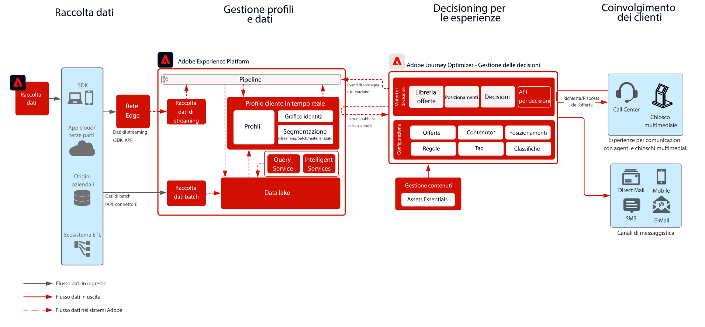

# Blueprint per la gestione delle decisioni tramite hub

Per ulteriori informazioni sul servizio Gestione delle decisioni, consulta la documentazione del prodotto (disponibile [QUI](https://experienceleague.adobe.com/docs/journey-optimizer/using/offer-decisioniong/get-started-decision/starting-offer-decisioning.html?lang=it)) e la panoramica di Gestione delle decisioni (disponibile [QUI](https://experienceleague.adobe.com/docs/blueprints-learn/architecture/customer-journeys/journey-optimizer/decision-management/decision-management-overview.html?lang=it)).

La funzionalità Gestione delle decisioni è un servizio Adobe fornito come parte di Adobe Journey Optimizer. Questo blueprint riassume i casi di utilizzo e le capacità tecniche dell’applicazione e descrive nel dettaglio i vari componenti dell’architettura di Gestione delle decisioni e le relative considerazioni.

Journey Optimizer viene utilizzato per fornire ai clienti le migliori offerte ed esperienze possibili, in tutti i punti di contatto e al momento opportuno. Gestione delle decisioni semplifica la personalizzazione grazie a una libreria centrale di offerte marketing e un motore di decisioni che applica regole e vincoli ai profili avanzati e in tempo reale creati da Adobe Experience Platform, per aiutarti a inviare a ogni cliente l’offerta giusta al momento giusto.

Il servizio Gestione delle decisioni può essere implementato in due modi. Il primo approccio prevede l’utilizzo dell’hub Adobe Experience Platform, un’architettura con un datacenter centrale. Con questo approccio mediante “hub”, le offerte vengono eseguite, personalizzate e distribuite con una latenza >500 ms. Pertanto, l’architettura con hub è più adatta per esperienze del cliente che non richiedono latenze inferiori al secondo, ad esempio per decisioni di offerta destinate a chioschi o esperienze assistite da agenti, come call center o interazioni con persone. L’approccio tramite hub consente anche di gestire le offerte inserite nelle e-mail e nelle campagne in uscita.

Il secondo approccio è tramite l&#39;esperienza [!DNL [!DNL Edge Network]], un&#39;infrastruttura distribuita a livello globale e con una posizione geografica per fornire esperienze veloci di secondo secondario e millisecondo. Per ridurre al minimo la latenza, l’esperienza del consumatore finale viene eseguita dall’infrastruttura Edge geograficamente più vicina. Il servizio Gestione delle decisioni sulla rete Edge è progettato per offrire ai consumatori esperienze in tempo reale, ad esempio con richieste di personalizzazione in entrata per web e dispositivi mobili.

Questo blueprint tratta le specifiche di Gestione delle decisioni tramite hub.

Per ulteriori informazioni su Gestione delle decisioni tramite rete Edge, consulta il blueprint [Gestione delle decisioni sulla rete Edge](https://experienceleague.adobe.com/docs/blueprints-learn/architecture/customer-journeys/journey-optimizer/decision-management/decision-management-edge.html?lang=it).

## Casi di utilizzo per Gestione delle decisioni tramite hub

* Casi di utilizzo dello streaming in cui la latenza del contesto del profilo non è rigida: 15 minuti o superiore.
* Offerte personalizzate per chioschi ed esperienze in-store.
* Offerte personalizzate tramite esperienze assistite da agenti, come call center o interazioni di vendita.
* Offerte incluse in e-mail, SMS, notifiche push per dispositivi mobili o altre interazioni in uscita.
* Fornire offerte a sistemi ESP esterni e di messaggistica per la consegna.
* Esecuzione di percorsi cross-channel: offerte coerenti su web, dispositivi mobili, e-mail e altri canali di interazione tramite Adobe Journey Optimizer.

>[!IMPORTANT]
>
>Per casi di utilizzo di offerte e percorsi che richiedono l’accesso al profilo per ulteriori informazioni e contesto. È importante considerare la latenza associata all’acquisizione dei dati da profilare sull’hub, in modo che siano disponibili al momento della decisione. Per gli scenari in cui il contesto è in streaming o in fase di acquisizione nel profilo e l’offerta o il percorso deve disporre di tale contesto entro pochi secondi o minuti dalla decisione di offerta, questi scenari vengono gestiti in modo ottimale con la funzione Gestione delle decisioni di Edge.

## Architettura

## Guardrail

* Per i guardrail relativi a Journey Optimizer, consulta i seguenti [Guardrail per Journey Optimizer](https://experienceleague.adobe.com/docs/journey-optimizer/using/get-started/limitations.html?lang=it).
* Per i guardrail relativi a Gestione delle decisioni, fai riferimento alla [Descrizione del prodotto Gestione delle decisioni](https://helpx.adobe.com/it/legal/product-descriptions/offer-decisioning-app-service.html).

[Guardrail e indicazioni sulla latenza End to End](https://experienceleague.adobe.com/docs/blueprints-learn/architecture/architecture-overview/guardrails.html?lang=it)

## Modelli di implementazione

* Implementazione in e-mail, SMS e canali in uscita tramite integrazione diretta con [Adobe Journey Optimizer](https://experienceleague.adobe.com/docs/journey-optimizer/using/offer-decisioniong/get-started-decision/offers-e2e.html?lang=it).
* Per l’implementazione di Gestione delle decisioni basata su Server API, utilizza [Decisioning API](https://experienceleague.adobe.com/docs/journey-optimizer/using/offer-decisioniong/api-reference/offer-delivery/decisioning-vs-edge-apis.html?lang=it).
* Per l’implementazione di decisioni basate su batch per la distribuzione di offerte in blocco a un’applicazione di consegna dei messaggi, utilizza [Batch Decisioning API](https://experienceleague.adobe.com/docs/journey-optimizer/using/offer-decisioniong/api-reference/offer-delivery/batch-decisioning-api.html?lang=it).
* Per esperienze in tempo reale basate sulla rete Edge, utilizza Web SDK o Mobile SDK oppure Edge Decisioning API, come descritto nel [blueprint per Gestione delle decisioni tramite rete Edge](https://experienceleague.adobe.com/docs/blueprints-learn/architecture/customer-journeys/journey-optimizer/decision-management/decision-management-edge.html?lang=it).

## Documentazione correlata

* [Adobe Experience Platform](https://experienceleague.adobe.com/docs/experience-platform.html?lang=it)
* [Adobe Journey Optimizer](https://experienceleague.adobe.com/docs/journey-optimizer.html?lang=it)
* [Gestione delle decisioni per Adobe Journey Optimizer](https://experienceleague.adobe.com/docs/journey-optimizer/using/offer-decisioniong/get-started-decision/starting-offer-decisioning.html?lang=it)
* [Descrizione del prodotto Adobe Journey Optimizer](https://helpx.adobe.com/it/legal/product-descriptions/adobe-journey-optimizer.html)
* [Descrizione del prodotto Adobe Gestione delle decisioni](https://helpx.adobe.com/it/legal/product-descriptions/offer-decisioning-app-service.html)
