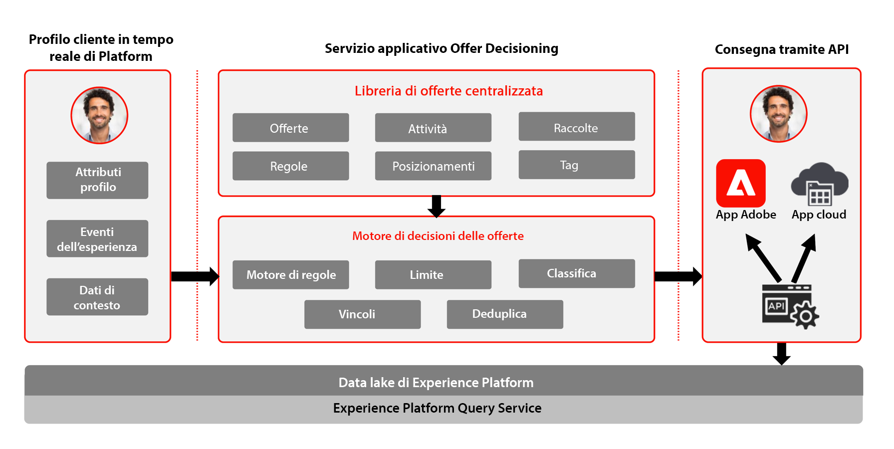

# Journey Optimizer - Blueprint per la gestione delle decisioni

Per ulteriori informazioni sul servizio Gestione delle decisioni, consulta la [documentazione del prodotto](https://experienceleague.adobe.com/docs/journey-optimizer/using/offer-decisioniong/get-started-decision/starting-offer-decisioning.html?lang=it).

Per i guardrail relativi alla gestione delle decisioni, consulta la seguente documentazione. [Guardrail Di Gestione Delle Decisioni](https://experienceleague.adobe.com/it/docs/journey-optimizer/using/get-started/guardrails#decision-management)

La funzionalità Gestione delle decisioni è un servizio Adobe fornito come parte di Adobe Journey Optimizer. Questo blueprint riassume i casi di utilizzo e le capacità tecniche dell’applicazione e descrive nel dettaglio i vari componenti dell’architettura di Gestione delle decisioni e le relative considerazioni.

Journey Optimizer viene utilizzato per fornire ai clienti le migliori offerte ed esperienze possibili, in tutti i punti di contatto e al momento opportuno. Gestione delle decisioni semplifica la personalizzazione grazie a una libreria centrale di offerte marketing e un motore di decisioni che applica regole e vincoli ai profili avanzati e in tempo reale creati da Adobe Experience Platform, per aiutarti a inviare a ogni cliente l’offerta giusta al momento giusto.

La funzionalità Gestione delle decisioni è composta da due componenti principali:

* La libreria di offerte centralizzata, ossia l’interfaccia che permette di creare e gestire i diversi elementi che compongono le offerte e di definirne regole e vincoli.
* Il motore che elabora le decisioni delle offerte, che utilizza i dati e i profili cliente in tempo reale di Adobe Experience Platform nonché la libreria di offerte per determinare il momento giusto, i clienti e i canali a cui verranno presentate le offerte.

Il servizio Gestione delle decisioni può essere implementato in due modi: tramite rete Edge o tramite hub. Ciascuno di questi metodi dispone di uno specifico set di interfacce e protocolli per il funzionamento del servizio, come descritto nei rispettivi blueprint indicati di seguito. Per ulteriori informazioni, consulta la [documentazione del servizio Gestione delle decisioni](https://experienceleague.adobe.com/docs/journey-optimizer/using/offer-decisioniong/api-reference/offer-delivery-api/decisioning-vs-edge-apis.html?lang=it).

## Gestione delle decisioni tramite hub

Il primo approccio prevede l’utilizzo dell’hub Adobe Experience Platform, un’architettura con un datacenter centrale. L’architettura dell’hub è ideale per le esperienze dei clienti che non richiedono bassa latenza e throughput elevato, ma richiedono una visualizzazione più completa del profilo del cliente. Alcuni esempi includono decisioni di offerta fornite per i chioschi o esperienze assistite da agenti, come nei call center o nelle interazioni di persona. L’approccio tramite hub consente anche di gestire le offerte inserite in e-mail, SMS o notifiche push e altre campagne in uscita. Per ulteriori informazioni su Gestione delle decisioni tramite hub, consulta il blueprint [Gestione delle decisioni tramite hub](https://experienceleague.adobe.com/docs/blueprints-learn/architecture/customer-journeys/journey-optimizer/decision-management/decision-management-hub.html?lang=it).

* L’idoneità alle offerte può funzionare in base al profilo cliente in tempo reale completo, inclusi tutti gli attributi e gli eventi delle esperienze.

### Casi di utilizzo per Gestione delle decisioni tramite hub

* Offerte personalizzate per chioschi ed esperienze in-store.
* Offerte personalizzate tramite esperienze assistite da agenti, come call center o interazioni di vendita.
* Offerte incluse in e-mail, SMS o altre interazioni in uscita.
* Esecuzione di percorsi cross-channel: offerte coerenti su web, dispositivi mobili, e-mail e altri canali di interazione tramite Adobe Journey Optimizer.

### Considerazioni tecniche per Gestione delle decisioni tramite hub

* Accesso al profilo cliente in tempo reale completo, compresi appartenenze a un pubblico, attributi ed eventi di esperienza.

## Gestione delle decisioni tramite rete Edge

Il secondo approccio è tramite l&#39;esperienza [!DNL Edge Network], un&#39;infrastruttura distribuita a livello globale e geograficamente situata per fornire esperienze veloci di secondo e millisecondo. Per ridurre al minimo la latenza, l’esperienza del consumatore finale viene eseguita dall’infrastruttura Edge geograficamente più vicina. Il servizio Gestione delle decisioni sulla rete Edge è progettato per offrire ai consumatori esperienze in tempo reale, ad esempio con richieste di personalizzazione in entrata per web e dispositivi mobili. Per ulteriori informazioni su Gestione delle decisioni tramite rete Edge, consulta il blueprint [Gestione delle decisioni sulla rete Edge](https://experienceleague.adobe.com/docs/blueprints-learn/architecture/customer-journeys/journey-optimizer/decision-management/decision-management-edge.html?lang=it).

### Casi di utilizzo per Gestione delle decisioni tramite rete Edge

* Personalizzazione online tramite esperienze web o mobile in entrata.
* Esecuzione di percorsi cross-channel: offerte coerenti su web, dispositivi mobili, e-mail e altri canali di interazione tramite Adobe Journey Optimizer.

### Considerazioni tecniche per Gestione delle decisioni tramite rete Edge

* Accesso al profilo Edge in tempo reale. Nel profilo saranno disponibili solo i tipi di pubblico e gli attributi di profilo Edge proiettati.

## Documentazione correlata

* [Adobe Experience Platform](https://experienceleague.adobe.com/docs/experience-platform.html?lang=it)
* [Adobe Journey Optimizer](https://experienceleague.adobe.com/docs/journey-optimizer.html?lang=it)
* [Gestione delle decisioni per Adobe Journey Optimizer](https://experienceleague.adobe.com/docs/journey-optimizer/using/offer-decisioniong/get-started-decision/starting-offer-decisioning.html?lang=it)
* [Descrizione del prodotto Adobe Journey Optimizer](https://helpx.adobe.com/it/legal/product-descriptions/adobe-journey-optimizer.html)
* [Descrizione del prodotto Adobe Gestione delle decisioni](https://helpx.adobe.com/it/legal/product-descriptions/offer-decisioning-app-service.html)
