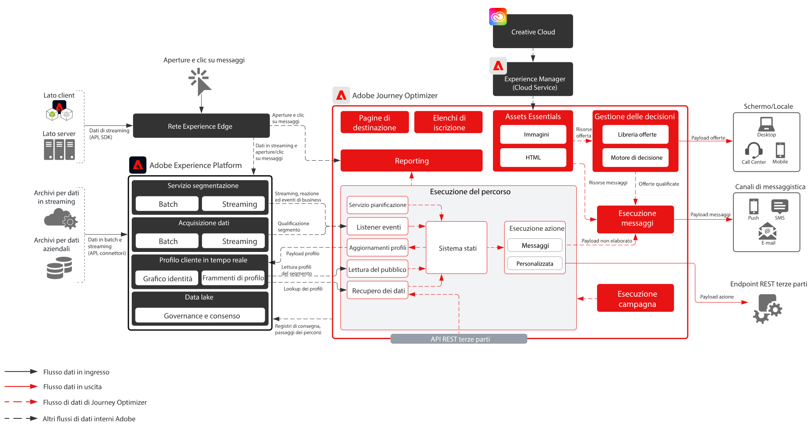
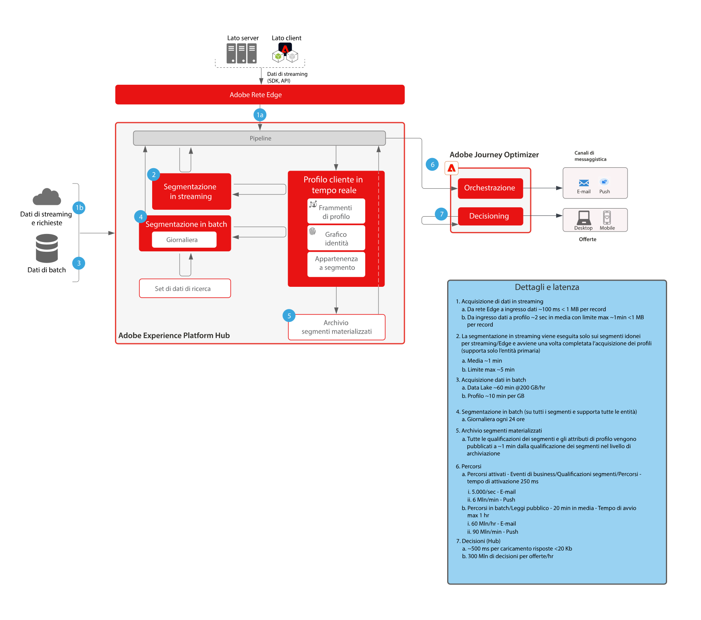

# Blueprint per  Journey Optimizer 

Adobe Journey Optimizer è un sistema appositamente progettato che consente ai team di marketing di reagire in tempo reale ai comportamenti dei clienti e di incontrarli là dove si trovano. Le funzionalità di gestione dei dati sono state trasferite in Adobe Experience Platform, consentendo ai team di marketing di concentrarsi sul loro punto di forza: la creazione di percorsi cliente d’eccellenza e conversazioni personalizzate. Questo blueprint delinea le funzionalità tecniche dell’applicazione e descrive i vari componenti dell’architettura di Adobe Journey Optimizer.

 

## Casi di utilizzo

* Messaggi attivati
* Conferme di benvenuto e registrazione
* Abbandoni del carrello e del modulo di richiesta
* Messaggi attivati dalla posizione
* Esperienze all’interno di uno stadio
* Esperienze di viaggio e ospitalità prima e durante il soggiorno

 

## Architettura

 

## Scenari del blueprint

| Scenario | Descrizione | Funzionalità |
| :-- | :--- | :--- |
| [Messaggistica di terze parti](3rd-party-messaging.md) | Mostra come Adobe Journey Optimizer può essere utilizzato con sistemi di messaggistica di terze parti per orchestrare e inviare comunicazioni personalizzate. | Invia ai clienti comunicazioni 1:1 personalizzate sul momento mentre interagiscono con il tuo brand o la tua azienda.  Considerazioni: <ul><li>Il sistema di terze parti deve supportare i bearer token per l’autenticazione.</li><li>Gli IP statici non sono supportati, a causa dell’architettura multi-tenant.</li><li>Considera i vincoli dell’architettura del sistema di terze parti in termini di chiamate API al secondo. Per supportare il volume proveniente da Journey Optimizer, potrebbe essere necessario acquistare ulteriori volumi dal fornitore di terze parti.</li><li>La funzionalità Gestione delle decisioni non è supportata nei messaggi o nei payload.</li></ul> |

 

## Modelli di integrazione

| Integrazione | Descrizione | Funzionalità |
| :-- | :--- | :--- |
| [Journey Optimizer con Adobe Campaign](ajo-and-campaign.md) | Mostra come utilizzare Adobe Journey Optimizer per orchestrare esperienze 1:1 utilizzando il profilo del cliente in tempo reale, e come sfruttare il sistema di messaggistica transazionale nativo di Adobe Campaign per inviare il messaggio. | Sfrutta il profilo cliente in tempo reale e la potenza di Journey Optimizer per orchestrare le esperienze attuali, e utilizza le funzionalità di messaggistica nativa in tempo reale di Adobe Campaign per le comunicazioni della fase finale.  Considerazioni: <ul><li>La versione dell’applicazione Campaign deve essere v7 build >21.1 oppure v8</li><li>Velocità della messaggistica</li><ul><li>Campaign v7: fino a 50.000 all’ora</li><li>Campaign v8: fino a 1 milione all’ora</li><li>Campaign Standard: fino a 50.000 all’ora</li></ul><li>Non viene applicata alcuna limitazione; pertanto i casi d’uso devono superare una verifica tecnica da parte di un Enterprise Architect.</li><li>Non è supportato l’utilizzo di Gestione delle decisioni nei messaggi inviati da Campaign.</li></ul> |

 

## Prerequisiti

Adobe Experience Platform

* Gli schemi e i set di dati devono essere configurati nel sistema prima di poter configurare le origini dati di Journey Optimizer.
* Per poter attivare un evento non basato su regole, aggiungi il gruppo di campi Orchestration eventID agli schemi di eventi Experience basati su classi.
* Per poter caricare profili di test da utilizzare con Journey Optimizer, aggiungi il gruppo di campi “Profile test details” agli schemi per singoli profili basati su classi.

E-mail

* Deve essere disponibile un sottodominio da utilizzare per l’invio dei messaggi.
* Il sottodominio può essere completamente delegato ad Adobe (consigliato) oppure è possibile utilizzare CNAME verso server DNS specifici per Adobe (personalizzati).
* Per garantire il corretto recapito dei messaggi, è necessario un record Google TXT per ciascun sottodominio.

Push per dispositivi mobili

* Per creare l’app, il cliente deve disporre di uno sviluppatore di app mobili.
* SDK per dispositivi mobili di Adobe Experience Platform

 

## Guardrail

[Link al prodotto per i guardrail Journey Optimizer](https://experienceleague.adobe.com/docs/journeys/using/starting-with-journeys/limitations.html?lang=it)

Tieni presenti questi aspetti, non inclusi nel link qui sopra:

* Segmenti batch: necessario comprendere il volume giornaliero di utenti qualificati e accertarsi che il sistema di destinazione sia in grado di gestire il throughput burst per percorso e per tutti i percorsi.
* Segmenti in streaming: il burst iniziale delle qualifiche dei profili deve poter essere gestito insieme al volume giornaliero di qualificazione dello streaming, per ogni percorso e per tutti i percorsi.
* La funzionalità Gestione delle decisioni è supportata in modalità nativa solo nei messaggi (nessuna azione personalizzata).
* Tipi di messaggi supportati:
   * E-mail
   * Push (FCM/APNS)
   * Azioni personalizzate (tramite API Rest)
* Integrazioni in uscita con sistemi di terze parti
   * Singoli indirizzi IP statici non sono supportati, in quanto la nostra infrastruttura è multi-tenant (inserire tutti gli indirizzi IP dei datacenter nell’elenco degli IP consentiti).
   * Per le azioni personalizzate sono supportati solo i metodi POST e PUT.
   * Autenticazione tramite nome utente/password o token di autorizzazione
* Non è possibile creare pacchetti e spostare singoli componenti di Adobe Experience Platform o Journey Optimizer tra diverse sandbox. È necessario reimplementarli nei nuovi ambienti.

### Guardrail per l’acquisizione dei dati

 

### Guardrail per l’attivazione

 

## Fasi di implementazione

### Adobe Experience Platform

#### Schema/set di dati

1. [Configurare singoli schemi di profilo, di esperienza e di entità multiple](https://experienceleague.adobe.com/?recommended=ExperiencePlatform-D-1-2021.1.xdm&amp;lang=it) in Experience Platform, in base ai dati forniti dal cliente
1. [Creare set di dati](https://experienceleague.adobe.com/docs/platform-learn/tutorials/data-ingestion/create-datasets-and-ingest-data.html?lang=it) in Experience Platform per i dati da acquisire.
1. [Aggiungere etichette di utilizzo dati](https://experienceleague.adobe.com/docs/platform-learn/tutorials/data-governance/classify-data-using-governance-labels.html?lang=it) ai set di dati in Experience Platform a scopo di governance.
1. [Creare le policy](https://experienceleague.adobe.com/docs/platform-learn/tutorials/data-governance/create-data-usage-policies.html?lang=it) che necessarie per applicare la governance alle destinazioni

#### Profilo/identità

1. [Creare namespace specifici per il cliente](https://experienceleague.adobe.com/docs/platform-learn/tutorials/identities/label-ingest-and-verify-identity-data.html?lang=it)
1. [Aggiungere le identità agli schemi](https://experienceleague.adobe.com/docs/platform-learn/tutorials/identities/label-ingest-and-verify-identity-data.html?lang=it)
1. [Attivare lo schema e i set di dati per il profilo](https://experienceleague.adobe.com/docs/platform-learn/tutorials/profiles/bring-data-into-the-real-time-customer-profile.html?lang=it)
1. [Impostare i criteri di unione](https://experienceleague.adobe.com/docs/platform-learn/tutorials/profiles/create-merge-policies.html?lang=it) per viste diverse del [!UICONTROL profilo cliente in tempo reale] (opzionale)
1. Creare segmenti da utilizzare in Journey

#### Origini/destinazioni

1. [Inserire i dati in Experience Platform](https://experienceleague.adobe.com/?recommended=ExperiencePlatform-D-1-2020.1.dataingestion&amp;lang=it) utilizzando API di streaming e connettori di origini.

### Journey Optimizer

1. Configurare l’origine dati di Experience Platform e determinare quali campi devono essere memorizzati nella cache come parte dei dati del profilo. I dati in streaming utilizzati per avviare un percorso cliente devono prima essere configurati in Journey Optimizer, per ottenere un ID di orchestrazione. Questo ID di orchestrazione viene quindi fornito allo sviluppatore che potrà utilizzarlo con l’acquisizione.
1. Configurare le origini dati esterne.
1. Configurare le azioni personalizzate.

### Configurazione push per dispositivi mobili

1. Implementare Experience Platform Mobile SDK per raccogliere i token push e le informazioni di accesso da associare ai profili cliente noti.
1. Utilizzare i tag di Adobe e creare una proprietà mobile con la seguente estensione:
1. Adobe Journey Optimizer
1. Rete Edge di Adobe Experience Platform
1. Identità  per rete Edge
1. Mobile Core
1. Assicurati di disporre di un flusso di dati dedicato per le implementazioni di app mobili rispetto alle implementazioni web.
1. Per ulteriori informazioni, consulta la [guida di Adobe Journey Optimizer Mobile](https://aep-sdks.gitbook.io/docs/using-mobile-extensions/adobe-journey-optimizer).

## Documentazione correlata

* [Documentazione di Experience Platform](https://experienceleague.adobe.com/docs/experience-platform.html?lang=it)
* [Documentazione sui tag di Experience Platform](https://experienceleague.adobe.com/docs/experience-platform/tags/home.html?lang=it)
* [Documentazione di Experience Platform Mobile SDK](https://experienceleague.adobe.com/docs/mobile.html?lang=it)
* [Documentazione di Journey Optimizer](https://experienceleague.adobe.com/docs/journey-optimizer/using/ajo-home.html?lang=it)
* [Descrizione del prodotto Journey Optimizer](https://helpx.adobe.com/it/legal/product-descriptions/adobe-journey-optimizer.html)
