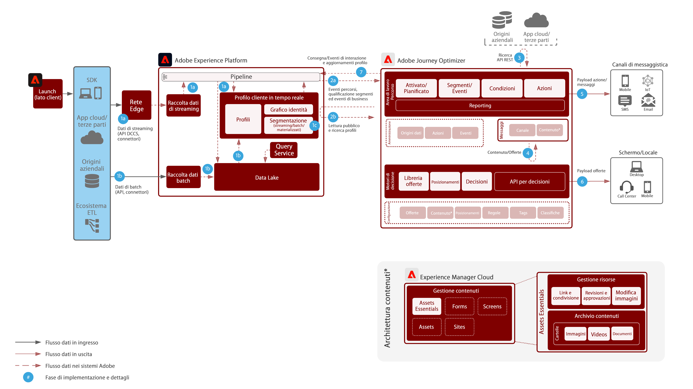

# Journey Optimizer

Adobe Journey Optimizer è un sistema appositamente progettato che consente ai team di marketing di reagire in tempo reale ai comportamenti dei clienti e di incontrarli là dove si trovano. Le funzionalità di gestione dei dati sono state trasferite in Adobe Experience Platform, consentendo ai team di marketing di concentrarsi sul loro punto di forza: la creazione di percorsi cliente d’eccellenza e conversazioni personalizzate.  Questo blueprint delinea le funzionalità tecniche dell’applicazione e descrive i vari componenti dell’architettura di Adobe Journey Optimizer.

## Casi di utilizzo

* Messaggi attivati
* Conferme di registrazione
* Abbandoni del carrello e del modulo di richiesta
* Messaggi attivati dalla posizione

## Architettura

## Pattern di integrazione

* Adobe Experience Platform -> Journey Optimizer

## Prerequisiti

1. Provisioning del cliente per Experience Cloud con un’organizzazione IMS valida
1. Push per dispositivi mobili

* Per creare l’app, il cliente deve disporre di uno sviluppatore di app mobili.
* SDK per dispositivi mobili di Adobe Experience Platform
* Raccolta dati
   * Proprietà dei tag mobili
      * Estensioni:
         * Estensione Adobe Journey Optimizer
         * Rete Edge di Adobe Experience Platform
         * Identità
         * Mobile Core
         * Profilo
   * Configurazioni app
   * Flussi di dati
      * Abilitato per Experience Platform
      * Set di dati evento: per la raccolta del comportamento mobile generale
      * Set di dati del profilo: set di dati del profilo push Adobe Journey Optimizer (non sono ammessi altri set di dati)

## Guardrail

* Vedi il link per maggiori dettagli sulle protezioni per Journey Optimizer [LINK](https://experienceleague.adobe.com/docs/journeys/using/starting-with-journeys/limitations.html?lang=en)
* Segmenti batch: necessario comprendere il volume giornaliero di utenti qualificati e accertarsi che il sistema di destinazione sia in grado di gestire il throughput burst per percorso e per tutti i percorsi.
* Segmenti in streaming: il burst iniziale delle qualifiche dei profili deve poter essere gestito insieme al volume giornaliero di qualificazione dello streaming, per ogni percorso e per tutti i percorsi.
* Attività di aggiornamento del profilo: il profilo Real-time Customer Profile può essere aggiornato in modalità nativa dall’interno di un percorso.  L’elaborazione dell’aggiornamento nell’archivio dei profili avviene con un ritardo massimo di 1 minuto.
* Eventi business: l’avvio di un percorso basato su un segmento di lettura può essere attivato in base a una chiamata esterna al sistema Journey Optimizer (JO).
* Supporta Offer Decisioning in modalità nativa solo nei messaggi. In futuro verrà introdotto il supporto tramite azione nativa.
* Canali supportati:
   * E-mail
   * Push (FCM/APNS)
   * Endpoint API REST
* Elabora 5000 eventi al secondo con scalabilità orizzontale (il limite dipende dal proprio budget).
* Il test A/B viene eseguito utilizzando due consegne e determinando i risultati tramite Query Service (QS) o Customer Journey Analytics (CJA).
* Integrazione Litmus: per sfruttare l’integrazione è richiesto un account Litmus.

## Fasi di implementazione

### Adobe Experience Platform

#### Schema/set di dati

1. [Configurare singoli schemi di profilo, di esperienza e di entità multiple](https://experienceleague.adobe.com/?recommended=ExperiencePlatform-D-1-2021.1.xdm) in Experience Platform, in base ai dati forniti dal cliente
1. Creare schemi di Adobe Campaign per broadLog, trackingLog, indirizzi non consegnabili e preferenze profilo (opzionale)
1. [Creare set di dati](https://experienceleague.adobe.com/docs/platform-learn/tutorials/data-ingestion/create-datasets-and-ingest-data.html?lang=it) in Experience Platform per i dati da acquisire.
1. [Aggiungere etichette di utilizzo dati](https://experienceleague.adobe.com/docs/platform-learn/tutorials/data-governance/classify-data-using-governance-labels.html?lang=it) ai set di dati in Experience Platform a scopo di governance.
1. [Creare i criteri](https://experienceleague.adobe.com/docs/platform-learn/tutorials/data-governance/create-data-usage-policies.html?lang=it) necessari per applicare la governance alle destinazioni

#### Profilo/Identità

1. [Creare namespace specifici per il cliente](https://experienceleague.adobe.com/docs/platform-learn/tutorials/identities/label-ingest-and-verify-identity-data.html?lang=it)
1. [Aggiungere le identità agli schemi](https://experienceleague.adobe.com/docs/platform-learn/tutorials/identities/label-ingest-and-verify-identity-data.html)
1. [Attivare lo schema e i set di dati per il profilo](https://experienceleague.adobe.com/docs/platform-learn/tutorials/profiles/bring-data-into-the-real-time-customer-profile.html?lang=it)
1. [Impostare i criteri di unione](https://experienceleague.adobe.com/docs/platform-learn/tutorials/profiles/create-merge-policies.html?lang=it) per le diverse viste di [!UICONTROL Real-time Customer Profile] (opzionale)
1. Creare segmenti da utilizzare in Campaign

#### Origini/Destinazioni

1. [Inserire i dati in Experience Platform](https://experienceleague.adobe.com/?recommended=ExperiencePlatform-D-1-2020.1.dataingestion&amp;lang=it) utilizzando le API di streaming e i connettori di origini. 1. Configurare la destinazione di archiviazione BLOB di [!DNL Azure] da utilizzare con Adobe Campaign.

#### Implementazione di app mobili

1. Implementare Adobe Campaign SDK per Adobe Campaign Classic o Experience Platform SDK per Adobe Campaign Standard. Se è presente Experience Platform Launch, si consiglia di utilizzare l’estensione Adobe Campaign Classic o Adobe Campaign Standard con Experience Platform SDK.

### Journey Orchestration

1. I dati di streaming utilizzati per avviare un percorso del cliente devono prima essere configurati in Journey Optimizer per ottenere un ID di orchestrazione. Questo ID di orchestrazione viene quindi fornito allo sviluppatore che potrà utilizzarlo con l’acquisizione.
1. Configurare le origini dati esterne.
1. Configurare le azioni personalizzate.

## Documentazione correlata

* [Documentazione di Adobe Experience Platform](https://experienceleague.adobe.com/docs/experience-platform.html?lang=it)
* [Documentazione di Journey Optimizer](https://experienceleague.adobe.com/docs/journey-orchestration.html?lang=it)
* [Documentazione di Experience Platform Launch](https://experienceleague.adobe.com/docs/launch.html?lang=it)
* [Documentazione di Experience Platform Mobile SDK](https://experienceleague.adobe.com/docs/mobile.html?lang=it)
