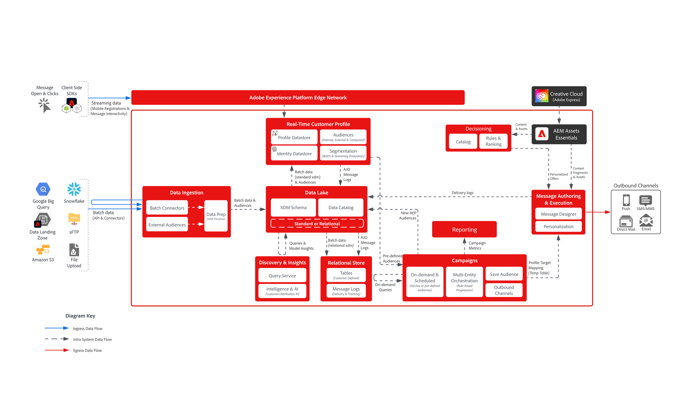
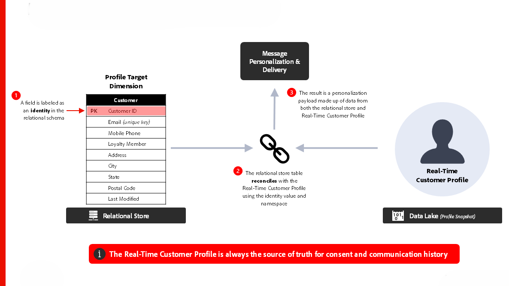
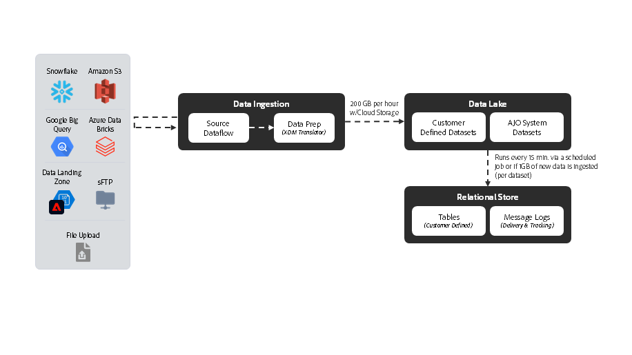

# [!DNL Journey Optimizer] - Blueprint per l’orchestrazione delle campagne

AJO Campaign Orchestration consente agli esperti di marketing di progettare ed eseguire comunicazioni pianificate, basate sul pubblico e in più passaggi, tra canali in uscita come e-mail, SMS, push e direct mail. A differenza dei Percorsi AJO, che reagiscono ai comportamenti dei singoli clienti utilizzando dati in tempo reale da Real-Time Customer Profile, le campagne sono attività di marketing coordinate e mirate ai tipi di pubblico a intervalli pianificati. Insieme, campagne e percorsi offrono approcci complementari: le campagne guidano le strategie di brand engagement, mentre i percorsi offrono esperienze personalizzate e reattive.

 

## Architettura

 

### Architettura di esecuzione dei messaggi

 

### Archivio relazionale - Latenza di acquisizione dati

 

## Considerazioni sull&#39;architettura dei Percorsi

- **Architettura dati**: AJO Campaign Orchestration utilizza un database relazionale sottostante per la creazione e l&#39;orchestrazione del pubblico
- **Integrazione con Audience Portal**: integrata in modo nativo con Audience Portal nel profilo cliente in tempo reale per leggere da tipi di pubblico esistenti e salvare nuovi tipi di pubblico in durante la creazione di campagne
- **Creazione di pubblico su richiesta**: genera, valuta ed esegui immediatamente un pubblico per casi di utilizzo di marketing urgenti
- **Integrazione dei profili cliente in tempo reale:** fonte di verità per la cronologia del consenso e delle comunicazioni; supporta la progettazione di &quot;profili skinny&quot; per la personalizzazione
- **Invio di messaggi con più entità:** possibilità di inviare più messaggi per profilo in un&#39;unica consegna (ad esempio inviare un messaggio per prenotazione all&#39;indirizzo e-mail del cliente)
- **Segmentazione multi-entità**: inizia a creare un pubblico da qualsiasi entità all&#39;interno dell&#39;archivio relazionale (ad esempio, prodotto, inventario, piano, ecc.)

 

## Guardrail

[Collegamento prodotto per campagne orchestrate](https://experienceleague.adobe.com/it/docs/journey-optimizer/using/campaigns/orchestrated-campaigns/guardrails)

[Guardrail e guida alla latenza end-to-end](https://experienceleague.adobe.com/docs/blueprints-learn/architecture/architecture-overview/deployment/guardrails)

 

## Documentazione correlata

- [[!DNL Journey Optimizer] campagne orchestrate](https://experienceleague.adobe.com/en/docs/journey-optimizer/using/campaigns/orchestrated-campaigns/orchestrated-campaigns-landing-page.html)
- [[!DNL Experience Platform] documentazione](https://experienceleague.adobe.com/docs/experience-platform.html?lang=it)
- [Documentazione di [!DNL Experience Platform] tag](https://experienceleague.adobe.com/docs/experience-platform/tags/home.html?lang=it)
- [[!DNL Experience Platform Mobile SDK] documentazione](https://experienceleague.adobe.com/docs/mobile.html?lang=it)
- [[!DNL Journey Optimizer] documentazione](https://experienceleague.adobe.com/docs/journey-optimizer/using/ajo-home.html?lang=it)
- [[!DNL Journey Optimizer] descrizione prodotto](https://helpx.adobe.com/it/legal/product-descriptions/adobe-journey-optimizer.html)
