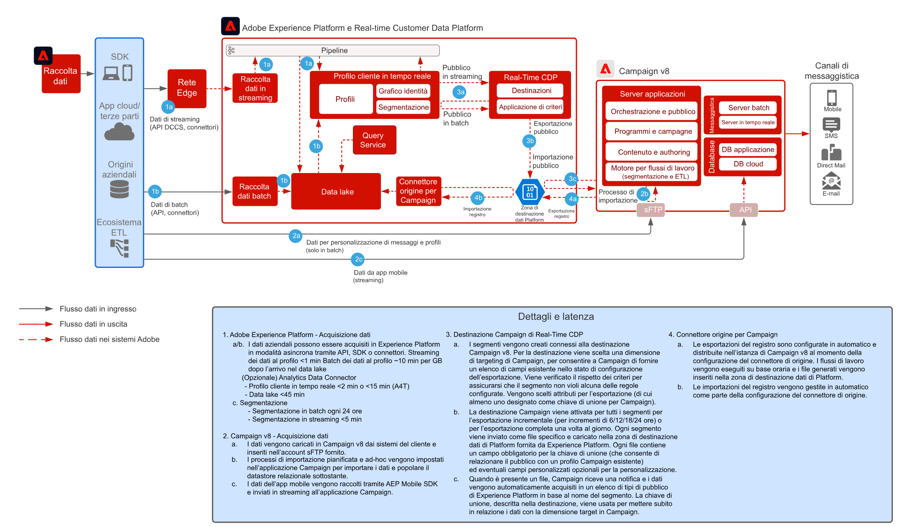

# Modello di integrazione per Real-Time CDP con Adobe Campaign v8

Mostra come utilizzare Adobe Experience Platform, il profilo cliente in tempo reale e lo strumento di segmentazione centralizzata con Adobe Campaign, per fornire conversazioni personalizzate.

 

## Applicazioni

* Adobe Experience Platform Real-Time CDP
* Adobe Campaign v8

 

## Architettura

 

## Prerequisiti

* Provisioning del cliente per Experience Cloud con un’organizzazione IMS valida
* Si consiglia di effettuare il provisioning di Adobe Experience Platform e Campaign nella stessa organizzazione IMS per un URL di accesso singolo.
* Per il cliente deve essere eseguito il provisioning dell’istanza v8 di Campaign.
* Il cliente deve essere idoneo e deve avere accesso a RTCDP, alle origini e alle destinazioni.
* Deve esistere il contesto del prodotto Adobe Campaign.

 

## Fasi di implementazione

Consulta la seguente documentazione su come configurare il connettore di origini di Campaign v8 per Adobe Experience Platform, e il connettore di destinazioni di Real-time Customer Data Platform per Campaign v8.
[Connettori per Campaign e AEP](https://experienceleague.adobe.com/docs/campaign/campaign-v8/connect/ac-aep.html?lang=it)

## Guardrail

### Adobe Campaign

* Consulta la documentazione del connettore di origini per Campaign - [Connettore origine per Campaign](https://experienceleague.adobe.com/docs/experience-platform/sources/ui-tutorials/create/adobe-applications/campaign.html?lang=it)
* Supporta solo le implementazioni di Adobe Campaign per singole unità organizzative

### Condivisione dei segmenti Experience Platform Real-time Customer Data Platform

* Consulta la documentazione sul connettore di destinazioni RTCDP per Campaign - [Connessione di RTCDP per Campaign](https://experienceleague.adobe.com/docs/experience-platform/destinations/catalog/email-marketing/adobe-campaign-managed-services.html?lang=it)
* Si consiglia un limite di 50 segmenti
* Tieni presente che la realizzazione dell’appartenenza al segmento da AEP ha una latenza sia per la modalità in batch (1 al giorno) che per la modalità in streaming (~5 min) e dipende dalla pianificazione della valutazione dei segmenti.
* La latenza per l’attivazione è di almeno 3 ore.
* Sono disponibili per l’attivazione solo gli attributi dello schema di unione (nessun supporto per array/mappe/eventi esperienza)
* Si raccomanda di non superare i 20 attributi per segmento
* Un file per segmento di tutti i profili con stato di appartenenza “realized” OPPURE, se l’appartenenza al segmento viene aggiunta al file come attributo, sia i profili “realized” che “exited”
* Sono supportate le esportazioni incrementali o di segmenti completi.
* La crittografia dei file non è supportata.
* Vedi i guardrail per l’acquisizione di profili e dati per AEP - [Collegamento](https://experienceleague.adobe.com/docs/experience-platform/profile/guardrails.html?lang=it)
