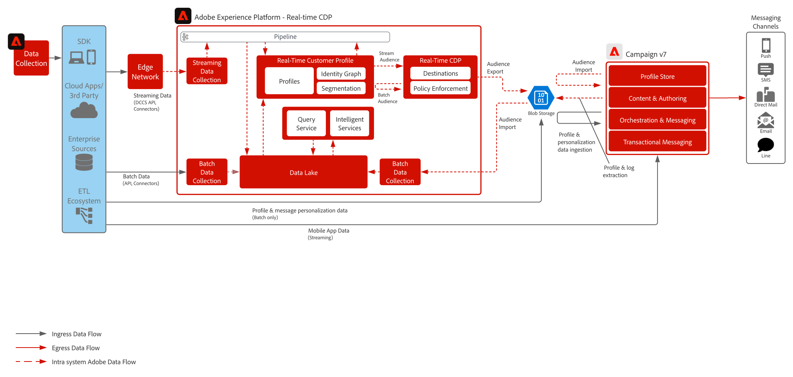

# Modello di integrazione per Real-Time CDP e Adobe Campaign

Mostra come utilizzare Adobe Experience Platform, il profilo cliente in tempo reale e lo strumento di segmentazione centralizzata con Adobe Campaign, per fornire conversazioni personalizzate.

 

## Applicazioni

* Adobe Experience Platform Real-Time CDP
* Adobe Campaign v7 o Campaign Standard

 

## Architettura

 

## Prerequisiti

* Si consiglia di effettuare il provisioning di Experience Platform e Campaign nella stessa organizzazione IMS e di utilizzare Adobe Admin Console per l’accesso degli utenti. I clienti potranno così passare da una soluzione all’altra direttamente dall’interfaccia utente per il marketing.

 

## Guardrail

### Adobe Campaign

* Supporta solo le implementazioni di Adobe Campaign per singole unità organizzative
* Adobe Campaign è la singola origine per tutti i profili attivi: i profili devono quindi esistere in Adobe Campaign e non dovrebbero essere creati nuovi profili in base ai segmenti di Experience Platform.
* I flussi di lavoro di esportazione da Campaign si devono eseguire al massimo ogni 4 ore.
* Gli schemi e i set di dati XDM per i broadLog, trackingLogs e gli indirizzi non consegnabili di Adobe Campaign non sono inclusi; devono essere progettati e realizzati.

### Condivisione dei segmenti Experience Platform CDP

* Si consiglia un limite di 20 segmenti
* L’attivazione è limitata a ogni 24 ore
* Sono disponibili per l’attivazione solo gli attributi dello schema di unione (nessun supporto per array/mappe/eventi esperienza)
* Si raccomanda di non superare i 20 attributi per segmento
* Un file per segmento di tutti i profili con stato di appartenenza “realized” OPPURE, se la partecipazione al segmento viene aggiunta al file come attributo, sia i profili “realized” che “exited”
* Sono supportate le esportazioni incrementali o di segmenti completi.
* La crittografia dei file non è supportata.

 

## Fasi di implementazione

### Adobe Experience Platform

#### Schema/Set di dati

1. [Configurare singoli schemi di profilo, di esperienza e di entità multiple](https://experienceleague.adobe.com/?recommended=ExperiencePlatform-D-1-2021.1.xdm) in Experience Platform, in base ai dati forniti dal cliente
1. Creare schemi di Adobe Campaign per broadLog, trackingLog, indirizzi non consegnabili e preferenze profilo (opzionale)
1. [Creare set di dati](https://experienceleague.adobe.com/docs/platform-learn/tutorials/data-ingestion/create-datasets-and-ingest-data.html?lang=it) in Experience Platform per i dati da acquisire.
1. [Aggiungere etichette di utilizzo dati](https://experienceleague.adobe.com/docs/platform-learn/tutorials/data-governance/classify-data-using-governance-labels.html?lang=it) ai set di dati in Experience Platform a scopo di governance.
1. [Creare le policy](https://experienceleague.adobe.com/docs/platform-learn/tutorials/data-governance/create-data-usage-policies.html?lang=it) che necessarie per applicare la governance alle destinazioni

#### Profilo/Identità

1. [Creare namespace specifici per il cliente](https://experienceleague.adobe.com/docs/platform-learn/tutorials/identities/label-ingest-and-verify-identity-data.html?lang=it)
1. [Aggiungere le identità agli schemi](https://experienceleague.adobe.com/docs/platform-learn/tutorials/identities/label-ingest-and-verify-identity-data.html)
1. [Attivare lo schema e i set di dati per il profilo](https://experienceleague.adobe.com/docs/platform-learn/tutorials/profiles/bring-data-into-the-real-time-customer-profile.html?lang=it)
1. [Impostare i criteri di unione](https://experienceleague.adobe.com/docs/platform-learn/tutorials/profiles/create-merge-policies.html?lang=it) per le diverse viste di [!UICONTROL Real-time Customer Profile] (opzionale)
1. Creare segmenti da utilizzare in Adobe Campaign

#### Origini/Destinazioni

1. [Inserire i dati in Experience Platform](https://experienceleague.adobe.com/?recommended=ExperiencePlatform-D-1-2020.1.dataingestion&amp;lang=it) utilizzando API di streaming e connettori di origini
1. Configurare la destinazione di archiviazione BLOB di [!DNL Azure] da utilizzare con Adobe Campaign

#### Adobe Campaign

1. Configurare gli schemi per il profilo, i dati di ricerca e i relativi dati di personalizzazione della consegna

>[!IMPORTANT]
>
>A questo punto, è fondamentale comprendere quale modello di dati si trova all’interno di Experience Platform per i dati di profilo ed eventi, in modo da sapere quali saranno richiesti in Adobe Campaign.

#### Flussi di lavoro per l’importazione

1. Caricare e acquisire dati di profilo semplificati in Adobe Campaign sFTP
1. Caricare e acquisire i dati di personalizzazione di orchestrazione e messaggistica in Adobe Campaign sFTP.
1. Acquisire segmenti di Experience Platform da BLOB di [!DNL Azure] tramite flussi di lavoro

#### Flussi di lavoro per l’esportazione

1. Inviare i log di Adobe Campaign a Experience Platform tramite flussi di lavoro ogni quattro ore (broadLog, trackingLog, indirizzi non consegnabili)
1. Inviare le preferenze profilo a Experience Platform tramite flussi di lavoro creati dal servizio di consulenza ogni quattro ore (facoltativo)

### Configurazione push per dispositivi mobili

* Due approcci supportati per l’integrazione con dispositivi mobili per le notifiche push:
   * Experience Platform Mobile SDK
   * Campaign Mobile SDK
* Approccio con Experience Platform Mobile SDK:
   * Sfrutta i tag di Adobe e l’estensione Campaign Classic per configurare l’integrazione con Experience Platform Mobile SDK
   * È richiesta la conoscenza delle funzioni Tag e Raccolta dati di Adobe.
   * È richiesta esperienza di sviluppo mobile con notifiche push per Android e iOS per: implementazione dell’SDK; integrazione con FCM (Android) e APNS (iOS) per recuperare il token push token; configurazione dell’app per la ricezione delle notifiche push; e gestione delle interazioni push.
* SDK per Campaign Mobile
   * Consulta la [Documentazione di Campaign SDK] (Campaign Mobile SDK
Consulta la documentazione per l’implementazione qui descritta)

   >[!IMPORTANT]
   >Se implementi Campaign SDK e utilizzi altre applicazioni Experience Cloud, per la raccolta dati dovrai utilizzare Experience Platform Mobile SDK. Verranno create chiamate lato client duplicate sul dispositivo.

## Documentazione correlata

* [Documentazione di Adobe Experience Platform](https://experienceleague.adobe.com/docs/experience-platform.html?lang=it)
* [Documentazione di Campaign Classic](https://experienceleague.adobe.com/docs/campaign-classic.html?lang=it)
* [Documentazione di Campaign Standard](https://experienceleague.adobe.com/docs/campaign-standard.html?lang=it)
* [Documentazione di Experience Platform Launch](https://experienceleague.adobe.com/docs/launch.html?lang=it)
* [Documentazione di Experience Platform Mobile SDK](https://experienceleague.adobe.com/docs/mobile.html?lang=it)
