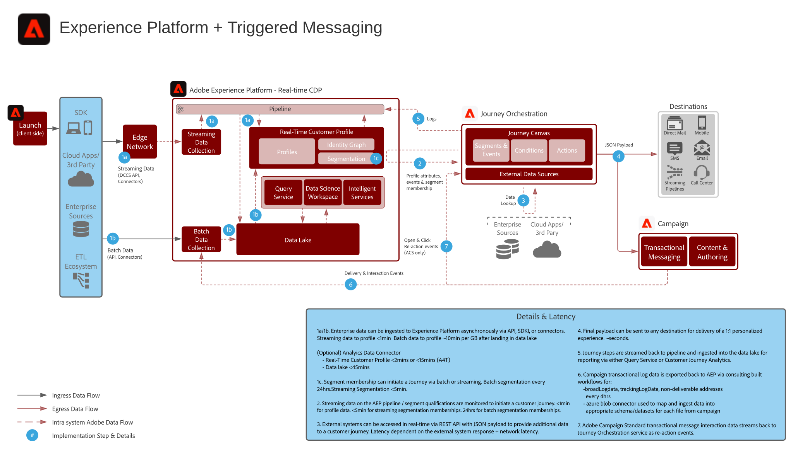

# Blueprint per messaggistica attivata e Adobe Experience Platform

Esegui messaggi ed esperienze attivate utilizzando Adobe Experience Platform come hub centrale per lo streaming di dati, profili dei clienti e segmentazione.

## Casi di utilizzo

* Messaggi attivati
* Conferme di registrazione
* Abbandoni del carrello e del modulo di richiesta
* Messaggi attivati dalla posizione

## Architettura

## Pattern di integrazione

* Adobe Experience Platform -> Journey Orchestration

## Prerequisiti

* Adobe Experience Platform
* Journey Orchestration

## Guardrail

### Journey Orchestration

* Per [ulteriori dettagli sulle limitazioni](https://experienceleague.adobe.com/docs/journeys/using/starting-with-journeys/limitations.html?lang=it#starting-with-journeys), fai clic su questo link.
* La funzione di limitazione è disponibile tramite l’impostazione API per garantire che il sistema di destinazione non sia saturato fino al punto di errore. Con la limitazione, i messaggi che superano il limite massimo vengono eliminati completamente e non vengono mai inviati. La regolazione della limitazione non è ancora supportata.
   * Max connessioni: numero massimo di connessioni http/s che una destinazione può gestire
   * Numero max chiamate: numero massimo di chiamate da effettuare nel parametro periodInMs
   * periodInMs: tempo in millisecondi
* I percorsi avviati dall’iscrizione a un segmento possono funzionare in due modalità:
   * segmenti batch (aggiornati ogni 24 ore)
   * segmenti in streaming (&lt;5 minuti di qualificazione)
* Segmenti batch: assicurati di comprendere il volume giornaliero di utenti qualificati in modo che il sistema di destinazione sia in grado di gestire il throughput burst per percorso e per tutti i percorsi.
* Segmenti in streaming: assicurati che il burst iniziale delle qualifiche dei profili possa essere gestito insieme al volume giornaliero di qualificazione dello streaming per percorso e per tutti i percorsi.
* La destinazione finale deve supportare REST API e il payload JSON.
* Attualmente non supporta Offer Decisioning.
* Vedi [guardrail per l’acquisizione di dati e profili per Experience Platform](https://experienceleague.adobe.com/docs/experience-platform/profile/guardrails.html?lang=it).

### Adobe Campaign Standard

* È in grado di supportare solo 14 tps (50.000 all’ora) in termini di throughput.
* I percorsi avviati dalla partecipazione a un segmento non sono supportati.
* Gli eventi di reazione all’apertura/clic di un messaggio transazionale sono supportati in Journey Orchestration.
* I registri dei messaggi transazionali non sono attualmente sincronizzati in modo nativo con Experience Platform, e richiedono una configurazione manuale. Si consiglia di esportare i registri al massimo ogni quattro ore.

## Fasi di implementazione

### Adobe Experience Platform

#### Schema/set di dati

1. [Configurare singoli schemi di profilo, di esperienza e di entità multiple](https://experienceleague.adobe.com/docs/platform-learn/tutorials/schemas/create-a-schema.html?lang=it) in Experience Platform, in base ai dati forniti dal cliente
1. Creare schemi di Adobe Campaign per broadLog, trackingLog, indirizzi non consegnabili e preferenze profilo (opzionale)
1. [Creare set di dati](https://experienceleague.adobe.com/docs/platform-learn/tutorials/data-ingestion/create-datasets-and-ingest-data.html?lang=it) in Experience Platform per i dati da acquisire.
1. [Aggiungere etichette di utilizzo dati](https://experienceleague.adobe.com/docs/platform-learn/tutorials/data-governance/classify-data-using-governance-labels.html?lang=it) ai set di dati in Experience Platform a scopo di governance.
1. [Creare i criteri](https://experienceleague.adobe.com/docs/platform-learn/tutorials/data-governance/create-data-usage-policies.html?lang=it) necessari per applicare la governance alle destinazioni

#### Profilo/Identità

1. [Creare namespace specifici per il cliente](https://experienceleague.adobe.com/docs/platform-learn/tutorials/identities/label-ingest-and-verify-identity-data.html?lang=it)
1. [Aggiungere le identità agli schemi](https://experienceleague.adobe.com/docs/platform-learn/tutorials/identities/label-ingest-and-verify-identity-data.html)
1. [Attivare lo schema e i set di dati per il profilo](https://experienceleague.adobe.com/docs/platform-learn/tutorials/profiles/bring-data-into-the-real-time-customer-profile.html?lang=it)
1. [Impostare i criteri di unione](https://experienceleague.adobe.com/docs/platform-learn/tutorials/profiles/create-merge-policies.html?lang=it) per le diverse viste di [!UICONTROL Real-time Customer Profile] (opzionale)
1. Creare segmenti da utilizzare in Adobe Campaign

#### Origini/Destinazioni

1. [Inserire i dati in Experience Platform](https://experienceleague.adobe.com/?recommended=ExperiencePlatform-D-1-2020.1.dataingestion&amp;lang=it) utilizzando le API di streaming e i connettori di origini. 1. Configurare la destinazione di archiviazione BLOB di [!DNL Azure] da utilizzare con Adobe Campaign.

#### Implementazione di app mobili

1. Implementare Adobe Campaign SDK per Adobe Campaign Classic o Experience Platform SDK per Adobe Campaign Standard. Se è presente Experience Platform Launch, si consiglia di utilizzare l’estensione Adobe Campaign Classic o Adobe Campaign Standard con Experience Platform SDK.

### Journey Orchestration

1. I dati di streaming utilizzati per avviare un percorso del cliente devono prima essere configurati in Journey Orchestration per ottenere un ID orchestrazione. Questo ID di orchestrazione viene quindi fornito allo sviluppatore che potrà utilizzarlo con l’acquisizione.
1. Configurare le origini dati esterne.
1. Configurare le azioni personalizzate.

### Adobe Campaign Standard

1. Configurare i modelli di messaggistica con le impostazioni di personalizzazione appropriate.
1. Configurare i flussi di lavoro di esportazione per esportare i registri dei messaggi transazionali. Si consiglia di eseguire al massimo ogni quattro ore.

## Documentazione correlata

* [Documentazione di Adobe Experience Platform](https://experienceleague.adobe.com/docs/experience-platform.html?lang=it)
* [Documentazione di Journey Orchestration](https://experienceleague.adobe.com/docs/journey-orchestration.html?lang=it)
* [Documentazione di Adobe Campaign Classic](https://experienceleague.adobe.com/docs/campaign-classic.html?lang=it)
* [Documentazione di Adobe Campaign Standard](https://experienceleague.adobe.com/docs/campaign-standard.html?lang=it)
* [Documentazione di Experience Platform Launch](https://experienceleague.adobe.com/docs/launch.html?lang=it)
* [Documentazione di Experience Platform Mobile SDK](https://experienceleague.adobe.com/docs/mobile.html?lang=it)
