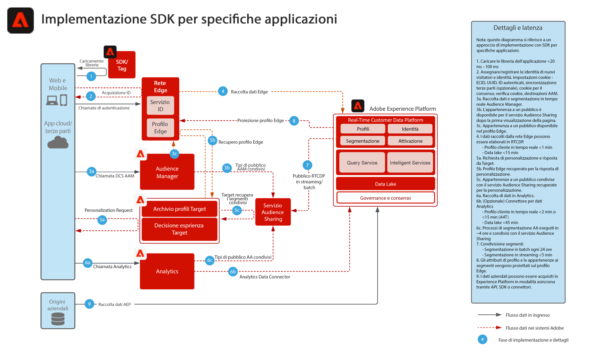

# Implementazione SDK specifica per l&#39;applicazione

Il diagramma di architettura seguente illustra i percorsi di integrazione e la raccolta dati che utilizzano SDK specifici per le applicazioni per l’implementazione.

## Documentazione di riferimento

* [Panoramica di Experience Platform Web/Mobile SDK](https://experienceleague.adobe.com/docs/experience-platform/edge/home.html?lang=it)
* [Tutorial sull’implementazione di Adobe Experience Cloud con Web SDK](https://experienceleague.adobe.com/docs/platform-learn/implement-web-sdk/overview.html?lang=it)
* [Tutorial sull’implementazione di Adobe Experience Cloud nelle app per dispositivi mobili](https://experienceleague.adobe.com/docs/platform-learn/implement-mobile-sdk/overview.html?lang=it)
