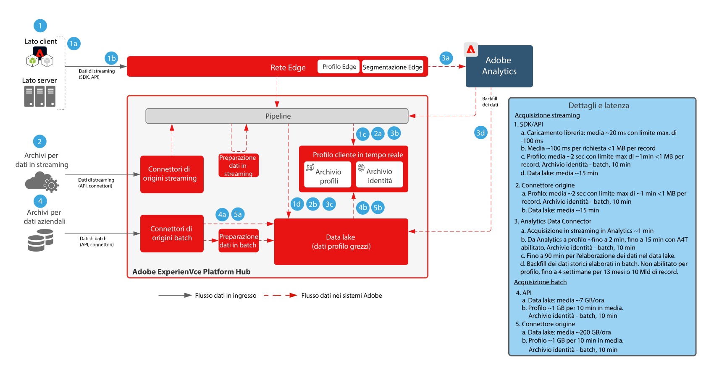

# Blueprint per la preparazione e l’acquisizione dei dati

Blueprint per la preparazione e l’acquisizione dei dati include tutti i metodi con cui i dati possono essere preparati e acquisiti nell’Adobe [!DNL Experience Platform].

La preparazione dei dati include la mappatura dei dati di origine sullo schema Experience Data Model (XDM). Include inoltre l’esecuzione di trasformazioni sui dati, tra cui formattazione della data, suddivisione/concatenazione/conversioni di campi e unione/fusione/riconfigurazione di record. La preparazione dei dati è utile per unificare i dati dei clienti al fine di fornire analisi aggregate/filtrate, inclusa la creazione di rapporti o la preparazione dei dati per assemblaggio/data science/attivazione dei profili cliente.

## Architettura

## Guardrail per l’acquisizione dei dati

Il diagramma seguente illustra i guardrail delle prestazioni e la latenza media per l&#39;acquisizione dei dati nell&#39;Adobe [!DNL Experience Platform].

## Metodi di acquisizione dei dati

<table cellspacing="0" class="Table" style="border-collapse:collapse; width:1123px">
<tbody>
<tr>
<td colspan="4" style="background-color:#308fff; border-bottom:4px solid white; border-left:1px solid white; border-right:1px solid white; border-top:1px solid white; height:31px; vertical-align:top; width:1123px">

<strong>Origini di streaming</strong>

</td>
</tr>
<tr>
<td style="background-color:#969696; border-bottom:1px solid white; border-left:1px solid white; border-right:1px solid white; border-top:none; height:20px; vertical-align:top; width:222px">

Metodo

</td>
<td style="background-color:#969696; border-bottom:1px solid white; border-left:none; border-right:1px solid white; border-top:none; height:20px; vertical-align:top; width:401px">

Casi d’uso più comuni

</td>
<td style="background-color:#969696; border-bottom:1px solid white; border-left:none; border-right:1px solid white; border-top:none; height:20px; vertical-align:top; width:218px">

Protocolli

</td>
<td style="background-color:#969696; border-bottom:1px solid white; border-left:none; border-right:1px solid white; border-top:none; height:20px; vertical-align:top; width:282px">

Considerazioni

</td>
</tr>
<tr>
<td style="background-color:#e8eeff; border-bottom:1px solid white; border-left:1px solid white; border-right:1px solid white; border-top:none; height:39px; vertical-align:top; width:222px">

<a href="https://experienceleague.adobe.com/docs/experience-platform/edge/home.html?lang=it" style="color:#0563c1; text-decoration:underline">Adobe Web/Mobile SDK</a>

</td>
<td style="background-color:#e8eeff; border-bottom:1px solid white; border-left:none; border-right:1px solid white; border-top:none; height:39px; vertical-align:top; width:401px">
<ul style="list-style-type:square">
<li>Raccolta dati da siti web e app mobili.</li>
<li>Metodo preferito per la raccolta lato client.</li>
</ul>
</td>
<td style="background-color:#e8eeff; border-bottom:1px solid white; border-left:none; border-right:1px solid white; border-top:none; height:39px; vertical-align:top; width:218px">

Push, HTTP, JSON

</td>
<td style="background-color:#e8eeff; border-bottom:1px solid white; border-left:none; border-right:1px solid white; border-top:none; height:39px; vertical-align:top; width:282px">
<ul>
<li>Implementa più applicazioni Adobe con un unico SDK.</li>
</ul>
</td>
</tr>
<tr>
<td style="background-color:#cddbff; border-bottom:1px solid white; border-left:1px solid white; border-right:1px solid white; border-top:none; height:39px; vertical-align:top; width:222px">

<a href="https://experienceleague.adobe.com/docs/experience-platform/sources/ui-tutorials/create/streaming/http.html?lang=it" style="color:#0563c1; text-decoration:underline">Connettore API HTTP</a>

</td>
<td style="background-color:#cddbff; border-bottom:1px solid white; border-left:none; border-right:1px solid white; border-top:none; height:39px; vertical-align:top; width:401px">
<ul style="list-style-type:square">
<li>Raccolta da origini di streaming, transazioni, eventi pertinenti dei clienti e segnali</li>
</ul>
</td>
<td style="background-color:#cddbff; border-bottom:1px solid white; border-left:none; border-right:1px solid white; border-top:none; height:39px; vertical-align:top; width:218px">

Push, REST API, JSON

</td>
<td style="background-color:#cddbff; border-bottom:1px solid white; border-left:none; border-right:1px solid white; border-top:none; height:39px; vertical-align:top; width:282px">
<ul>
<li>I dati vengono trasmessi in streaming direttamente all’hub, senza inoltro eventi o segmentazione Edge in tempo reale.</li>
</ul>
</td>
</tr>
<tr>
<td style="background-color:#e8eeff; border-bottom:1px solid white; border-left:1px solid white; border-right:1px solid white; border-top:none; height:39px; vertical-align:top; width:222px">

<a href="https://experienceleague.adobe.com/docs/experience-platform/edge-network-server-api/data-collection/interactive-data-collection.html?lang=it" style="color:#0563c1; text-decoration:underline">[!DNL Edge Network] API</a>

</td>
<td style="background-color:#e8eeff; border-bottom:1px solid white; border-left:none; border-right:1px solid white; border-top:none; height:39px; vertical-align:top; width:401px">
<ul style="list-style-type:square">
<li>Raccolta da fonti di streaming, transazioni, eventi rilevanti per i clienti e segnali provenienti da tutto il mondo [!DNL Edge Network]</li>
</ul>
</td>
<td style="background-color:#e8eeff; border-bottom:1px solid white; border-left:none; border-right:1px solid white; border-top:none; height:39px; vertical-align:top; width:218px">

Push, REST API, JSON

</td>
<td style="background-color:#e8eeff; border-bottom:1px solid white; border-left:none; border-right:1px solid white; border-top:none; height:39px; vertical-align:top; width:282px">
<ul>
<li>Streaming dei dati tramite [!DNL Edge Network]. Supporto della segmentazione in tempo reale nella rete Edge. </li>
</ul>
</td>
</tr>
<tr>
<td style="background-color:#cddbff; border-bottom:1px solid white; border-left:1px solid white; border-right:1px solid white; border-top:none; height:39px; vertical-align:top; width:222px">

<a href="https://experienceleague.adobe.com/docs/experience-platform/sources/connectors/adobe-applications/analytics.html?lang=it" style="color:#0563c1; text-decoration:underline">Applicazioni Adobe</a>

</td>
<td style="background-color:#cddbff; border-bottom:1px solid white; border-left:none; border-right:1px solid white; border-top:none; height:39px; vertical-align:top; width:401px">
<ul style="list-style-type:square">
<li>Precedente implementazione di Adobe Analytics, Marketo, Campaign, Target, AAM</li>
</ul>
</td>
<td style="background-color:#cddbff; border-bottom:1px solid white; border-left:none; border-right:1px solid white; border-top:none; height:39px; vertical-align:top; width:218px">

Push, connettori di origini e API

</td>
<td style="background-color:#cddbff; border-bottom:1px solid white; border-left:none; border-right:1px solid white; border-top:none; height:39px; vertical-align:top; width:282px">
<ul>
<li>L’approccio consigliato prevede la migrazione dagli SDK tradizionali delle singole applicazioni a Web/Mobile SDK.</li>
</ul>
</td>
</tr>
<tr>
<td style="background-color:#e8eeff; border-bottom:1px solid white; border-left:1px solid white; border-right:1px solid white; border-top:none; height:39px; vertical-align:top; width:222px">

<a href="https://experienceleague.adobe.com/docs/experience-platform/ingestion/streaming/overview.html?lang=it" style="color:#0563c1; text-decoration:underline">Connettori per origini in streaming</a>

</td>
<td style="background-color:#e8eeff; border-bottom:1px solid white; border-left:none; border-right:1px solid white; border-top:none; height:39px; vertical-align:top; width:401px">
<ul style="list-style-type:square">
<li>Acquisizione di uno stream di eventi aziendali, solitamente utilizzato per la condivisione di dati aziendali con più applicazioni a valle. </li>
</ul>
</td>
<td style="background-color:#e8eeff; border-bottom:1px solid white; border-left:none; border-right:1px solid white; border-top:none; height:39px; vertical-align:top; width:218px">

Push, REST API, JSON

</td>
<td style="background-color:#e8eeff; border-bottom:1px solid white; border-left:none; border-right:1px solid white; border-top:none; height:39px; vertical-align:top; width:282px">
<ul>
<li>È necessaria la trasmissione in streaming in formato XDM.</li>
</ul>
</td>
</tr>
<tr>
<td style="background-color:#cddbff; border-bottom:1px solid white; border-left:1px solid white; border-right:1px solid white; border-top:none; height:39px; vertical-align:top; width:222px">

SDK per origini di streaming

</td>
<td style="background-color:#cddbff; border-bottom:1px solid white; border-left:none; border-right:1px solid white; border-top:none; height:39px; vertical-align:top; width:401px">
<ul style="list-style-type:square">
<li>Simile al connettore API HTTP, consente una scheda di configurazione self-service per un flusso di dati esterno.</li>
</ul>
</td>
<td style="background-color:#cddbff; border-bottom:1px solid white; border-left:none; border-right:1px solid white; border-top:none; height:39px; vertical-align:top; width:218px">

Push, HTTP API, JSON

</td>
<td style="background-color:#cddbff; border-bottom:1px solid white; border-left:none; border-right:1px solid white; border-top:none; height:39px; vertical-align:top; width:282px">
<ul>
<li>[!DNL Edge Network]</li>
</ul>
</td>
</tr>
</tbody>
</table>

<table cellspacing="0" class="Table" style="border-collapse:collapse; width:1105px">
<tbody>
<tr>
<td colspan="4" style="background-color:#308fff; border-bottom:4px solid white; border-left:1px solid white; border-right:1px solid white; border-top:1px solid white; height:37px; vertical-align:top; width:1105px">

<strong>Origini batch</strong>

</td>
</tr>
<tr>
<td style="background-color:#969696; border-bottom:1px solid white; border-left:1px solid white; border-right:1px solid white; border-top:none; height:34px; vertical-align:top; width:217px">

Metodo

</td>
<td style="background-color:#969696; border-bottom:1px solid white; border-left:none; border-right:1px solid white; border-top:none; height:34px; vertical-align:top; width:397px">

Casi d’uso più comuni

</td>
<td style="background-color:#969696; border-bottom:1px solid white; border-left:none; border-right:1px solid white; border-top:none; height:34px; vertical-align:top; width:215px">

Protocolli

</td>
<td style="background-color:#969696; border-bottom:1px solid white; border-left:none; border-right:1px solid white; border-top:none; height:34px; vertical-align:top; width:277px">

Considerazioni

</td>
</tr>
<tr>
<td style="background-color:#e8eeff; border-bottom:1px solid white; border-left:1px solid white; border-right:1px solid white; border-top:none; height:62px; vertical-align:top; width:217px">

<a href="https://experienceleague.adobe.com/docs/experience-platform/ingestion/batch/getting-started.html?lang=it" style="color:#0563c1; text-decoration:underline">API per acquisizione batch</a>

</td>
<td style="background-color:#e8eeff; border-bottom:1px solid white; border-left:none; border-right:1px solid white; border-top:none; height:62px; vertical-align:top; width:397px">
<ul style="list-style-type:square">
<li>Acquisizione da una coda gestita dall’azienda. Pulizia e trasformazione dei dati prima dell’acquisizione.</li>
</ul>
</td>
<td style="background-color:#e8eeff; border-bottom:1px solid white; border-left:none; border-right:1px solid white; border-top:none; height:62px; vertical-align:top; width:215px">

Push, JSON o Parquet

</td>
<td style="background-color:#e8eeff; border-bottom:1px solid white; border-left:none; border-right:1px solid white; border-top:none; height:62px; vertical-align:top; width:277px">
<ul>
<li>Deve gestire batch e file per l’acquisizione</li>
</ul>
</td>
</tr>
<tr>
<td style="background-color:#cddbff; border-bottom:1px solid white; border-left:1px solid white; border-right:1px solid white; border-top:none; height:62px; vertical-align:top; width:217px">

<a href="https://experienceleague.adobe.com/docs/experience-platform/sources/connectors/cloud-storage/blob-s3.html?lang=it" style="color:#0563c1; text-decoration:underline">Connettori per origini batch</a>

</td>
<td style="background-color:#cddbff; border-bottom:1px solid white; border-left:none; border-right:1px solid white; border-top:none; height:62px; vertical-align:top; width:397px">
<ul style="list-style-type:square">
<li>Approccio comune per l’acquisizione di file da archiviazione cloud.</li>
<li>Connettori alle più comuni applicazioni CRM e marketing.</li>
<li>Ideale per l’acquisizione di grandi quantità di dati storici.</li>
</ul>
</td>
<td style="background-color:#cddbff; border-bottom:1px solid white; border-left:none; border-right:1px solid white; border-top:none; height:62px; vertical-align:top; width:215px">

Pull, CSV, JSON, Parquet

</td>
<td style="background-color:#cddbff; border-bottom:1px solid white; border-left:none; border-right:1px solid white; border-top:none; height:62px; vertical-align:top; width:277px">
<ul>
<li>Non sempre attivi, acquisizione immediata. </li>
<li>Controlli a frequenza ricorrente per l’acquisizione di file delta almeno ogni 15 minuti.</li>
</ul>
</td>
</tr>
<tr>
<td style="background-color:#e8eeff; border-bottom:1px solid white; border-left:1px solid white; border-right:1px solid white; border-top:none; height:62px; vertical-align:top; width:217px">

<a href="https://experienceleague.adobe.com/docs/experience-platform/sources/connectors/cloud-storage/data-landing-zone.html?lang=it" style="color:#0563c1; text-decoration:underline">Zona di destinazione dati</a>

</td>
<td style="background-color:#e8eeff; border-bottom:1px solid white; border-left:none; border-right:1px solid white; border-top:none; height:62px; vertical-align:top; width:397px">
<ul style="list-style-type:square">
<li>Percorso di archiviazione file con provisioning Adobe a cui inviare in push i file da acquisire.</li>
</ul>
</td>
<td style="background-color:#e8eeff; border-bottom:1px solid white; border-left:none; border-right:1px solid white; border-top:none; height:62px; vertical-align:top; width:215px">

Push, CSV, JSON, Parquet

</td>
<td style="background-color:#e8eeff; border-bottom:1px solid white; border-left:none; border-right:1px solid white; border-top:none; height:62px; vertical-align:top; width:277px">

- File forniti con un TTL di 7 giorni

</td>
</tr>
<tr>
<td style="background-color:#cddbff; border-bottom:1px solid white; border-left:1px solid white; border-right:1px solid white; border-top:none; height:62px; vertical-align:top; width:217px">

<a href="https://experienceleague.adobe.com/docs/experience-platform/sources/sdk/overview.html?lang=it" style="color:#0563c1; text-decoration:underline">SDK per origini batch</a>

</td>
<td style="background-color:#cddbff; border-bottom:1px solid white; border-left:none; border-right:1px solid white; border-top:none; height:62px; vertical-align:top; width:397px">
<ul style="list-style-type:square">
<li>Consente una scheda di configurazione self-service per un’origine dati esterna.</li>
<li>Ideale per connettori partner o per un’esperienza di flusso di lavoro personalizzata per l’impostazione di un connettore aziendale.</li>
</ul>
</td>
<td style="background-color:#cddbff; border-bottom:1px solid white; border-left:none; border-right:1px solid white; border-top:none; height:62px; vertical-align:top; width:215px">

Pull, REST API, CSV o JSON

</td>
<td style="background-color:#cddbff; border-bottom:1px solid white; border-left:none; border-right:1px solid white; border-top:none; height:62px; vertical-align:top; width:277px">
<ul>
<li>Frequenza minima di 15 min</li>
<li>Esempi: MailChimp, One Trust, Zendesk</li>
</ul>

 

</td>
</tr>
</tbody>
</table>

| Metodi di acquisizione | Descrizione |
|------------------------------|-----------------------------------------------------------------------------------------------------------------------------------------------------------------------------------------------------------------------------------------------------------------------------------------------------------------------------------------------------------------------------------------------------------------------------------------|
| Web/Mobile SDK | Latenza:<ul><li>In tempo reale - stessa raccolta pagine a [!DNL Edge Network]</li><li>Acquisizione in streaming sul profilo &lt; 15 minuti al 95° percentile</li><li>Acquisizione in streaming nel data lake (micro batch ~15 minuti)</ul>Documentazione: <ul><li>[Web SDK](https://experienceleague.adobe.com/docs/web-sdk.html?lang=it)</li><li>[Tutorial sull’implementazione di Adobe Experience Cloud con Web SDK](https://experienceleague.adobe.com/docs/platform-learn/implement-web-sdk/overview.html?lang=it)</li><li>[Mobile SDK](https://experienceleague.adobe.com/docs/mobile.html?lang=it)</li><li>[Tutorial sull’implementazione di Adobe Experience Cloud nelle app per dispositivi mobili](https://experienceleague.adobe.com/docs/platform-learn/implement-mobile-sdk/overview.html?lang=it)</li></ul> |
| Origini di streaming | [Origini di streaming](https://experienceleague.adobe.com/docs/experience-platform/sources/home.html?lang=it#connectors) Latenza:<ul><li>In tempo reale - stessa raccolta pagine a [!DNL Edge Network]</li><li>Acquisizione in streaming nel profilo ~1 minuto</li><li>Acquisizione in streaming nel data lake (micro batch ~15 minuti)</li></ul> |
| API di streaming | [[!DNL Edge Network] API server (preferita)](https://experienceleague.adobe.com/docs/experience-platform/edge-network-server-api/data-collection/interactive-data-collection.html?lang=it) - supporta i servizi Edge, inclusa la segmentazione di Edge, e  [API servizio core raccolta dati](https://experienceleague.adobe.com/docs/experience-platform/sources/connectors/streaming/http.html?lang=it) - non supporta i servizi Edge, instrada direttamente all&#39;hub. Latenza:<ul><li>In tempo reale - stessa raccolta pagine a [!DNL Edge Network]</li><li>Acquisizione in streaming nel profilo ~1 minuto</li><li>Acquisizione in streaming nel data lake (micro batch ~15 minuti)</li><li>7 GB/ora</li></ul>[Documentazione](https://experienceleague.adobe.com/docs/experience-platform/ingestion/streaming/overview.html?lang=it#what-can-you-do-with-streaming-ingestion%3F) |
| Strumenti ETL | Utilizza gli strumenti ETL per modificare e trasformare i dati aziendali prima dell&#39;acquisizione in [!DNL Experience Platform].  Latenza:<ul><li>La tempistica dipende dalla pianificazione degli strumenti ETL esterni, quindi si applicano i guardrail di acquisizione standard in base al metodo utilizzato.</li></ul> |
| Origini batch | Recupero programmato da origini Latenza: ~ 200 GB/ora  [Documentazione](https://experienceleague.adobe.com/docs/experience-platform/sources/home.html?lang=it#connectors) [Tutorial video](https://experienceleague.adobe.com/docs/platform-learn/tutorials/sources/overview.html?lang=it) |
| API batch | Latenza:<ul><li>Acquisizione batch nel profilo in base alle dimensioni e ai carichi di traffico ~45 minuti</li><li>Acquisizione batch nel data lake in base alle dimensioni e dal traffico</li></ul>[Documentazione](https://experienceleague.adobe.com/docs/experience-platform/ingestion/batch/overview.html?lang=it#batch) |
| Connettori per applicazioni Adobe | Acquisizione automatica dei dati provenienti da applicazioni Adobe Experience Cloud<ul><li>Adobe Analytics: [Documentazione](https://experienceleague.adobe.com/docs/experience-platform/sources/connectors/adobe-applications/analytics.html?lang=it#connectors) e [Tutorial video](https://experienceleague.adobe.com/docs/platform-learn/tutorials/sources/ingest-data-from-adobe-analytics.html?lang=it)</li><li>Audience Manager: [Documentazione](https://experienceleague.adobe.com/docs/experience-platform/sources/connectors/adobe-applications/audience-manager.html?lang=it#connectors) e [Tutorial video](https://experienceleague.adobe.com/docs/platform-learn/tutorials/sources/ingest-data-from-aam.html?lang=it)</li></ul> |

## Metodi di preparazione dei dati

| Metodi di preparazione dei dati | Descrizione |
|------------------------------------------------------------|------------------------------------------------------------------------------------------------------------------------------------------------------------------------------------------------------------------------------------------------------------------------------------------------|
| Strumento ETL esterno ([!DNL Snaplogic], [!DNL Mulesoft], [!DNL Informatica], ecc.) | Eseguire trasformazioni complesse negli strumenti ETL e utilizzare le API [!DNL Experience Platform] [!UICONTROL Flow Service] standard o i connettori di origine per acquisire i dati risultanti. |
| [!UICONTROL Query Service]: preparazione dei dati | Unire, separare, fondere, trasformare, interrogare e filtrare i dati in un nuovo set di dati  [Documentazione](https://experienceleague.adobe.com/docs/experience-platform/query/home.html?lang=it#sql) sull’utilizzo di Create Table as Select (CTAS) |
| Funzioni mappatore XDM e preparazione dati (streaming e batch) | Mappa gli attributi sorgente in formato CSV o JSON negli attributi XDM durante l&#39;acquisizione di [!DNL Experience Platform]. Elaborare le funzioni sui dati man mano che vengono acquisiti; ovvero, formattazione dei dati, suddivisione, concatenazione e così via [Documentazione](https://experienceleague.adobe.com/docs/experience-platform/data-prep/home.html?lang=it) |

## Articoli di blog correlati

* [Utilizzo di piattaforme dati esterne in Adobe [!DNL Experience Platform] [!DNL Journey Orchestration]](https://medium.com/adobetech/leveraging-external-data-platforms-in-adobe-experience-platform-journey-orchestration-54fc6134fe17?source=your_stories_page)
* [Acquisizione ad alta produttività con Iceberg](https://medium.com/adobetech/high-throughput-ingestion-with-iceberg-ccf7877a413f?source=your_stories_page)
* [Trucchi al servizio query nell&#39;Adobe [!DNL Experience Platform] (Scrittura di query e archiviazione di set di dati derivati)](https://medium.com/adobetech/query-service-tricks-in-adobe-experience-platform-writing-queries-and-storing-derived-datasets-eaee0d6d683e?source=your_stories_page)
* [Accesso al Experience Data Model di Adobe [!DNL Experience Platform] per comprendere meglio la potenza del profilo cliente in tempo reale](https://medium.com/adobetech/digging-into-adobe-experience-platforms-experience-data-model-to-more-fully-understand-the-power-3e109271e04f?source=your_stories_page)
* [Un&#39;analisi introduttiva dei dati esplorativi sull&#39;Adobe [!DNL Experience Platform]](https://medium.com/adobetech/an-introductory-look-at-exploratory-data-analysis-on-adobe-experience-platform-1bfce7501d9a?source=your_stories_page)
* [Modellazione dei dati XDM per Data Science su scala su Adobe [!DNL Experience Platform]](https://medium.com/adobetech/modeling-xdm-data-for-data-science-at-scale-on-adobe-experience-platform-222bb2a6dbf7?source=your_stories_page)
