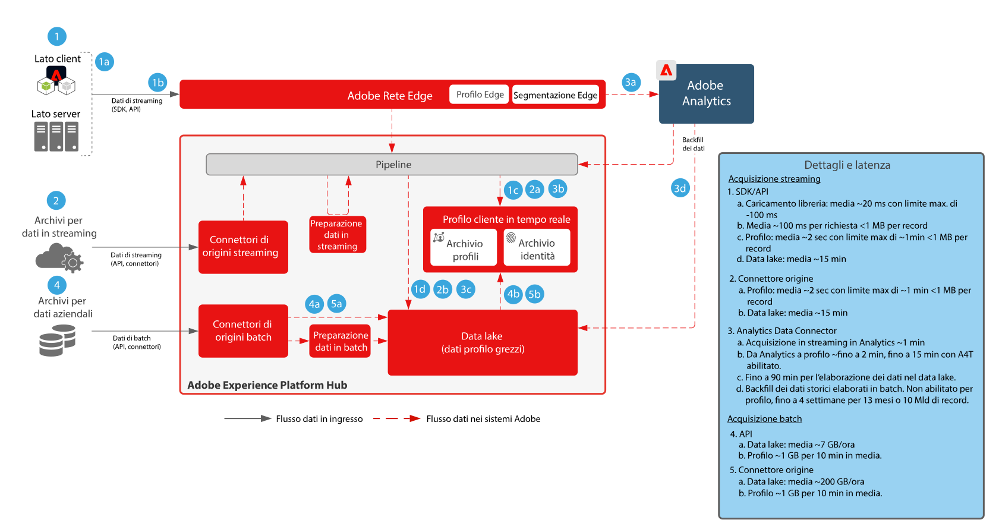

# Piano di preparazione dei dati e acquisizione

Il blueprint per la preparazione e acquisizione dei dati comprende tutti i metodi con cui i dati possono essere preparati e inseriti in Adobe Experience Platform.

La preparazione dei dati include la mappatura dei dati di origine sullo schema Experience Data Model (XDM). Include inoltre l’esecuzione di trasformazioni sui dati, tra cui formattazione della data, suddivisione/concatenazione/conversioni di campi e unione/fusione/riconfigurazione di record. La preparazione dei dati è utile per unificare i dati dei clienti al fine di fornire analisi aggregate/filtrate, inclusa la creazione di rapporti o la preparazione dei dati per assemblaggio/data science/attivazione dei profili cliente.

## Architettura

## Garanzie per l’inserimento dei dati

Il diagramma seguente illustra i guardrail per prestazioni e la latenza media per l’acquisizione dei dati in Adobe Experience Platform.

## Metodi di acquisizione dei dati

| Metodi di acquisizione | Descrizione |
|------------------------------|-----------------------------------------------------------------------------------------------------------------------------------------------------------------------------------------------------------------------------------------------------------------------------------------------------------------------------------------------------------------------------------------------------------------------------------------|
| Web/Mobile SDK | Latenza:<ul><li>In tempo reale: stessa raccolta di pagine della rete Edge</li><li>Acquisizione in streaming nel profilo ~1 minuto</li><li>Acquisizione in streaming nel data lake (micro batch ~15 minuti)</ul>Documentazione: <ul><li>[Web SDK](https://experienceleague.adobe.com/docs/web-sdk.html?lang=it)</li><li>[Tutorial sull’implementazione di Adobe Experience Cloud con Web SDK](https://experienceleague.adobe.com/docs/platform-learn/implement-web-sdk/overview.html?lang=it)</li><li>[Mobile SDK](https://experienceleague.adobe.com/docs/mobile.html?lang=it)</li><li>[Tutorial sull’implementazione di Adobe Experience Cloud nelle app per dispositivi mobili](https://experienceleague.adobe.com/docs/platform-learn/implement-mobile-sdk/overview.html?lang=it)</li></ul> |
| Origini di streaming | [Origini di streaming](https://experienceleague.adobe.com/docs/experience-platform/sources/home.html?lang=it#connectors) Latenza:<ul><li>In tempo reale: stessa raccolta di pagine della rete Edge</li><li>Acquisizione in streaming nel profilo ~1 minuto</li><li>Acquisizione in streaming nel data lake (micro batch ~15 minuti)</li></ul> |
| API di streaming | [Edge Network Server API (preferita)](https://experienceleague.adobe.com/docs/experience-platform/edge-network-server-api/data-collection/interactive-data-collection.html?lang=it) - Supporta i servizi Edge, inclusa la segmentazione Edge e le  [API del servizio core per la raccolta dati](https://experienceleague.adobe.com/docs/experience-platform/sources/connectors/streaming/http.html?lang=it) - Non supporta i servizi Edge, esegue l&#39;indirizzamento direttamente all’hub. Latenza:<ul><li>In tempo reale: stessa raccolta di pagine della rete Edge</li><li>Acquisizione in streaming nel profilo ~1 minuto</li><li>Acquisizione in streaming nel data lake (micro batch ~15 minuti)</li><li>7 GB/ora</li></ul>[Documentazione](https://experienceleague.adobe.com/docs/experience-platform/ingestion/streaming/overview.html?lang=it#what-can-you-do-with-streaming-ingestion%3F) |
| Strumenti ETL | Utilizza gli strumenti ETL per modificare e trasformare i dati aziendali prima dell’acquisizione in Experience Platform.  Latenza:<ul><li>La tempistica dipende dalla pianificazione degli strumenti ETL esterni, quindi si applicano i guardrail di acquisizione standard in base al metodo utilizzato.</li></ul> |
| Origini batch | Recupero programmato da origini Latenza: ~ 200 GB/ora  [Documentazione](https://experienceleague.adobe.com/docs/experience-platform/sources/home.html?lang=it#connectors) [Tutorial video](https://experienceleague.adobe.com/docs/platform-learn/tutorials/sources/overview.html?lang=it) |
| API batch | Latenza:<ul><li>Acquisizione batch nel profilo in base alle dimensioni e ai carichi di traffico ~45 minuti</li><li>Acquisizione batch nel data lake in base alle dimensioni e dal traffico</li></ul>[Documentazione](https://experienceleague.adobe.com/docs/experience-platform/ingestion/batch/overview.html?lang=it#batch) |
| Connettori per applicazioni Adobe | Acquisizione automatica dei dati provenienti da applicazioni Adobe Experience Cloud<ul><li>Adobe Analytics: [Documentazione](https://experienceleague.adobe.com/docs/experience-platform/sources/connectors/adobe-applications/analytics.html?lang=it#connectors) e [Tutorial video](https://experienceleague.adobe.com/docs/platform-learn/tutorials/sources/ingest-data-from-adobe-analytics.html?lang=it)</li><li>Audience Manager: [Documentazione](https://experienceleague.adobe.com/docs/experience-platform/sources/connectors/adobe-applications/audience-manager.html?lang=it#connectors) e [Tutorial video](https://experienceleague.adobe.com/docs/platform-learn/tutorials/sources/ingest-data-from-aam.html?lang=it)</li></ul> |

## Metodi di preparazione dei dati

| Metodi di preparazione dei dati | Descrizione |
|------------------------------------------------------------|------------------------------------------------------------------------------------------------------------------------------------------------------------------------------------------------------------------------------------------------------------------------------------------------|
| Strumento ETL esterno ([!DNL Snaplogic], [!DNL Mulesoft], [!DNL Informatica], ecc.) | Eseguire trasformazioni complesse negli strumenti ETL e acquisire i dati risultanti mediante le API standard di Experience Platform [!UICONTROL Flow Service] o connettori di origini |
| [!UICONTROL Query Service]: preparazione dei dati | Unire, separare, fondere, trasformare, interrogare e filtrare i dati in un nuovo set di dati  [Documentazione](https://experienceleague.adobe.com/docs/experience-platform/query/home.html?lang=it#sql) sull’utilizzo di Create Table as Select (CTAS) |
| Funzioni mappatore XDM e preparazione dati (streaming e batch) | Mappare gli attributi di origine in formato CSV o JSON su attributi XDM durante l’acquisizione in Experience Platform Elaborare le funzioni sui dati man mano che vengono acquisiti; ovvero, formattazione dei dati, suddivisione, concatenazione e così via [Documentazione](https://experienceleague.adobe.com/docs/experience-platform/data-prep/home.html?lang=it) |

## Post di blog correlati

* [[!DNL Leveraging External Data Platforms in Adobe Experience Platform Journey Orchestration]](https://medium.com/adobetech/leveraging-external-data-platforms-in-adobe-experience-platform-journey-orchestration-54fc6134fe17?source=your_stories_page-------------------------------------)
* [[!DNL High Throughput Ingestion with Iceberg]](https://medium.com/adobetech/high-throughput-ingestion-with-iceberg-ccf7877a413f?source=your_stories_page-------------------------------------)
* [[!DNL Query Service Tricks in Adobe Experience Platform (Writing Queries and Storing Derived Datasets)]](https://medium.com/adobetech/query-service-tricks-in-adobe-experience-platform-writing-queries-and-storing-derived-datasets-eaee0d6d683e?source=your_stories_page-------------------------------------)
* [[!DNL Digging into Adobe Experience Platform's Experience Data Model to More Fully Understand the Power of Real-time Customer Profile]](https://medium.com/adobetech/digging-into-adobe-experience-platforms-experience-data-model-to-more-fully-understand-the-power-3e109271e04f?source=your_stories_page-------------------------------------)
* [[!DNL An Introductory Look at Exploratory Data Analysis on Adobe Experience Platform]](https://medium.com/adobetech/an-introductory-look-at-exploratory-data-analysis-on-adobe-experience-platform-1bfce7501d9a?source=your_stories_page-------------------------------------)
* [[!DNL Modeling XDM Data for Data Science at Scale on Adobe Experience Platform]](https://medium.com/adobetech/modeling-xdm-data-for-data-science-at-scale-on-adobe-experience-platform-222bb2a6dbf7?source=your_stories_page-------------------------------------)
