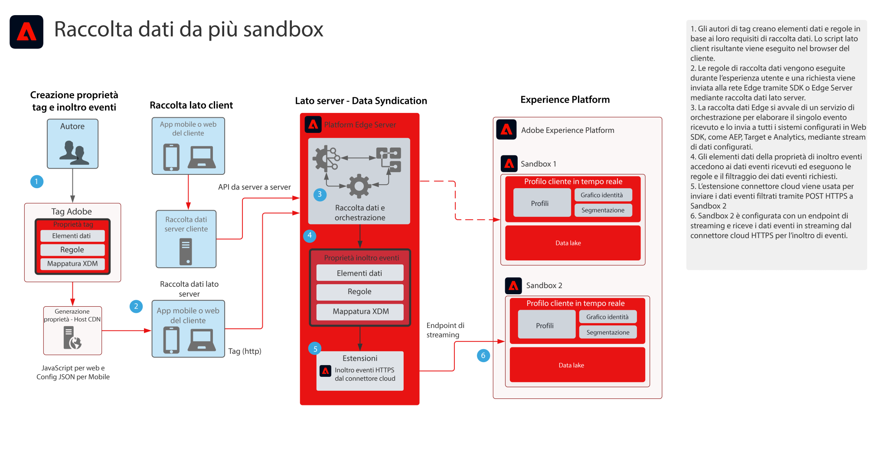

# Blueprint per raccolta dati per l’inoltro di eventi a più sandbox

Il blueprint per raccolta dati per l’inoltro di eventi a più sandbox illustra come i dati raccolti tramite Adobe Experience Platform Web SDK e Mobile SDK possono essere configurati in modo da raccogliere un singolo evento e inoltrarlo a più sandbox AEP. Questo blueprint è un caso d’uso specifico che utilizza la funzione di inoltro eventi dei tag di Adobe.

Oltre a replicare l’evento, le funzioni di inoltro eventi consentono di aggiungere, filtrare o manipolare i dati raccolti originali che soddisfano i requisiti per altre sandbox. Consideriamo ad esempio che la Sandbox A debba ricevere tutti gli elementi di dati di eventi, mentre la Sandbox B solo i dati non PII.

La funzione di inoltro eventi utilizza una proprietà Tag distinta che contiene gli elementi dati, le regole e le estensioni necessari per i requisiti dei dati. Con un evento in entrata, la proprietà di inoltro eventi può raccogliere i dati e gestirli in base alle esigenze prima dell’inoltro stesso.

Per la sandbox di destinazione è necessario configurare un endpoint di streaming HTTP che verrà utilizzato dall’estensione di inoltro eventi HTTPS.

## Casi di utilizzo

* Reporting globale dei dati: è utile quando si utilizzano più sandbox per isolare gli ambienti operativi e si desidera consolidare la raccolta dati in un unico sandbox per generare rapporti su tutte le sandbox. L’inoltro eventi a una sandbox di reporting consente a ogni ambiente operativo sandbox di inviare i dati raccolti in tempo reale a una sandbox di reporting.
* Gestione della raccolta di dati da sandbox diverse in base a diverse regole di dati per ciascun ambiente operativo sandbox. Tali ambienti operativi richiedono il filtraggio di dati sensibili, ad esempio per il settore sanitario e servizi finanziari.

## Applicazioni

* Raccolta dati di Adobe Experience Platform

## Architettura

1. Gli autori dei tag definiscono sia una proprietà Tag che una proprietà di inoltro eventi. In questo caso, gli autori definiscono gli elementi dati, le regole e le azioni che gestiscono la raccolta dei dati. Tieni presente che il codice della proprietà Tag viene eseguito sul client e distribuito da un host CDN. Il codice della proprietà di inoltro eventi viene eseguito sul server Adobe Edge.

1. I dati raccolti sul client vengono inviati alla rete Edge. I clienti hanno anche la possibilità di inviare prima i dati al proprio server come metodo di raccolta lato server. Web SDK può fornire una funzionalità di raccolta da server a server. Tuttavia, ciò richiede l’implementazione di un diverso modello di programmazione. Consulta la documentazione **Panoramica delle API server della rete Edge**, di seguito.

1. La rete Edge di Platform riceve i payload di raccolta dati e orchestra il flusso di dati verso i sistemi richiesti, come Target e Analytics.

1. Gli elementi dati della proprietà di inoltro eventi vengono utilizzati per accedere ai dati evento in arrivo nel payload. Le regole possono anche essere utilizzate per manipolare i dati evento in base alle esigenze, prima dell’inoltro. Ad esempio, per formattare i dati nell’XDM richiesto per l’acquisizione dei dati in streaming.

1. La funzione di inoltro eventi fornisce l’estensione HTTPS che consente di inoltrare i dati evento a un endpoint HTTPS.

1. La sandbox 2 è configurata con un endpoint di streaming che riceve l’evento inoltrato.

## Documentazione correlata

* [Documentazione sull’inoltro degli eventi](https://experienceleague.adobe.com/docs/experience-platform/tags/event-forwarding/overview.html?lang=it)
* [Video sull’inoltro degli eventi](https://experienceleague.adobe.com/docs/launch-learn/tutorials/server-side/overview.html?lang=it)
* [Lezione sull’inoltro degli eventi](https://experienceleague.adobe.com/docs/platform-learn/implement-web-sdk/event-forwarding/setup-event-forwarding.html?lang=it) nel tutorial su Web SDK
* [Panoramica di Experience Platform Web SDK](https://experienceleague.adobe.com/docs/experience-platform/edge/home.html?lang=it)
* [Panoramica delle API server della rete Edge](https://experienceleague.adobe.com/docs/experience-platform/edge-network-server-api/overview.html?lang=it)

## Articoli di blog correlati

* [[!DNL Boosting Website Performance with Adobe Experience Platform Web SDK and Edge Network]](https://medium.com/adobetech/boosting-website-performance-with-adobe-experience-platform-web-sdk-and-edge-network-329fcf70fdf9)
* [[!DNL Solving Implementation Pain Points with Adobe Experience Platform Web SDK and Edge Network]](https://medium.com/adobetech/solving-implementation-pain-points-with-adobe-experience-platform-web-sdk-and-edge-network-880b635e6819)
* [[!DNL Adobe Experience Platform Web SDK for Audience Management]](https://medium.com/adobetech/adobe-experience-platform-web-sdk-for-audience-management-751fa6d063bc)
* [[!DNL Adobe Experience Platform Web SDK — Adobe Target]](https://medium.com/adobetech/adobe-experience-platform-web-sdk-adobe-target-9b9f621d271)
* [[!DNL Adobe Experience Platform Web SDK Migration Scenarios for Adobe Analytics]](https://medium.com/adobetech/adobe-experience-platform-web-sdk-migration-scenarios-for-adobe-analytics-91c255ec82b0)
* [[!DNL Unify Your Adobe Experience Platform Services with Adobe Experience Platform Web SDK]](https://medium.com/adobetech/unify-your-adobe-experience-platform-services-with-adobe-experience-platform-web-sdk-75cf6851a9fc)
* [[!DNL Accelerate Your Mobile Application Development with Adobe Experience Platform Mobile SDK and Launch]](https://medium.com/adobetech/accelerate-your-mobile-application-development-with-adobe-experience-platform-mobile-sdk-and-launch-ed023536d611)
* [[!DNL Simplifying Customer Workflows with Adobe Experience Platform Web SDK]](https://medium.com/adobetech/simplifying-customer-workflows-with-adobe-experience-platform-web-sdk-4e54fe134f4a)
