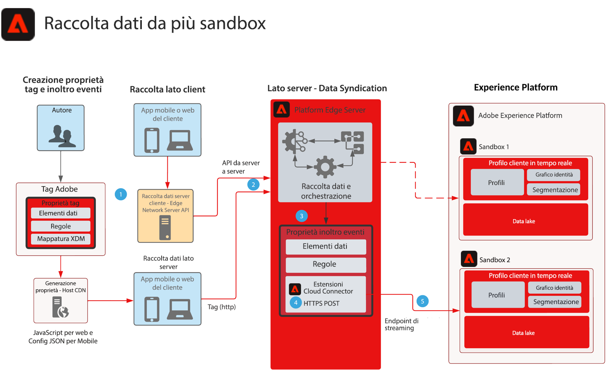

# Blueprint per raccolta dati per l’inoltro di eventi a più sandbox

Questo blueprint mostra come configurare i dati raccolti con Experience Platform Web e Mobile SDK per raccogliere un singolo evento e inoltrarlo a più Sandbox AEP. Questo blueprint è un caso d’uso specifico per la raccolta dati di più sandbox che utilizza l’inoltro degli eventi per raggiungere questo obiettivo.

Oltre a replicare l’evento con le funzioni di Inoltro eventi, puoi aggiungere, filtrare o manipolare i dati raccolti originali che soddisfano i requisiti di altre sandbox.

L’inoltro degli eventi utilizza una proprietà separata che contiene gli elementi dati, le regole e le estensioni necessari per i requisiti dei dati. Con un evento in arrivo, la proprietà Inoltro eventi può raccogliere i dati e gestirli in base alle esigenze prima dell’inoltro.

La sandbox di destinazione richiede un endpoint di streaming HTTP configurato, utilizzato dall’estensione Cloud Connector di Adobe.

## Casi di utilizzo

* Reporting globale dei dati: è utile quando si utilizzano più sandbox per isolare gli ambienti operativi e si desidera consolidare la raccolta dati in un unico sandbox per generare rapporti su tutte le sandbox. Inoltrare un evento Experience Edge tramite l’inoltro di eventi a una sandbox di reporting consente a ogni ambiente operativo sandbox di inviare dati raccolti in tempo reale a una sandbox di reporting
* Gestione della raccolta di dati da sandbox diverse in base a diverse regole di dati per ciascun ambiente operativo sandbox.

## Applicazioni

* Raccolta dati di Adobe Experience Platform
* Inoltro eventi
* Estensione AEP
* Estensione Cloud Connector

## Considerazioni

Con l’inoltro degli eventi come approccio per inviare dati a più sandbox, è necessario tenere conto di alcune considerazioni con l’architettura della soluzione.

### Nessun dato HIPAA

L’inoltro degli eventi non è considerato pronto per HIPAA e non deve essere utilizzato in alcun caso di utilizzo HIPAA in cui vengono raccolti dati HIPAA. Tuttavia, l’infrastruttura utilizzata per l’inoltro degli eventi è considerata pronta per HIPAA ed è a esclusiva discrezione del cliente. Mentre la proprietà Tag per l’inoltro degli eventi si trova nel sistema di inoltro degli eventi, l’intero payload dei dati raccolti viene inviato al sistema di inoltro degli eventi per l’elaborazione. È questo processo che crea l’inoltro degli eventi relativo ai casi d’uso HIPAA. Con l’intero payload inviato al sistema di inoltro degli eventi, questo includerebbe tutti i valori HIPAA. Anche se le regole di Inoltro eventi filtrano tali dati prima di inviarli alla loro destinazione, tali dati HIPAA vengono comunque spediti a un’infrastruttura non compatibile con HIPAA. Tuttavia, i dati di payload non vengono mai memorizzati e sono semplicemente un pass-through.

### Diversi flussi di dati e endpoint di streaming

Quando i dati fluiscono attraverso gli stream di dati dalla rete Edge di Platform, quando si utilizza l’inoltro degli eventi a un’altra sandbox AEP, un requisito DIFFICILE è non utilizzare MAI lo stesso stream di dati o endpoint di streaming dello stream di dati che crea la raccolta originale. Questo può essere dannoso per l&#39;istanza AEP e può potenzialmente attivare una situazione DoS.

### Volume di traffico stimato

I volumi di traffico sono necessari per la revisione con ogni caso d’uso. Questo è importante in quanto volumi elevati potrebbero causare una situazione di limitazione e i clienti riceveranno una notifica nel caso in cui ciò si verifichi.

## Architettura

1. Per utilizzare l’inoltro degli eventi è necessario raccogliere e inviare dati evento alla rete Edge di Platform. I clienti possono utilizzare i tag Adobe per il lato client o l’API del server di rete Edge di Platform per la raccolta dati server-to-server. L’API della rete Edge di Platform può fornire una funzionalità di raccolta da server a server. Tuttavia, ciò richiede l’implementazione di un diverso modello di programmazione. Fai riferimento a [Panoramica API server di rete Edge](https://experienceleague.adobe.com/docs/experience-platform/edge-network-server-api/overview.html?lang=en)

1. I payload raccolti vengono inviati dall’implementazione dei tag alla rete Edge di Platform al servizio di inoltro degli eventi ed elaborati in base ai propri elementi dati, regole e azioni. Ulteriori informazioni sulle differenze tra [Tag e inoltro eventi](https://experienceleague.adobe.com/docs/experience-platform/tags/event-forwarding/overview.html?lang=en#differences-from-tags).

1. È inoltre necessaria una proprietà di inoltro degli eventi per ricevere i dati degli eventi raccolti dalla rete Edge di Platform. Indica se i dati dell’evento sono stati inviati alla rete Edge di Platform da un’implementazione di Tag implementata o da una raccolta da server a server. Gli autori definiscono gli elementi di dati, le regole e le azioni utilizzati per arricchire i dati dell’evento prima di inoltrarli alla seconda sandbox. Prendi in considerazione l’utilizzo dell’elemento dati JavaScript del codice personalizzato per strutturare i dati per l’acquisizione sandbox. In combinazione con le funzionalità di AEP Data Prep, puoi gestire la struttura dati in diverse opzioni.

1. Attualmente, è necessario utilizzare l’estensione Adobe Cloud Connector all’interno della proprietà di inoltro degli eventi. Una volta che le regole elaborano o arricchiscono i dati dell’evento, il connettore cloud viene utilizzato all’interno di una chiamata Fetch configurata per un POST che invia il payload alla seconda sandbox

1. Per la seconda sandbox è necessario un endpoint di streaming per l’acquisizione dei dati. Puoi anche prendere in considerazione le funzionalità di preparazione dati in AEP per semplificare l’acquisizione e la mappatura dei payload di Inoltro eventi in XDM. Consulta la documentazione di AEP Creare un [Connessione streaming API HTTP tramite l’interfaccia utente](https://experienceleague.adobe.com/docs/experience-platform/sources/ui-tutorials/create/streaming/http.html?lang=it)
