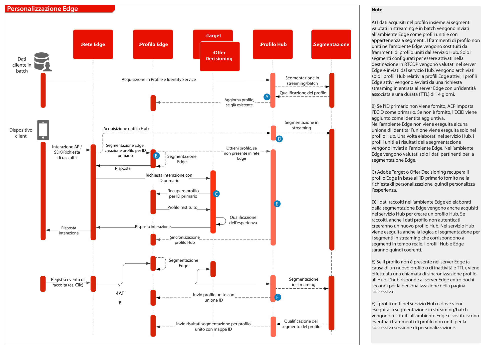

# Panoramica

Per una panoramica e dettagli sull’SDK per web e dispositivi mobili e sull’API di Edge Network Server, consulta quanto segue.
* [Panoramica di WebSDK](https://experienceleague.adobe.com/docs/web-sdk.html?lang=it)
* [Panoramica di MobileSDK](https://aep-sdks.gitbook.io/docs/)
* [API server di rete Edge](https://experienceleague.adobe.com/docs/experience-platform/edge-network-server-api/overview.html)

Per una descrizione dettagliata delle funzionalità dell&#39;applicazione supportate in WebSDK, consulta la documentazione seguente.
* [Supporto delle funzionalità dell&#39;applicazione WebSDK](https://github.com/orgs/adobe/projects/18/views/1)

Per informazioni dettagliate sulla migrazione dagli SDK specifici per le applicazioni agli SDK per web e dispositivi mobili, consulta la seguente documentazione.
* [Servizi identità](https://experienceleague.adobe.com/docs/experience-platform/edge/identity/overview.html)
* [Analytics](https://experienceleague.adobe.com/docs/experience-platform/edge/data-collection/adobe-analytics/analytics-overview.html)
* [Target](https://experienceleague.adobe.com/docs/experience-platform/edge/personalization/adobe-target/target-overview.html)
* [Analytics for Target](https://experienceleague.adobe.com/docs/experience-platform/edge/personalization/adobe-target/a4t/overview.html)

## Implementazione dell&#39;API Experience Platform Web/Mobile SDK o Edge Network Server

Il diagramma dell’architettura seguente illustra la distribuzione e la raccolta di dati che utilizzano l’SDK per web di Experience Platform.

Diagramma di sequenza di Experience Edge, Experience Platform Services e applicazioni

## Documentazione di riferimento

* [Tutorial sull’implementazione di Adobe Experience Cloud con Web SDK](https://experienceleague.adobe.com/docs/platform-learn/implement-web-sdk/overview.html?lang=it)
* [Tutorial sull’implementazione di Adobe Experience Cloud nelle app per dispositivi mobili](https://experienceleague.adobe.com/docs/platform-learn/implement-mobile-sdk/overview.html?lang=it)