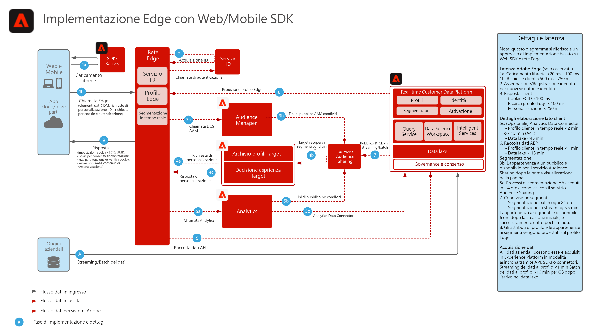

# Raccolta dati tramite SDK Web/Mobile di Experience Platform

Questo schema dell’architettura illustra i percorsi di integrazione e raccolta dati tramite l’SDK Web di Experience Platform.

## Documentazione di riferimento

* [Panoramica dell’SDK Web/Mobile di Experience Platform](https://experienceleague.adobe.com/docs/experience-platform/edge/home.html?lang=it)
* [Esercitazione sull’implementazione di Adobe Experience Cloud con SDK per web](https://experienceleague.adobe.com/docs/blueprints-learn/architecture/data-ingestion/websdk.html)
