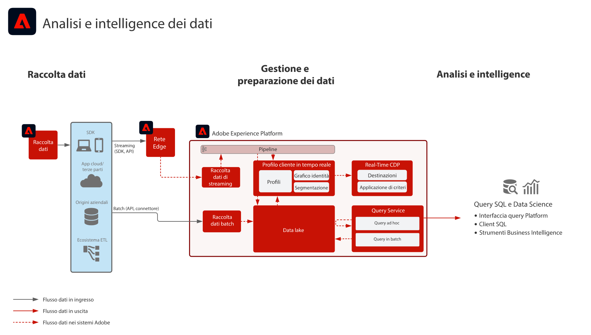

# Blueprint per analisi e intelligence dei dati

Il blueprint per analisi e intelligence dei dati comprende la capacità di Adobe Experience Platform di eseguire query esplorative e analisi dei dati presenti nel data lake.

Experience Platform [!UICONTROL Query Service] consente di eseguire query SQL sui dati. [!UICONTROL Data Science Workspace] consente di eseguire esplorazione dei dati, data science e carichi di lavoro di apprendimento automatico.

Inoltre, Experience Platform consente connessioni con client SQL, interfacce e strumenti di Business Intelligence (BI) di terze parti per connettersi, accedere e interrogare direttamente i dati all’interno di Experience Platform, utilizzando il protocollo [!DNL PostgreSQL].

Alcuni guardrail riguardano il timeout delle query e la quantità di dati inclusi nel risultato della query, come indicato nei dettagli del blueprint.

## Casi di utilizzo

* Query interattiva e aggregazione dei dati
* Accesso per righe e colonne ai dati acquisiti per l’esplorazione e la convalida
* Creazione di dashboard e visualizzazione dei dati tramite strumenti di Business Intelligence

## Applicazioni

* Adobe Experience Platform

## Architettura

## Guardrail

Per informazioni sulle best practice e le protezioni, consulta la documentazione del prodotto del servizio query .
[Guida al servizio query](https://experienceleague.adobe.com/docs/experience-platform/query/best-practices/writing-queries.html?lang=en#best-practices)

## Fasi di implementazione

1. [Creare schemi per i dati da acquisire.](https://experienceleague.adobe.com/docs/platform-learn/tutorials/schemas/create-a-schema.html)
1. [Creare set di dati per i dati da acquisire.](https://experienceleague.adobe.com/docs/platform-learn/tutorials/data-ingestion/create-datasets-and-ingest-data.html)
1. [Inserire i dati in Experience Platform](https://experienceleague.adobe.com/?recommended=ExperiencePlatform-D-1-2020.1.dataingestion)
1. Verificare che i dati siano disponibili per [!UICONTROL Query Service] e [!UICONTROL Data Science Workspace] per accesso e query raw.
1. Collegare gli strumenti di Business Intelligence e i client SQL a [!UICONTROL Query Service] per la visualizzazione, l’interrogazione e l’esplorazione dei dati.

## Documentazione correlata

* [Descrizione del prodotto Adobe Experience Platform Intelligence](https://helpx.adobe.com/it/legal/product-descriptions/adobe-experience-platform-intelligence---product-description.html)
* Documentazione di [[!UICONTROL Query Service]](https://experienceleague.adobe.com/docs/experience-platform/query/home.html?lang=it)
