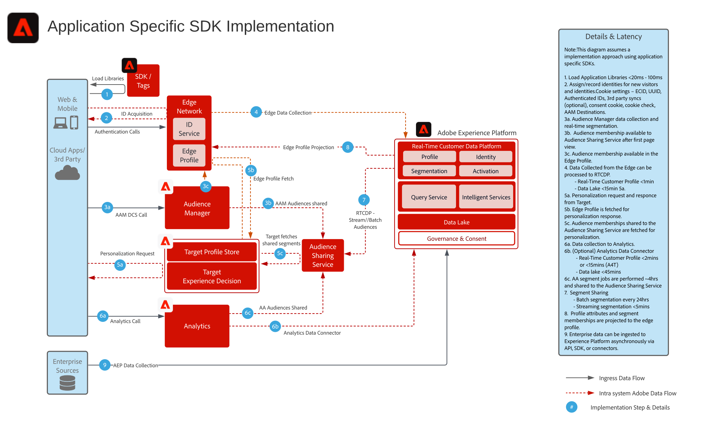

# Diagramma dell&#39;architettura di distribuzione SDK specifica per l&#39;applicazione

Questo schema dell’architettura illustra i percorsi di integrazione e raccolta dati con l’implementazione eseguita mediante gli SDK di specifiche applicazioni.

## Documentazione di riferimento

* [Panoramica di Experience Platform Web/Mobile SDK](https://experienceleague.adobe.com/docs/experience-platform/edge/home.html?lang=it)
* [Tutorial sull’implementazione di Adobe Experience Cloud con Web SDK](https://experienceleague.adobe.com/docs/platform-learn/implement-web-sdk/overview.html?lang=it)
* [Tutorial sull’implementazione di Adobe Experience Cloud nelle app per dispositivi mobili](https://experienceleague.adobe.com/docs/platform-learn/implement-mobile-sdk/overview.html?lang=it)
